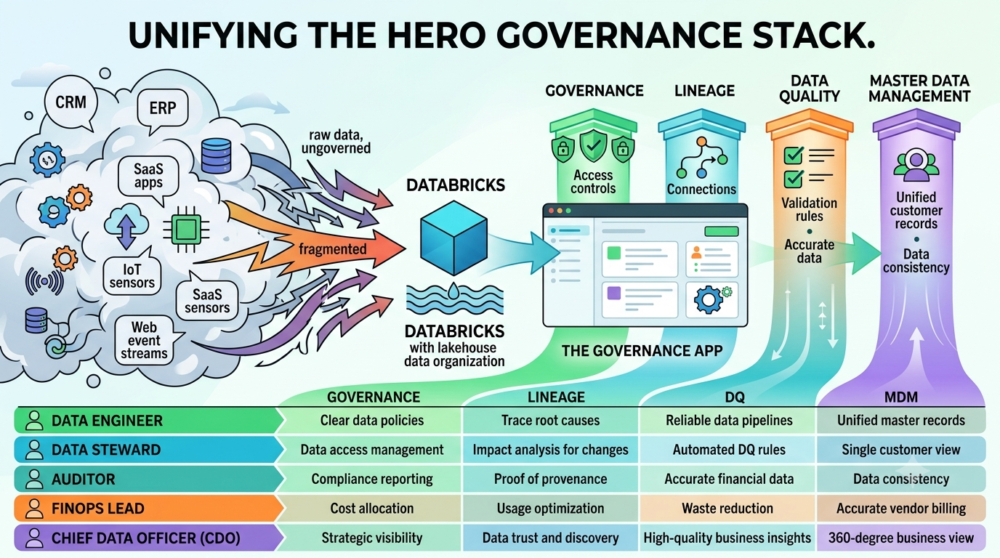
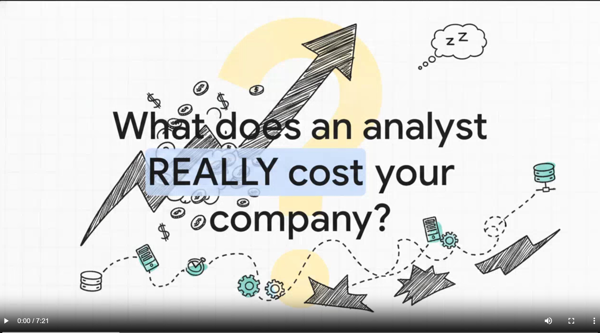
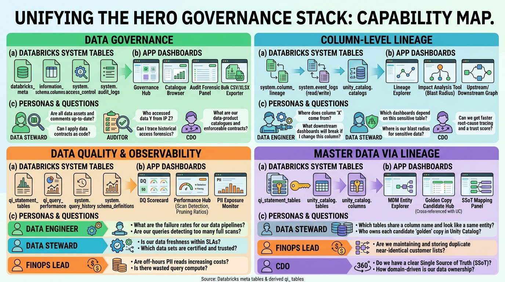
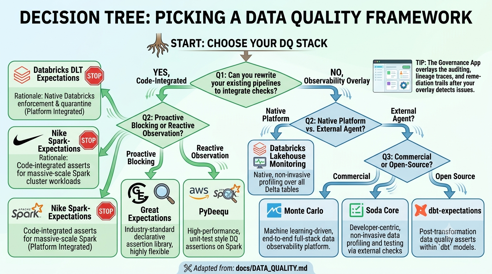
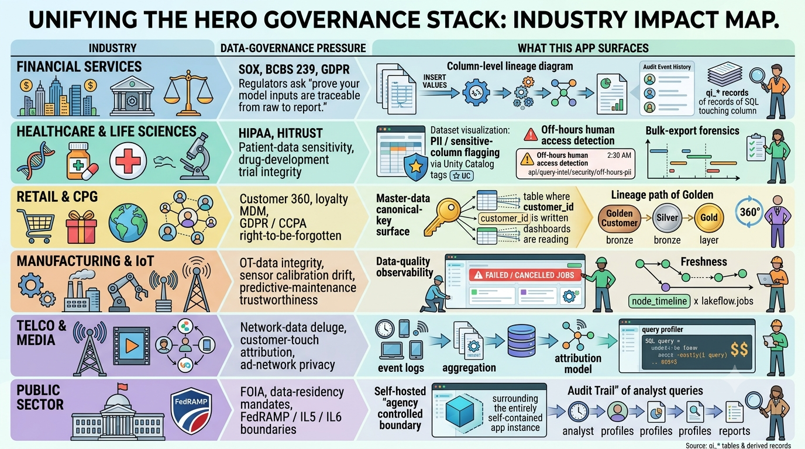
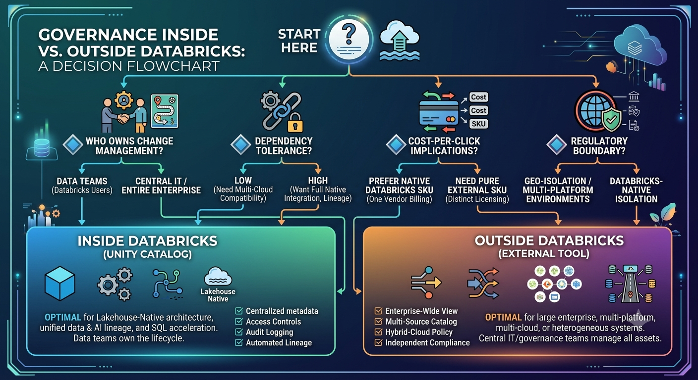
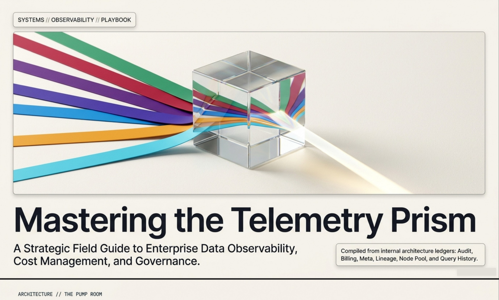
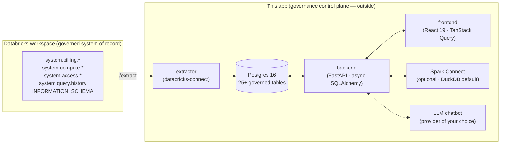

# Lakelens

## Databricks Governance, Data Quality & Lineage Workbench

> **The governance, data-quality, lineage, audit, and master-data-management layer for your Databricks workspace — running outside it, owned by you.**

> #### 🚀 An enabler for your Databricks Governance · Data Quality · Lineage · MDM program
>
> **This app does not replace anything you already run on Databricks.** It is a purpose-built **enabler** that sits *beside* your workspace and turns the data that Unity Catalog and the `system.*` tables already emit into:
>
> - **Governance** — a federated control plane: who owns what, what's documented, who accessed it, role-scoped views, per-feature RBAC.
> - **Data Quality & Observability** — failure rates, error categories, full-scan / pruning ratios, duplicate-query clustering, off-hours PII reads — the **observability layer around** whichever DQ framework (DLT Expectations, Great Expectations, Lakehouse Monitoring, Monte Carlo …) you adopt.
> - **Column-level Lineage** — direct + transitive upstream / downstream graphs for every table and every column. Blast-radius and impact-analysis on demand.
> - **Master Data via Lineage** — canonical-key surface across query history × catalog × lineage to find where the same logical entity (customer / product / account) is copied, fanned out, or owned.
>
> Plus FinOps cost dashboards, audit forensics, compute / node-pool telemetry, and a natural-language chatbot grounded in the same governed metadata. **Your Databricks investment keeps working — this app makes it visible, accountable, and discoverable to every persona in your org.**

A self-hosted web app that turns the Databricks `system.*` tables and Unity Catalog `INFORMATION_SCHEMA` into a **federated data-governance control plane**: column-level lineage, end-to-end impact analysis, data-quality observability, audit-trail forensics, cost & FinOps dashboards, master-data-style canonical-key tracking, and a natural-language chatbot that grounds its answers in your governed metadata — all running outside the Databricks workspace it observes.

> 🌐 **Try the live demo — [lakelens.ai](https://lakelens.ai)** — a fully-static, browser-only mock of every dashboard, chatbot, and admin surface. No signup, no backend, no Databricks workspace needed. Walk every page, click every filter, then come back here to deploy your own copy.

```bash
docker compose up        # http://localhost:3000
```

After the stack is up, **configure your Databricks connection**:

```bash
cp .env.example .env     # then edit .env and fill in:
#   DATABRICKS_HOST   = https://<your-workspace>.cloud.databricks.com
#   DATABRICKS_TOKEN  = a PAT with read access to `system.*` tables
#                       (Unity Catalog GRANT SELECT on system.billing.*,
#                        system.compute.*, system.access.*, system.query.history,
#                        system.lakeflow.* — see docs/USER_GUIDE.md)
docker compose restart backend extractor   # pick up the new env vars
```

That `docker compose up` brings up Postgres + backend + frontend + the isolated Databricks extractor. Add `--profile local-spark` to also start the optional Spark stack. The first login is auto-bootstrapped from `DEFAULT_ADMIN_EMAIL` / `DEFAULT_ADMIN_PASSWORD` in `.env` — see [`docs/USER_GUIDE.md`](docs/USER_GUIDE.md#signing-in). Without `DATABRICKS_HOST` / `DATABRICKS_TOKEN` the app still starts and demo data is available; the **Extract** button on the Data Management page is what triggers real extraction once the env is set.



---

## Why this exists

Databricks adoption is universal in 2026. Over **700 enterprises now use Unity Catalog** to centralise governance across multiple engines, and **Unity Catalog client SDKs see more than 1 million downloads per month** [[1]](https://www.databricks.com/blog/year-interoperability-how-enterprises-are-scaling-governance-unity-catalog). The platform has been adopted by:

- **Startups** — moving from spreadsheets to a lakehouse before they hire their first dedicated data team. Velocity over discipline.
- **SMEs** — consolidating five-tool BI stacks onto one Databricks workspace. Migration projects ship first; governance is "phase 2."
- **Enterprises** — financial services, healthcare, retail, manufacturing, telco, public sector — each with their own compliance surface (SOX, HIPAA, BCBS 239, GDPR, FedRAMP, PCI-DSS, CCPA), all using Databricks as the lake / mesh / fabric backbone.

But adoption velocity has outpaced governance velocity. **64 % of organisations identify data quality as their top integrity challenge, and 77 % rate their data quality as average or worse** — which means automation and AI today are multiplying errors rather than correcting them [[2]](https://parseur.com/blog/gigo). The root cause of AI failures is clear:

> *"Data and the gaps in quality, access, trust, and lineage that continue to limit outcomes and prevent AI from scaling."* — [Acceldata, How AI Is Transforming Data Quality Management](https://www.acceldata.io/blog/how-ai-is-transforming-data-quality-management)

In plain language: **garbage in, garbage out**. The more data you put inside Databricks, the more urgent it becomes to have visibility into who reads what, when it last changed, who owns it, where it flows, and which fields are trustworthy enough for downstream AI grounding.

This app gives you that visibility — owned by your platform team, deployed outside Databricks, with no read-runtime dependency on the workspace.

🎬 **Watch the explainer — *Lakehouse Survival Guide*** (click the image to play the 90-second video):

<a href="https://s3.us-east-1.amazonaws.com/static.lakelens.ai/Lakehouse_Survival_Guide.mp4"></a>

---

## What it does — the four pillars

| Pillar | What it covers in the app | Industry vocabulary |
|---|---|---|
| **Data Governance** | Catalogue → schema → table → column browser over `databricks_meta`. Owners, comments, type heatmaps, bulk CSV/XLSX export. Per-role data-scope filters + per-role feature matrix. Audit-event forensics with substring search across user / service / action / IP / error. | Federated governance · data-product catalogue · data contracts (code-enforceable) · governance-as-code · lifecycle governance |
| **Column-Level Lineage** | Direct + transitive upstream / downstream graphs for every table AND column. Read-only / write-only / read-write event class. Direct vs indirect edges. Top sources, top targets, orphans, terminals, per-FQN rollup tiles. | Impact analysis · blast radius · root-cause tracing · column-level lineage · lineage-driven policy propagation |
| **Data Quality & Observability** | Statement-level quality signals from `qi_*` derived tables — failure rates per workspace / role / SKU, error-category bucketing, full-scan detection, partition-pruning ratios, off-hours PII reads, bulk-export forensics, duplicate-query clustering, syntax-error catch-up. | Data observability (freshness, volume, schema, distribution, lineage) · data SLAs · AI data observability · certified data sets · trust score |
| **Master Data via Lineage** | Canonical-key surface across `qi_statement_tables`: which tables share a column name, where the same logical entity (customer / product / account) is being copied, fanned out, or read from. Cross-references back to Unity Catalog so you can see who owns each candidate "golden" copy. | MDM · golden record · single source of truth (SSoT) · entity resolution · canonical model · domain-driven ownership |



### Where this app fits in the data-quality landscape

This app is a **governance + observability overlay** on top of whichever data-quality framework you adopt — **it does not replace your DQ framework**. There's a thriving open-source + commercial landscape (Databricks Lakehouse Monitoring, DLT Expectations, Great Expectations, Soda Core, PyDeequ, dbt-expectations, Nike Spark-Expectations, Monte Carlo). Picking among them depends on posture (proactive vs reactive), execution model, code-change budget, and how tightly you need Unity Catalog integration.

We maintain a comparative deep-dive — **eight frameworks scored across 12 criteria including reactive-vs-proactive posture, total-cost-of-ownership, UC compatibility, and execution model**: **[`docs/DATA_QUALITY.md`](docs/DATA_QUALITY.md)**.

Read that doc first if you're choosing a DQ stack from scratch. Once the stack is in place, this app gives you the **governance layer around it**: who triggered the failing assertion, what lineage edges the bad data touched downstream, which dashboards still read from quarantined tables, and the audit trail of remediation.



Beyond the four pillars, the app also surfaces:

- **Cost & FinOps** — billing analysis split by SKU, workspace, user, billing-origin product, with anomaly detection (rolling z-score) and 30-day linear-regression forecast.
- **Compute Resource Inventory** — clusters, warehouses, jobs, node-pool telemetry (`node_timeline`, `warehouse_events`, `instance_events`, `instance_pools`, `node_types`).
- **LLM Chatbot grounded in governed metadata** — natural-language questions answered by SQL grounded in the same governance surface the dashboards use, with view-mode isolation so demo data and production data never mix in a session.

---

## Who it's for


### Startups (Seed → Series B)

You moved to Databricks to skip the legacy-warehouse step. Five people on your data team, no full-time governance role yet. This app gives you:

- A free, self-hosted **lineage + audit + DQ surface** before you can justify a paid SaaS catalogue.
- A **cost dashboard** so the CFO doesn't get surprised by your DBU growth curve.
- A **chatbot** that lets non-engineers self-serve "where does this column come from?" without slacking the founders.

### Small / Mid-Sized Enterprises (SMEs)

You're scaling from "one Databricks workspace" to "one workspace per business unit." Federated governance becomes urgent the moment a second domain team starts publishing data products.

- **Per-role data scope** — filter a marketing analyst to their workspace IDs without rebuilding the dashboards.
- **Per-role feature matrix** — gate the Chatbot, the Spark SQL Editor, or the Database Explorer per role.
- **Audit + lineage in one place** — answer "who touched this PII column?" in seconds rather than chasing a service-account log.

### Enterprises

You have a Chief Data Officer, a steward per domain, an internal-audit function, and a compliance team. You already have Unity Catalog. What you need is a **layer on top** that:

- Stays **outside the workspace** (no read-runtime dependency, separate change-management, owned by Platform Eng) — see [§ Why outside Databricks](#why-outside-databricks).
- Gives the **stewards** a column-level lineage UI that doesn't require a Databricks login per click.
- Gives **internal audit** a queryable `audit_events` history with substring search, status-class breakdowns, and CSV export for evidence packs.
- Gives **FinOps** a per-billing-origin chargeback view by workspace, user, SKU.
- Gives the **AI/ML team** a lineage-aware view of which tables are "AI-ready" — provenance traced, freshness known, schema stable enough to ground an LLM on.

---

## Industry vignettes



| Industry | The data-governance pressure | What this app surfaces |
|---|---|---|
| **Financial Services** | SOX, BCBS 239, GDPR. Regulators ask: *"prove your risk-model inputs are traceable from raw to report."* | Column-level lineage from a regulatory-report column back to its `INSERT VALUES` origin. Audit-event history of who altered the calculation. `qi_*` records of every SQL that touched the column. |
| **Healthcare & Life Sciences** | HIPAA, HITRUST. Patient-data sensitivity, drug-development trial integrity. | PII / sensitive-column flagging via Unity Catalog tags; off-hours human access detection (`/api/query-intel/security/off-hours-pii`); bulk-export forensics. |
| **Retail & CPG** | Customer 360, loyalty MDM, GDPR / CCPA right-to-be-forgotten. | Master-data canonical-key surface — find every table where `customer_id` is written, every dashboard reading it; trace the "golden customer" through silver and gold layers. |
| **Manufacturing & IoT** | OT-data integrity, sensor calibration drift, predictive-maintenance trustworthiness. | Data-quality observability — `qi_*` surfaces failed / cancelled jobs ingesting sensor streams; freshness via `node_timeline` × `lakeflow.jobs`. |
| **Telco & Media** | Network-data deluge, customer-touch attribution, ad-network privacy. | Lineage from raw event logs through aggregation to attribution model; query-profiler views identify the costly attribution SQL. |
| **Public Sector** | FOIA, data-residency mandates, FedRAMP / IL5 / IL6 boundaries. | Self-hosted deployment — runs entirely inside the agency's controlled boundary; audit trail of every analyst query. |

---

## Why outside Databricks

Everything in this repo could be built **inside** Databricks. We choose to run it outside for four reasons:

1. **Separation of concerns.** A governance layer that lives inside the system it governs is structurally compromised. Outside-the-platform observability is the same logic as putting your SIEM on different infrastructure from the systems it monitors.
2. **No read-runtime dependency.** Your dashboards stay up even when the Databricks workspace is upgrading, throttled, or offline. The app re-reads the latest parquet snapshot from object storage.
3. **Lower cost of access.** Lineage, audit, and FinOps users hit a Postgres-backed app instead of a Databricks SQL Warehouse — no DBU charge per click, no warehouse spin-up latency.
4. **Change-management ownership.** Your platform team owns the release cadence, the RBAC model, the upgrade path — independent of any vendor's product roadmap.

A longer treatment of this rationale lives in [`docs/technical/ARCHITECTURE.md`](docs/technical/ARCHITECTURE.md).



---

## What's the pitch deck story

🎯 **Executive deck — *Lakelens Telemetry Prism*** (click the image to open the PDF):

<a href="https://s3.us-east-1.amazonaws.com/static.lakelens.ai/Lakelens_Telemetry_Prism.pdf"></a>

---

## Architecture in 30 seconds



Full diagrams + technology choices: [`docs/technical/ARCHITECTURE.md`](docs/technical/ARCHITECTURE.md). Spark stack (bundled `local-spark` profile vs external Spark / Databricks): [`docs/technical/SPARK_STACK.md`](docs/technical/SPARK_STACK.md) and [`docs/technical/SPARK_EXTERNAL_DEPLOYMENT.md`](docs/technical/SPARK_EXTERNAL_DEPLOYMENT.md).

---

## system-tables coverage

The matrix below tracks every system table published by Databricks against what this app currently extracts, ingests, and surfaces in the UI. "Covered" means: parquet extraction in `extractor/`, Postgres model in `backend/models.py`, and at least one dashboard or page that reads it.

### ✅ Covered today

| Table | Used by |
|---|---|
| [`system.billing.usage`](https://docs.databricks.com/aws/en/admin/system-tables/billing) | Billing Explorer (cost, SKU, origin, trends), Cost Explorer, User Footprint, Chatbot |
| [`system.billing.list_prices`](https://docs.databricks.com/aws/en/admin/system-tables/pricing) | Cost calculation (`usage_quantity × effective_list_price`) |
| [`system.compute.clusters`](https://docs.databricks.com/aws/en/admin/system-tables/compute) | Compute Resources page, cluster lookups in Cost Explorer |
| [`system.compute.warehouses`](https://docs.databricks.com/aws/en/admin/system-tables/warehouses) | Compute Resources page, warehouse lookups |
| [`system.lakeflow.jobs`](https://docs.databricks.com/aws/en/admin/system-tables/jobs) | Compute Resources page, job_id joins on billing |
| [`system.access.workspaces_latest`](https://docs.databricks.com/aws/en/admin/system-tables/workspaces-latest-system-table) | Workspace name lookups across every dashboard |
| [`system.query.history`](https://docs.databricks.com/aws/en/admin/system-tables/query-history) | Query Profiler (statements, qi_* derived tables, departmental scenarios) |
| [`system.access.table_lineage`](https://docs.databricks.com/aws/en/admin/system-tables/lineage) | Meta Explorer → Lineage — Tables dashboard |
| [`system.access.column_lineage`](https://docs.databricks.com/aws/en/admin/system-tables/lineage) | Meta Explorer → Lineage — Columns dashboard |
| [`system.access.audit`](https://docs.databricks.com/aws/en/admin/system-tables/audit-logs) | Meta Explorer → Audit dashboard (service/action breakdowns, error analysis, recent-events table with filters) |
| [`system.access.assistant_events`](https://docs.databricks.com/aws/en/admin/system-tables/assistant) | Audit dashboard's Assistant section + chatbot grounding |
| [`system.compute.node_timeline`](https://docs.databricks.com/aws/en/admin/system-tables/node-timeline) | Meta Explorer → Node Pool dashboard (per-minute utilisation) |
| [`system.compute.warehouse_events`](https://docs.databricks.com/aws/en/admin/system-tables/warehouse-events) | Node Pool dashboard — warehouse lifecycle |
| [`system.compute.node_types`](https://docs.databricks.com/aws/en/admin/system-tables/node-types) | Node Pool dashboard — reference catalogue |
| [`system.compute.node_events`](https://docs.databricks.com/aws/en/admin/system-tables/node-events) | Node Pool dashboard — VM lifecycle (surfaced as `instance_events`) |
| [`system.compute.instance_pools`](https://docs.databricks.com/aws/en/admin/system-tables/instance-pools) | Node Pool dashboard — pool catalogue |
| `INFORMATION_SCHEMA` (Unity Catalog) | Meta Explorer overview (catalogue/schema/table/column tree + search + export) |

### 🟡 Roadmap (highest governance value first)

The next-up candidates are the ones that close governance gaps — **data classification**, **data-quality results**, and the **job/pipeline timeline** that ties lineage back to its producing job. PRs welcome:

| Table | What it unlocks |
|---|---|
| [`system.data_classification.results`](https://docs.databricks.com/aws/en/admin/system-tables/data-classification) | PII / sensitive-data column detections — governance overlay on lineage + audit. |
| [`system.data_quality_monitoring.table_results`](https://docs.databricks.com/aws/en/admin/system-tables/data-quality) | DQ check outcomes — broken-table incidents inside Meta Explorer. |
| [`system.lakeflow.job_run_timeline`](https://docs.databricks.com/aws/en/admin/system-tables/jobs-system-table#job-run-timeline) | Job-run durations + status — tie lineage `entity_metadata` back to operational jobs. |
| [`system.lakeflow.job_task_run_timeline`](https://docs.databricks.com/aws/en/admin/system-tables/jobs-system-table#job-task-run-timeline) | Task-level "which step in the DAG broke" view. |
| [`system.lakeflow.pipelines`](https://docs.databricks.com/aws/en/admin/system-tables/pipelines) + [`pipeline_update_timeline`](https://docs.databricks.com/aws/en/admin/system-tables/pipelines#pipeline-update-timeline) | DLT pipeline inventory + run history — completes the lineage producer picture. |
| [`system.serving.served_entities`](https://docs.databricks.com/aws/en/admin/system-tables/served-entities-system-table) + [`endpoint_usage`](https://docs.databricks.com/aws/en/admin/system-tables/serving-endpoint-usage-system-table) | Model-serving inventory + token counts — AI cost and governance overlay. |
| [`system.ai_gateway.usage`](https://docs.databricks.com/aws/en/admin/system-tables/ai-gateway-usage) | AI Gateway request/response logs — model-level audit. |
| [`system.mlflow.experiments_latest`](https://docs.databricks.com/aws/en/admin/system-tables/mlflow) + `runs_latest` + `run_metrics_history` | MLflow lineage — ground AI model outputs in governed training-data provenance. |
| [`system.marketplace.listing_funnel_events`](https://docs.databricks.com/aws/en/admin/system-tables/marketplace-listing-funnel-events) + [`listing_access_events`](https://docs.databricks.com/aws/en/admin/system-tables/marketplace-listing-access-events) | Databricks Marketplace publisher analytics. |
| [`system.access.clean_room_events`](https://docs.databricks.com/aws/en/admin/system-tables/clean-room-events) | Clean-room collaboration events. |
| [`system.access.inbound_network`](https://docs.databricks.com/aws/en/admin/system-tables/inbound-network-system-table) + [`outbound_network`](https://docs.databricks.com/aws/en/admin/system-tables/outbound-network-system-table) | Network policy denials — security forensics. |
| [`system.sharing.materialization_history`](https://docs.databricks.com/aws/en/admin/system-tables/materialization-history) | Delta Sharing materialisation events. |
| [`system.storage.predictive_optimization_operations_history`](https://docs.databricks.com/aws/en/admin/system-tables/predictive-optimization-history) | Predictive Optimisation operations log. |
| [`system.replication.states`](https://docs.databricks.com/aws/en/admin/system-tables/replication-states-system-table) | Managed DR replication status. |
| [`system.lakeflow.zerobus_stream`](https://docs.databricks.com/aws/en/admin/system-tables/lakeflow-zerobus-stream) + [`zerobus_ingest`](https://docs.databricks.com/aws/en/admin/system-tables/lakeflow-zerobus-ingest) | Zerobus stream / ingest telemetry. |

---

## TODO — Snowflake parity (future)

This app is **Databricks-first today**, but the four pillars (Governance · Data Quality · Lineage · MDM) are warehouse-agnostic. A planned future track adds a **Snowflake extractor** that maps the same dashboards onto Snowflake's `SNOWFLAKE.ACCOUNT_USAGE` views — same UI, same scenarios, same governance overlay, second source. Once shipped, a single deployment will be able to observe both warehouses side-by-side.

The matrix below shows the planned cross-platform mapping:

| Use case | Databricks system table / area | Snowflake closest equivalent | Notes |
|---|---|---|---|
| **Billing / usage** | `system.billing.usage` ([docs](https://docs.databricks.com/aws/en/admin/system-tables/billing)) | `SNOWFLAKE.ACCOUNT_USAGE.METERING_DAILY_HISTORY`, `WAREHOUSE_METERING_HISTORY`, `QUERY_HISTORY` | Snowflake billing is typically split across metering and query views rather than one billing table. |
| **Audit / admin activity** | `system.access.audit` ([docs](https://docs.databricks.com/aws/en/admin/system-tables/audit-logs)) | `SNOWFLAKE.ACCOUNT_USAGE.ACCESS_HISTORY`, `LOGIN_HISTORY`, `QUERY_HISTORY`, plus the wider `ACCOUNT_USAGE` views | `ACCESS_HISTORY` is the closest match for object access, but Snowflake uses multiple views for a fuller audit trail. |
| **Lineage** | `system.access.table_lineage` + `column_lineage` ([docs](https://docs.databricks.com/aws/en/admin/system-tables/lineage)) | `SNOWFLAKE.ACCOUNT_USAGE.ACCESS_HISTORY` + Snowflake Horizon / lineage features | Snowflake lineage is more feature-driven and metadata-driven than table-centric; `ACCESS_HISTORY` helps reconstruct usage patterns. |
| **Compute / workload monitoring** | `system.compute.*` ([docs](https://docs.databricks.com/aws/en/admin/system-tables/compute)) | `WAREHOUSE_METERING_HISTORY`, `QUERY_HISTORY`, `WAREHOUSE_LOAD_HISTORY` | Snowflake splits compute monitoring into warehouse and query history views. |
| **Data sharing / marketplace activity** | Databricks system tables + Marketplace operational tables | `SNOWFLAKE.ACCOUNT_USAGE.SHARE_USAGE`, `DATA_TRANSFER_HISTORY` | Useful for sharing, replication, and consumption monitoring. |
| **Job / task observability** | `system.lakeflow.*` job & task timelines ([docs](https://docs.databricks.com/aws/en/admin/system-tables/jobs-system-table)) | `QUERY_HISTORY`, `TASK_HISTORY`, `PIPE_USAGE_HISTORY` where applicable | Snowflake's model is more object/activity-specific. |
| **Security / login events** | `system.access.audit` ([docs](https://docs.databricks.com/aws/en/admin/system-tables/audit-logs)) | `LOGIN_HISTORY`, `SESSIONS`, `ACCESS_HISTORY` | Snowflake separates authentication and object access into distinct views. |

PRs adding the Snowflake extractor (parallel to `extractor/` for Databricks) are very welcome — open an issue first so we can agree the schema-mapping table → Postgres model conventions before code lands.

---

## 📚 Documentation map

> **Pick your entry point.** Each link opens a self-contained guide — the full tree lives in [`docs/`](docs/). Grouped below by the question you're trying to answer.

### 🚀 Getting started — *"I just landed here, where do I begin?"*

| | If you want… | Read… |
|:-:|---|---|
| 🎯 | First-run + dashboard tour | [`docs/USER_GUIDE.md`](docs/USER_GUIDE.md) |
| 🎭 | Business scenarios per persona | [`docs/scenarios/README.md`](docs/scenarios/README.md) |
| 📋 | Per-column schema reference | [`docs/DATA_DICTIONARY.md`](docs/DATA_DICTIONARY.md) |

### 🧩 Architecture & engineering — *"How is this thing built and deployed?"*

| | If you want… | Read… |
|:-:|---|---|
| 🏗️ | Architecture + tech stack | [`docs/technical/README.md`](docs/technical/README.md) |
| 🦆 | DuckDB vs Spark engine choice | [`docs/technical/QUERY_ENGINE.md`](docs/technical/QUERY_ENGINE.md) |
| ⚡ | External Spark / Databricks integration | [`docs/technical/SPARK_EXTERNAL_DEPLOYMENT.md`](docs/technical/SPARK_EXTERNAL_DEPLOYMENT.md) |
| 🔐 | Security + RBAC model | [`docs/technical/SECURITY.md`](docs/technical/SECURITY.md) |
| ☁️ | Cloud deployment | [`deploy/README.md`](deploy/README.md) + [`docs/technical/CLOUD_MIGRATION.md`](docs/technical/CLOUD_MIGRATION.md) |

### 🔬 Deep dives & quality — *"I want to go deeper on one pillar."*

| | If you want… | Read… |
|:-:|---|---|
| ✅ | Choose a data-quality framework (8-way comparative deep-dive) | [`docs/DATA_QUALITY.md`](docs/DATA_QUALITY.md) |
| 🧪 | Feature deep-dives (audit, compute, lineage) | [`docs/features_grouped/README.md`](docs/features_grouped/README.md) |

---

## Sources

The framing and statistics in this README draw on:

- [A Year of Interoperability: How Enterprises Are Scaling Governance with Unity Catalog — Databricks](https://www.databricks.com/blog/year-interoperability-how-enterprises-are-scaling-governance-unity-catalog)
- [What Modern Data Governance Actually Looks Like in 2026 — Acceldata](https://www.acceldata.io/blog/what-modern-data-governance-actually-looks-like-in-2026)
- [9 Trends Shaping The Future Of Data Management In 2026 — Monte Carlo](https://montecarlo.ai/blog-data-management-trends)
- [5 Key Pillars of Data Observability to Know in 2026 — Modern Data 101](https://medium.com/@community_md101/5-key-pillars-of-data-observability-to-know-in-2026-814515c22a04)
- [Data Lineage for Compliance: From Audit Prep to Operational Evidence — DataHub](https://datahub.com/blog/data-lineage-for-compliance/)
- [Garbage In, Garbage Out: Why Data Relevance Is Make-or-Break for AI — Ascent](https://www.ascentregtech.com/blog/garbage-in-garbage-out-why-data-relevance-is-make-or-break-for-ai/)
- [Garbage In, Garbage Out — Why Bad Data Destroys Automation ROI — Parseur](https://parseur.com/blog/gigo)
- [How AI Data Quality Management Is Redefining Accuracy and Efficiency — Acceldata](https://www.acceldata.io/blog/how-ai-is-transforming-data-quality-management)
- [Gartner Magic Quadrant for Data & Analytics Governance Platforms 2026 — Ataccama](https://www.ataccama.com/blog/gartner-magic-quadrant-for-data-and-analytics-governance-platforms-2026-explained-what-changed-this-year)
- [Data Observability use cases — Ataccama](https://www.ataccama.com/blog/data-observability-use-cases-real-world-examples-and-benefits)

---

## Enterprise deployment & support

Running this in production for a team, a business unit, or a whole enterprise? We offer paid services that go beyond the OSS surface:

- **Scoping & deployment in your environment.** Sizing, cloud-target selection (AWS / Azure / GCP / on-prem), external-Spark vs DuckDB engine choice, network + secrets posture, RBAC model, integration with your IdP / SSO — delivered into your environment, owned by you afterwards.
- **Managed hosting (alternative — we run it for you).** Prefer not to host in your own environment? We can run the app on dedicated infrastructure on your behalf — with a secure, read-only connection to your Databricks workspace, SSO integration, and SLA-backed uptime. Your data stays governed; you skip the deployment + ongoing-ops overhead. Single-tenant by default; bring-your-own-cloud-account also available.
- **Onboarding your team.** White-glove onboarding for your data engineers, stewards, FinOps analysts, security & compliance leads, and executives — each persona walked through the dashboards and scenarios that map to their day job.
- **Training & enablement.** Live workshops, recorded training tracks, and customised user guides for your organisation's catalogue, naming conventions, and chargeback model. Optional certification-style assessments for internal champions.
- **Custom scenarios & dashboards.** Build org-specific scenarios on top of the existing per-persona scenario library ([`docs/scenarios/`](docs/scenarios/)) — e.g. your regulator-facing audit pack, your CFO's cost-attribution view, your data-product health card.
- **Ongoing maintenance & support.** Versioned upgrades, security patches, system-table coverage expansion (e.g. the Snowflake parity track above), SLA-backed incident response.

**Interested?** Reach out to the author — **[pradeep@automationpractice.com](mailto:pradeep@automationpractice.com)** — with a short note about your stack (Databricks workspace count, data scale, persona mix) and what success looks like in the first 90 days. We'll come back with a scoped engagement plan.

---

## License + contributing

MIT. PRs welcome — please follow the guidelines below:

- **Roadmap-aligned.** The next-up roadmap (above) is the governance-value-first ordering of unwired system tables. Pick one and follow the existing extractor → model → ingest → router → dashboard pattern (worked example: any of the audit / lineage / node-pool implementations).
- **Design first for substantive changes.** For non-trivial design discussions, please open an issue first so the shape can be agreed before the code lands.
- **Value-add + tests + demo video required.** Every PR must include a clear value-add justification, **unit tests** and **end-to-end tests** for the changed code paths, and a short **video / screen recording** showing the feature working in a real deployment (attach to the PR description).
- **Human-reviewed only.** PRs that are the output of vibe-coding agents with no human oversight will not be merged. Use AI assistance freely, but **read what you submit**, run it, test it, and own it — that's the bar for review.
