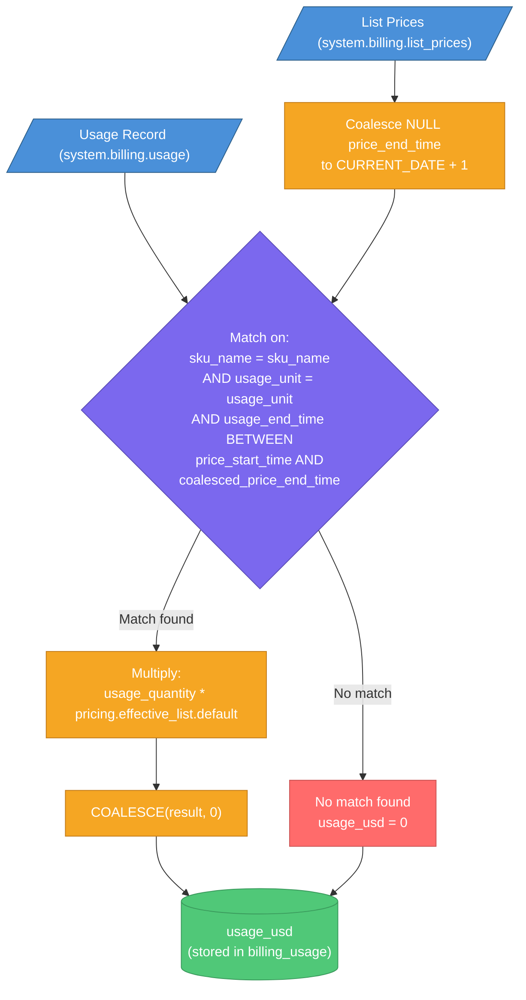
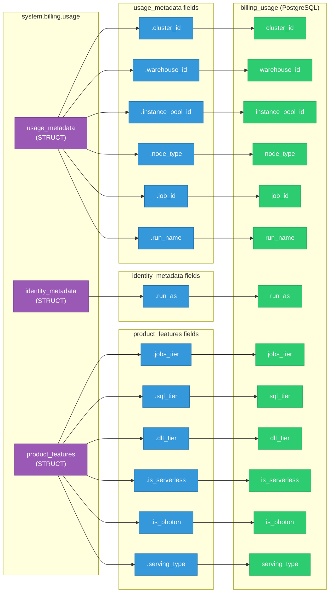
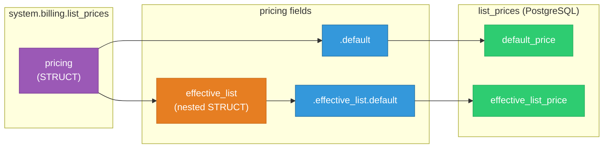
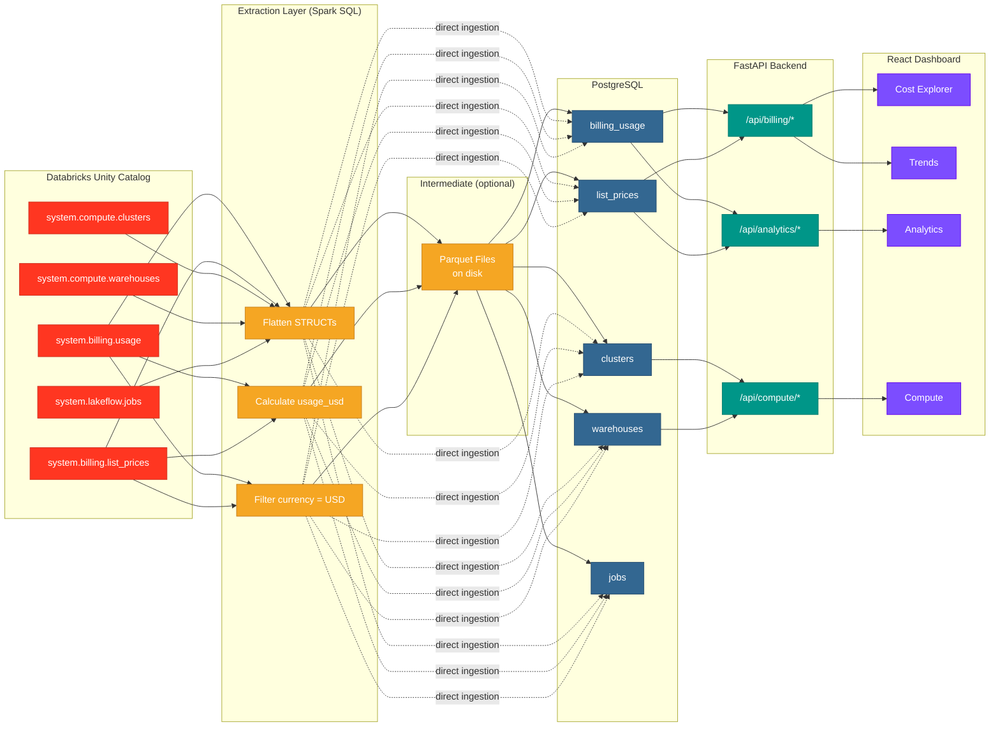
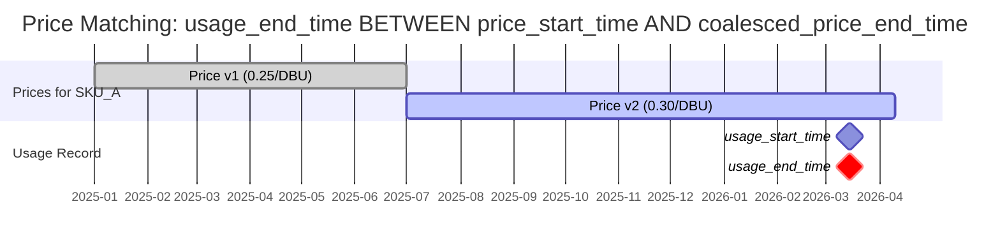
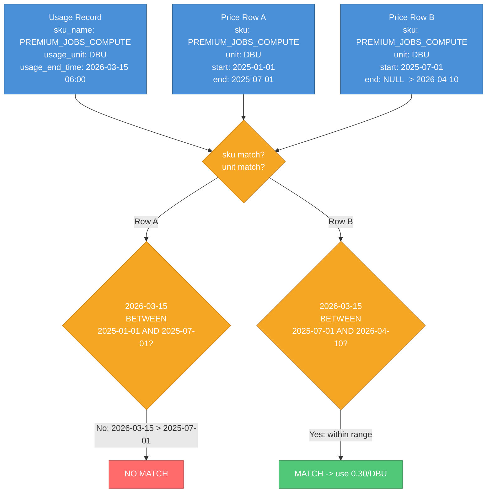
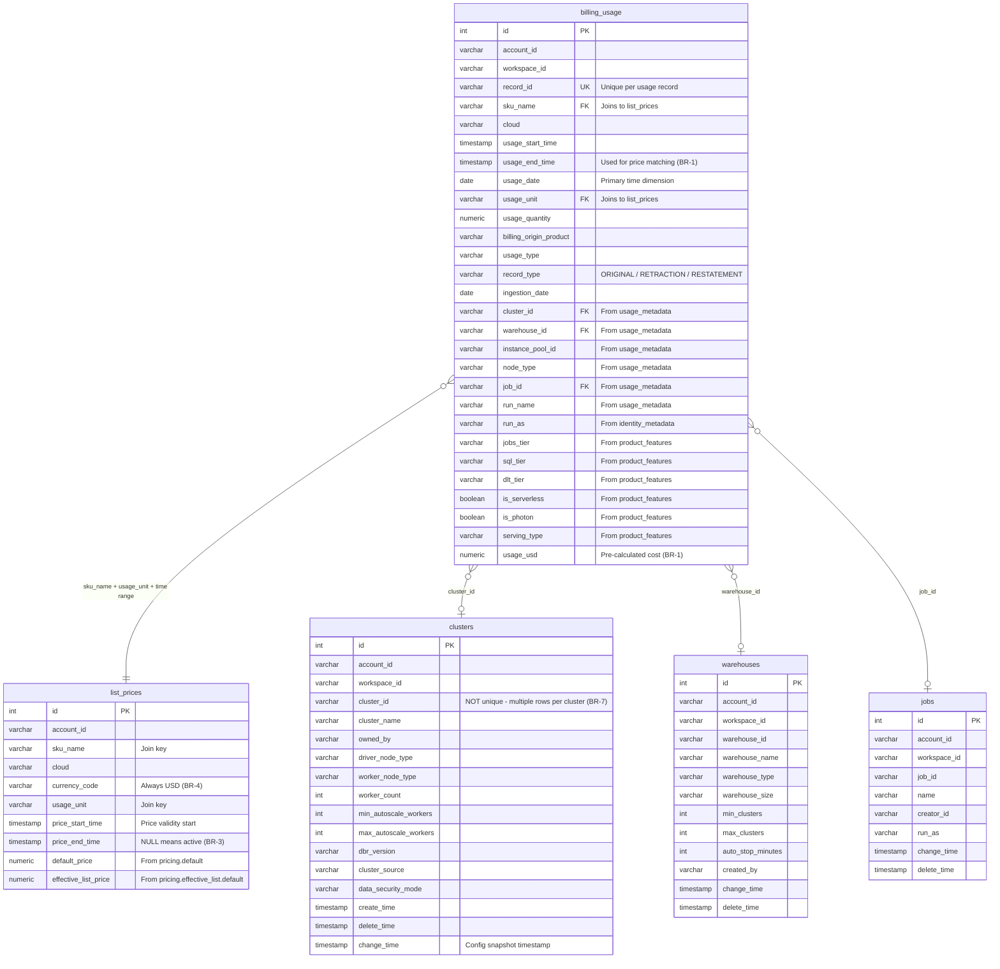

# Data Dictionary

**Audience:** Data Analysts  
**Last updated:** 2026-06-27  
**Scope:** Databricks system tables + Unity Catalog metadata + Query Profiler artifacts + Lineage tables, all in PostgreSQL.

---

## Table of Contents

1. [Architecture Overview](#architecture-overview)
2. [Business Rules](#business-rules)
3. [Source-to-Target Mapping](#source-to-target-mapping)
4. [Table Definitions](#table-definitions)
   - **Billing & compute** (extracted live from Databricks system tables):
     - [billing_usage](#1-billing_usage)
     - [list_prices](#2-list_prices)
     - [clusters](#3-clusters)
     - [warehouses](#4-warehouses)
     - [jobs](#5-jobs)
     - [workspaces](#6-workspaces)
     - [query_history](#7-query_history)
   - **Meta Explorer** (Unity Catalog INFORMATION_SCHEMA snapshot):
     - [databricks_meta](#8-databricks_meta)
   - **Query Profiler** (derived from `query_history` via sqlglot ETL — see `QUERY_PROFILER_TRANSFORMATION.md`):
     - [qi_statements](#9-qi_statements)
     - [qi_statement_tables](#10-qi_statement_tables)
     - [qi_statement_columns](#11-qi_statement_columns)
     - [qi_statement_errors](#12-qi_statement_errors)
     - [qi_statement_tags](#13-qi_statement_tags)
     - [qi_statement_parameters](#14-qi_statement_parameters)
   - **Lineage** (extracted from `system.access.*`; see [`LINEAGE.md`](features_grouped/LINEAGE.md) for the full story):
     - `table_lineage` — one row per directed edge from `system.access.table_lineage`. Full schema mirror plus the standard `data_origin` / `deleted_at` isolation columns. Powers `Meta Explorer → Lineage — Tables`.
     - `column_lineage` — same shape with `source_column_name` / `target_column_name`. Note: Databricks drops events without a source (e.g. `INSERT VALUES`), so column lineage is NOT a strict subset of table lineage.
     - `lineage_rollups` — materialised per-FQN aggregates (`edges_in`, `edges_out`, `distinct_upstream`, `distinct_downstream`, `distinct_entities`, `direct_edges`, `indirect_edges`, `last_event`). Rebuilt by the **Transform → Lineage rollups** job. Used as a fast tile cache; current dashboards read directly from `table_lineage`.
   - **Audit** (extracted from `system.access.*`; see [`AUDIT.md`](features_grouped/AUDIT.md)):
     - `audit_events` — one row per Databricks audit event from `system.access.audit`. Powers `Meta Explorer → Audit`. Carries pre-extracted `user_identity_email`, `response_status_code`, `response_error_message` for cheap GROUP BY; nested STRUCT / MAP columns (`user_identity`, `request_params`, `response`, `identity_metadata`) stored as JSON. Account-level events have `workspace_id='0'`.
     - `assistant_events` — one row per user-submitted Databricks Assistant / Genie prompt from `system.access.assistant_events`. Excludes autocomplete and safety checks upstream. Joinable with `qi_statements.executed_by` via `initiated_by`.
   - **Node Pool** (extracted from `system.compute.*`; see [`COMPUTE.md`](features_grouped/COMPUTE.md)):
     - `node_timeline` — per-minute instance utilization snapshot from `system.compute.node_timeline`. Highest-cardinality compute table; the extractor uses 3-day chunks. CPU/mem percentages 0–100; `disk_free_bytes_per_mount_point` is the upstream MAP stored as JSON.
     - `warehouse_events` — SQL warehouse lifecycle events from `system.compute.warehouse_events` (STARTING / RUNNING / STOPPED / SCALED_UP / SCALED_DOWN).
     - `node_types` — reference catalog of cloud node SKUs from `system.compute.node_types` (cpu / memory / gpu / category).
     - `instance_events` — VM lifecycle events. **Sourced from `system.compute.node_events`** and surfaced as `instance_events` everywhere downstream to match the Databricks UI label. `event_details` STRUCT stored as JSON.
     - `instance_pools` — pool catalog from `system.compute.instance_pools` (min/max capacity, idle behavior, preloaded Spark versions).
   - **Auth / RBAC** (not in the workbook today; sourced from `backend/models.py`):
     - `auth_users` / `auth_roles` / `auth_user_roles` / `auth_oauth_accounts` / `auth_email_verification_tokens` — RBAC stack.
     - `auth_roles.features` — JSON column carrying per-role feature keys (the Toggle Features matrix in the Role editor). Canonical key list in `backend/features_registry.py`.
5. [Struct Flattening Reference](#struct-flattening-reference)
6. [Diagrams](#diagrams)
7. [Worked Examples](#worked-examples)
8. [Indexes](#indexes)
9. [Common Query Patterns](#common-query-patterns)

> **Full per-column documentation** for every table also lives in
> `consolidated_metadata_with_descriptions.xlsx` (the chatbot's grounding
> workbook). The script `scripts/update_consolidated_metadata.py` keeps it
> in sync with the schema; re-run after a model change. The lineage and
> `lineage_rollups` tables landed after the most recent workbook
> regeneration — re-run the script to publish their per-column docs into
> the chatbot's grounding set.

---

## Architecture Overview

This application extracts data from Databricks across **four logical groups** and lands it in PostgreSQL for fast analytical queries. The Data Management UI exposes per-group checkboxes (Billing / Compute / Query History / Unity Catalog Meta) so each group can be refreshed independently. Extraction runs in a **dedicated `extractor` container** — `databricks-connect 16.x` lives there, isolated from the backend's `pyspark 4.1.1` pin. The backend's `POST /api/admin/extract` proxies to `http://extractor:8000/extract` over the docker network, the extractor writes timestamped parquet to the shared `/data` volume, and the backend then calls `ingest_from_parquet(tables=...)` to load only the just-refreshed slices.

| Layer | Technology | Purpose |
|-------|-----------|---------|
| Source | Databricks Unity Catalog system tables | Raw billing, pricing, and compute metadata |
| Extraction (isolated service) | extractor container — Python + Databricks Connect 16.x (Spark SQL) | Flatten structs, calculate `usage_usd`, filter to ORIGINAL + USD. Also crawls INFORMATION_SCHEMA across all accessible catalogs → `databricks_meta`. Runs in its own container so `databricks-connect`'s pyspark 3.5 stays clear of the backend's pyspark 4.1. Backend triggers it via `POST http://extractor:8000/extract`. |
| Storage | PostgreSQL | Flat relational tables for fast analytical queries |
| API | FastAPI (async) | REST endpoints for dashboard charts and KPIs |
| Frontend | React + TypeScript | Interactive billing dashboard |

---

## Business Rules

### BR-1: Cost Calculation (Critical)

This is the single most important business rule in the system. Cost is calculated **at extraction time** using Databricks' own billing dashboard formula. Once data lands in PostgreSQL, the pre-calculated `usage_usd` column is used directly.

**The Formula:**

```sql
COALESCE(u.usage_quantity * p.pricing.effective_list.default, 0) AS usage_usd
```

**The Join (price matching):**

```sql
LEFT JOIN prices AS p
    ON u.sku_name = p.sku_name           -- match SKU
    AND u.usage_unit = p.usage_unit       -- match unit (e.g., DBU)
    AND u.usage_end_time BETWEEN p.price_start_time AND p.coalesced_price_end_time
```

Key details:

- The join uses `usage_end_time` (NOT `usage_start_time`) to determine which price row applies.
- Matching is on `sku_name + usage_unit` -- cloud is NOT part of the price-matching join in the extraction query.
- The LEFT JOIN means if no price matches, the COALESCE produces `0` (not NULL).
- The result is stored as `usage_usd` in `billing_usage`, so downstream queries never re-derive it.

### BR-2: Record Type Filtering

Only records where `record_type = 'ORIGINAL'` are meaningful for cost analysis. Databricks also emits `RETRACTION` and `RESTATEMENT` records for billing corrections.

- **Extraction behavior:** The extraction query does NOT filter `record_type` -- all types are extracted.
- **Seed data behavior:** All generated records use `record_type = 'ORIGINAL'`.
- **Analyst guidance:** When aggregating costs, filter to `WHERE record_type = 'ORIGINAL'` unless you are specifically analyzing billing corrections.

### BR-3: Price End Time NULL Handling

In `system.billing.list_prices`, a NULL `price_end_time` means the price is **currently active** (no expiration). The extraction query handles this with:

```sql
COALESCE(price_end_time, DATE_ADD(CURRENT_DATE(), 1)) AS coalesced_price_end_time
```

This sets the effective end to **tomorrow**, ensuring the BETWEEN comparison works for currently-active prices. In PostgreSQL, `list_prices.price_end_time` preserves the original NULL for active prices.

### BR-4: Currency Filtering

Only USD-denominated prices are extracted. The extraction query applies `WHERE currency_code = 'USD'` to the list_prices CTE. All `usage_usd` values and all rows in the `list_prices` table are in US Dollars.

### BR-5: Struct Flattening

Databricks system tables use nested STRUCT columns. These are flattened into scalar columns at extraction time. See the [Struct Flattening Reference](#struct-flattening-reference) section for the complete mapping.

### BR-6: Dual Cost Path

The application supports two cost calculation strategies in PostgreSQL, selected automatically at query time:

| Scenario | `usage_usd` column | Cost calculation |
|----------|-------------------|------------------|
| **Real data** (extracted from Databricks) | Populated with pre-calculated values | `SUM(usage_usd)` -- no join needed |
| **Demo/seed data** (generated locally) | NULL | Falls back to `SUM(usage_quantity * list_prices.effective_list_price)` via JOIN |

The API checks whether any `usage_usd` values are non-NULL. If yes, it uses the direct path. If no, it joins against `list_prices`.

**Important for analysts:** If you see `usage_usd = NULL` in `billing_usage`, you are looking at seed data. The cost must be derived by joining to `list_prices`.

### BR-7: Clusters Table Has Multiple Rows Per Cluster

The `clusters` table mirrors `system.compute.clusters`, which contains **one row per configuration change**, not one row per cluster. The same `cluster_id` appears multiple times with different `change_time` values.

To get the latest configuration for each cluster:

```sql
SELECT DISTINCT ON (cluster_id) *
FROM clusters
ORDER BY cluster_id, change_time DESC NULLS LAST;
```

### BR-8: Ingestion Deduplication

When appending usage data (non-replace mode), the ingestion pipeline checks `record_id` uniqueness. Records with a `record_id` already in the database are skipped. This makes the pipeline idempotent for repeated runs.

### BR-9: Data Isolation — `data_origin` + `deleted_at`

Every domain table (`billing_usage`, `list_prices`, `clusters`, `warehouses`, `jobs`, `workspaces`, `query_history`, `databricks_meta`, and the `qi_*` family) carries two governance columns:

- `data_origin VARCHAR(8)` — `'real'` for rows pulled from a live Databricks workspace, `'demo'` for the Acme Corp synthetic shape. Defaults to `'real'`. Each user has a sticky `viewing_data_mode` on `auth_users` that scopes every read.
- `deleted_at TIMESTAMP NULL` — soft-delete marker. `NULL` = visible; non-NULL = hidden by all read endpoints. Set when a partition is replaced via Full Extract or hard-deleted via admin tools.

Every read endpoint applies `WHERE data_origin = :user.viewing_data_mode AND deleted_at IS NULL` so the same database can serve real and demo data without cross-contamination.

### BR-10: Per-Group Extract — Tables Outside the Selected Groups Are NOT Touched

The Data Management → Extract from Databricks UI exposes four checkboxes mapping to the groups in `extract/groups.py`:

| Group | Tables |
|---|---|
| `billing` | `billing_usage`, `list_prices` |
| `compute` | `clusters`, `warehouses`, `jobs`, `workspaces` |
| `query_history` | `query_history` |
| `meta` | `databricks_meta` |

The extractor only pulls (and writes parquet for) the selected groups, and the backend then calls `ingest_from_parquet(tables=<just-written>)` so tables outside the selection are left alone. Each group writes its own dated parquet, and downstream reads always pick the newest `{table}_*.parquet`.

### BR-11: Incremental Cursor for `query_history`

`query_history` is the only table large enough to need a per-table high-watermark. The `ingest_cursors` table tracks `(table_name, data_origin, max_update_time)`. When **Incremental Extract** is selected with the `query_history` group, the router resolves `effective_start_date = cursor.max_update_time` before posting to the extractor — so the Databricks SQL window only fetches new rows. For other tables, append/dedup happens at ingest (`record_id` uniqueness on billing, full-replace on small dimensions, full-snapshot on meta).

### BR-12: Meta is Always Full-Snapshot Replaced

`databricks_meta` is a "current state" capture of Unity Catalog, not a stream. Even in Incremental mode, meta is fully replaced because (a) `INFORMATION_SCHEMA` doesn't expose a deterministic change marker, (b) the volume is small (~100K-500K rows for most workspaces), and (c) the application semantics — "what does the catalog look like right now?" — rule out append-mode. Each run stamps `as_of = today()`; keep multiple `as_of` snapshots if you want time-series drift analysis.

---

## Source-to-Target Mapping

| Source Table (Databricks) | Target Table (PostgreSQL) | Group | Ingestion Mode | Notes |
|---|---|---|---|---|
| `system.billing.usage` | `billing_usage` | `billing` | Append (deduplicate by `record_id`) | Structs flattened, `usage_usd` pre-calculated |
| `system.billing.list_prices` | `list_prices` | `billing` | Full replace each run | `pricing` struct flattened |
| `system.compute.clusters` | `clusters` | `compute` | Full replace each run | One row per config change |
| `system.compute.warehouses` | `warehouses` | `compute` | Full replace each run | One row per config change |
| `system.lakeflow.jobs` | `jobs` | `compute` | Full replace each run | Job definitions |
| `system.access.workspaces_latest` | `workspaces` | `compute` | Full replace each run | Workspace name registry |
| `system.query.history` | `query_history` | `query_history` | Append + cursor (BR-11) | Bounded by `start_time` window |
| `<cat>.INFORMATION_SCHEMA.COLUMNS` ⋈ `TABLES` (per accessible catalog) | `databricks_meta` | `meta` | Full replace each run (BR-12) | One row per (catalog, schema, table, column) |
| `query_history` (PG) | `qi_*` family | (Query Profiler ETL — separate button) | Truncate + insert via sqlglot | See `QUERY_PROFILER_TRANSFORMATION.md` |
| `system.access.audit` | `audit_events` | `audit` | Full replace per partition | `node_events` STRUCT/MAP → JSON; pre-extracted email + status code |
| `system.access.assistant_events` | `assistant_events` | `audit` | Full replace per partition | Low volume; user-submitted Assistant prompts only |
| `system.compute.node_timeline` | `node_timeline` | `node_pool` | Full replace per partition (3-day chunks) | Per-minute utilization; highest-cardinality compute table |
| `system.compute.warehouse_events` | `warehouse_events` | `node_pool` | Full replace per partition (7-day chunks) | SQL warehouse lifecycle |
| `system.compute.node_types` | `node_types` | `node_pool` | Full replace each run | Reference catalog — no date bound |
| `system.compute.node_events` | `instance_events` | `node_pool` | Full replace per partition (7-day chunks) | Renamed to `instance_events` downstream to match Databricks UI label |
| `system.compute.instance_pools` | `instance_pools` | `node_pool` | Full replace each run | Pool catalog — no date bound |

---

## Table Definitions

### 1. billing_usage

The central fact table. Each row represents a single usage record from Databricks billing, with nested structs flattened and cost pre-calculated.

**Source:** `system.billing.usage` LEFT JOIN `system.billing.list_prices`

| Column | Postgres Type | Source Column / Expression | Nullable | Business Rule | Description | Example |
|--------|--------------|---------------------------|----------|---------------|-------------|---------|
| `id` | `INTEGER` (PK, auto) | -- | No | -- | Surrogate primary key, auto-incremented | `42871` |
| `account_id` | `VARCHAR` | `u.account_id` | No | -- | Databricks account identifier | `a1b2c3d4-e5f6-7890-abcd-ef1234567890` |
| `workspace_id` | `VARCHAR` | `u.workspace_id` | No | -- | Workspace where usage occurred | `ws-001` |
| `record_id` | `VARCHAR` (unique) | `u.record_id` | No | BR-8 | Globally unique usage record ID; used for dedup | `f47ac10b-58cc-4372-a567-0e02b2c3d479` |
| `sku_name` | `VARCHAR` | `u.sku_name` | No | BR-1 | Databricks SKU (product + tier + compute type) | `PREMIUM_JOBS_COMPUTE` |
| `cloud` | `VARCHAR` | `u.cloud` | No | -- | Cloud provider | `AZURE`, `AWS`, `GCP` |
| `usage_start_time` | `TIMESTAMP` | `u.usage_start_time` | No | -- | Start of the usage window | `2026-03-15 02:00:00` |
| `usage_end_time` | `TIMESTAMP` | `u.usage_end_time` | No | BR-1 | End of the usage window; used for price matching | `2026-03-15 06:00:00` |
| `usage_date` | `DATE` | `u.usage_date` | No | -- | Calendar date of usage (primary time dimension) | `2026-03-15` |
| `usage_unit` | `VARCHAR` | `u.usage_unit` | No | BR-1 | Unit of measurement | `DBU` |
| `usage_quantity` | `NUMERIC(20,6)` | `u.usage_quantity` | No | BR-1 | Amount consumed in `usage_unit` | `10.500000` |
| `billing_origin_product` | `VARCHAR` | `u.billing_origin_product` | No | -- | Databricks product generating the usage | `JOBS`, `SQL`, `ALL_PURPOSE`, `DLT`, `SERVING` |
| `usage_type` | `VARCHAR` | `u.usage_type` | No | -- | Type of resource consumed | `COMPUTE_TIME`, `STORAGE_SPACE`, `NETWORK_BYTES`, `TOKEN`, `GPU_TIME` |
| `record_type` | `VARCHAR` | `u.record_type` | No | BR-2 | Billing record type | `ORIGINAL`, `RETRACTION`, `RESTATEMENT` |
| `ingestion_date` | `DATE` | `u.ingestion_date` | No | -- | Date Databricks ingested this record | `2026-03-15` |
| `cluster_id` | `VARCHAR` | `u.usage_metadata.cluster_id` | Yes | BR-5 | Cluster that generated this usage (if applicable) | `clst-0001` |
| `warehouse_id` | `VARCHAR` | `u.usage_metadata.warehouse_id` | Yes | BR-5 | SQL warehouse that generated this usage | `wh-0002` |
| `instance_pool_id` | `VARCHAR` | `u.usage_metadata.instance_pool_id` | Yes | BR-5 | Instance pool used (if any) | `pool-123` |
| `node_type` | `VARCHAR` | `u.usage_metadata.node_type` | Yes | BR-5 | VM instance type for the compute | `Standard_DS3_v2` |
| `job_id` | `VARCHAR` | `u.usage_metadata.job_id` | Yes | BR-5 | Job that generated this usage | `job-0001` |
| `run_name` | `VARCHAR` | `u.usage_metadata.run_name` | Yes | BR-5 | Human-readable name of the job run | `daily_etl_pipeline` |
| `run_as` | `VARCHAR` | `u.identity_metadata.run_as` | Yes | BR-5 | Identity (user/service principal) the job ran as | `pradeep.macharla@company.com` |
| `jobs_tier` | `VARCHAR` | `u.product_features.jobs_tier` | Yes | BR-5 | Tier for Jobs SKUs | `PREMIUM`, `STANDARD`, `ENTERPRISE` |
| `sql_tier` | `VARCHAR` | `u.product_features.sql_tier` | Yes | BR-5 | Tier for SQL SKUs | `PREMIUM`, `STANDARD`, `ENTERPRISE` |
| `dlt_tier` | `VARCHAR` | `u.product_features.dlt_tier` | Yes | BR-5 | Tier for DLT (Delta Live Tables) SKUs | `STANDARD`, `PREMIUM` |
| `is_serverless` | `BOOLEAN` | `u.product_features.is_serverless` | Yes | BR-5 | Whether the compute was serverless | `true` / `false` |
| `is_photon` | `BOOLEAN` | `u.product_features.is_photon` | Yes | BR-5 | Whether Photon engine was used | `true` / `false` |
| `serving_type` | `VARCHAR` | `u.product_features.serving_type` | Yes | BR-5 | Type of model serving (if applicable) | `MODEL_SERVING` |
| `usage_usd` | `NUMERIC(20,6)` | `COALESCE(u.usage_quantity * p.pricing.effective_list.default, 0)` | Yes | BR-1, BR-6 | Pre-calculated cost in USD. NULL for seed data. | `3.150000` |

### 2. list_prices

Reference/dimension table containing Databricks SKU pricing. Each row represents a price for a specific SKU + cloud + time period combination.

**Source:** `system.billing.list_prices`

| Column | Postgres Type | Source Column / Expression | Nullable | Business Rule | Description | Example |
|--------|--------------|---------------------------|----------|---------------|-------------|---------|
| `id` | `INTEGER` (PK, auto) | -- | No | -- | Surrogate primary key | `1` |
| `account_id` | `VARCHAR` | `account_id` | No | -- | Databricks account identifier | `a1b2c3d4-e5f6-7890-abcd-ef1234567890` |
| `sku_name` | `VARCHAR` | `sku_name` | No | BR-1 | SKU identifier (join key with billing_usage) | `PREMIUM_JOBS_COMPUTE` |
| `cloud` | `VARCHAR` | `cloud` | No | -- | Cloud provider for this price | `AZURE` |
| `currency_code` | `VARCHAR` | `currency_code` | No | BR-4 | Always `USD` (filtered at extraction) | `USD` |
| `usage_unit` | `VARCHAR` | `usage_unit` | No | BR-1 | Unit of measurement (join key with billing_usage) | `DBU` |
| `price_start_time` | `TIMESTAMP` | `price_start_time` | No | BR-1, BR-3 | Start of the price validity window | `2025-01-01 00:00:00` |
| `price_end_time` | `TIMESTAMP` | `price_end_time` | Yes | BR-3 | End of the price validity window. **NULL = currently active** | `NULL` |
| `default_price` | `NUMERIC(20,6)` | `pricing.default` | No | BR-5 | List price (before any discounts) | `0.300000` |
| `effective_list_price` | `NUMERIC(20,6)` | `pricing.effective_list.default` | No | BR-1, BR-5 | Effective price used for cost calculation | `0.300000` |

**Note on `default_price` vs `effective_list_price`:** These are often identical. `default_price` comes from `pricing.default` (the published list price). `effective_list_price` comes from `pricing.effective_list.default` (the price after any account-level adjustments). The extraction formula uses `effective_list_price` for cost calculation.

### 3. clusters

Compute cluster definitions. Contains **one row per configuration change** (see BR-7), not one row per cluster.

**Source:** `system.compute.clusters`

| Column | Postgres Type | Source Column | Nullable | Business Rule | Description | Example |
|--------|--------------|--------------|----------|---------------|-------------|---------|
| `id` | `INTEGER` (PK, auto) | -- | No | -- | Surrogate primary key | `1` |
| `account_id` | `VARCHAR` | `account_id` | No | -- | Databricks account identifier | `a1b2c3d4-...` |
| `workspace_id` | `VARCHAR` | `workspace_id` | No | -- | Workspace containing the cluster | `ws-001` |
| `cluster_id` | `VARCHAR` | `cluster_id` | No | BR-7 | Cluster identifier. NOT unique in this table. | `clst-0001` |
| `cluster_name` | `VARCHAR` | `cluster_name` | No | -- | Human-readable cluster name | `etl-daily-pipeline` |
| `owned_by` | `VARCHAR` | `owned_by` | Yes | -- | User or service principal that owns the cluster | `pradeep.macharla@company.com` |
| `driver_node_type` | `VARCHAR` | `driver_node_type` | Yes | -- | VM type for the driver node | `Standard_DS3_v2` |
| `worker_node_type` | `VARCHAR` | `worker_node_type` | Yes | -- | VM type for worker nodes | `Standard_DS3_v2` |
| `worker_count` | `INTEGER` | `worker_count` | Yes | -- | Fixed worker count (if not autoscaling) | `4` |
| `min_autoscale_workers` | `INTEGER` | `min_autoscale_workers` | Yes | -- | Minimum workers when autoscaling | `2` |
| `max_autoscale_workers` | `INTEGER` | `max_autoscale_workers` | Yes | -- | Maximum workers when autoscaling | `8` |
| `dbr_version` | `VARCHAR` | `dbr_version` | Yes | -- | Databricks Runtime version | `14.3.x-scala2.12` |
| `cluster_source` | `VARCHAR` | `cluster_source` | Yes | -- | How the cluster was created | `JOB`, `UI`, `PIPELINE` |
| `data_security_mode` | `VARCHAR` | `data_security_mode` | Yes | -- | Unity Catalog security mode | `SINGLE_USER`, `USER_ISOLATION` |
| `create_time` | `TIMESTAMP` | `create_time` | Yes | -- | When the cluster was first created | `2025-04-01 00:00:00` |
| `delete_time` | `TIMESTAMP` | `delete_time` | Yes | -- | When the cluster was deleted. NULL = still exists | `NULL` |
| `change_time` | `TIMESTAMP` | `change_time` | Yes | BR-7 | When this configuration snapshot was recorded | `2025-06-15 10:30:00` |

### 4. warehouses

SQL warehouse definitions. Similar to clusters, may contain multiple rows per warehouse if configuration changes occurred.

**Source:** `system.compute.warehouses`

| Column | Postgres Type | Source Column | Nullable | Business Rule | Description | Example |
|--------|--------------|--------------|----------|---------------|-------------|---------|
| `id` | `INTEGER` (PK, auto) | -- | No | -- | Surrogate primary key | `1` |
| `account_id` | `VARCHAR` | `account_id` | No | -- | Databricks account identifier | `a1b2c3d4-...` |
| `workspace_id` | `VARCHAR` | `workspace_id` | No | -- | Workspace containing the warehouse | `ws-003` |
| `warehouse_id` | `VARCHAR` | `warehouse_id` | No | -- | SQL warehouse identifier | `wh-0001` |
| `warehouse_name` | `VARCHAR` | `warehouse_name` | No | -- | Human-readable warehouse name | `reporting-warehouse` |
| `warehouse_type` | `VARCHAR` | `warehouse_type` | Yes | -- | Warehouse engine type | `PRO`, `CLASSIC`, `SERVERLESS` |
| `warehouse_size` | `VARCHAR` | `warehouse_size` | Yes | -- | T-shirt size of the warehouse | `X_SMALL`, `SMALL`, `MEDIUM`, `LARGE`, `X_LARGE` |
| `min_clusters` | `INTEGER` | `min_clusters` | Yes | -- | Minimum cluster count for multi-cluster warehouses | `1` |
| `max_clusters` | `INTEGER` | `max_clusters` | Yes | -- | Maximum cluster count | `4` |
| `auto_stop_minutes` | `INTEGER` | `auto_stop_minutes` | Yes | -- | Minutes of inactivity before auto-stop | `15` |
| `created_by` | `VARCHAR` | `created_by` | Yes | -- | User who created the warehouse | `sarah.chen@company.com` |
| `change_time` | `TIMESTAMP` | `change_time` | Yes | -- | When this configuration snapshot was recorded | `2025-08-01 14:00:00` |
| `delete_time` | `TIMESTAMP` | `delete_time` | Yes | -- | When the warehouse was deleted. NULL = still exists | `NULL` |

### 5. jobs

Job definitions from Databricks Lakeflow (Workflows).

**Source:** `system.lakeflow.jobs`

| Column | Postgres Type | Source Column | Nullable | Business Rule | Description | Example |
|--------|--------------|--------------|----------|---------------|-------------|---------|
| `id` | `INTEGER` (PK, auto) | -- | No | -- | Surrogate primary key | `1` |
| `account_id` | `VARCHAR` | `account_id` | No | -- | Databricks account identifier | `a1b2c3d4-...` |
| `workspace_id` | `VARCHAR` | `workspace_id` | No | -- | Workspace containing the job | `ws-001` |
| `job_id` | `VARCHAR` | `job_id` | No | -- | Job identifier (links to `billing_usage.job_id`) | `job-0001` |
| `name` | `VARCHAR` | `name` | No | -- | Human-readable job name | `daily_etl_pipeline` |
| `creator_id` | `VARCHAR` | `creator_id` | Yes | -- | User or service principal that created the job | `pradeep.macharla@company.com` |
| `run_as` | `VARCHAR` | `run_as` | Yes | -- | Default identity the job runs as | `pradeep.macharla@company.com` |
| `change_time` | `TIMESTAMP` | `change_time` | Yes | -- | Last modification time | `2025-06-01 09:00:00` |
| `delete_time` | `TIMESTAMP` | `delete_time` | Yes | -- | When the job was deleted. NULL = still exists | `NULL` |

> All tables below also carry the `data_origin` + `deleted_at` isolation
> columns from **BR-9**. They are not repeated in the per-table schemas to
> keep the noise down — assume they exist with `data_origin='real'` and
> `deleted_at IS NULL` for every visible row.

### 6. workspaces

Workspace name registry. Drives the human-readable labels in every chart and dropdown.

**Source:** `system.access.workspaces_latest`  
**Group:** `compute`  
**Ingestion mode:** Full replace per run; ingest also synthesizes stub rows (name=NULL) for any `workspace_id` observed in `billing_usage` but missing from the source table (helps when the PAT lacks SELECT on `workspaces_latest`).

| Column | Postgres Type | Source Column | Nullable | Description | Example |
|---|---|---|---|---|---|
| `id` | `INTEGER` (PK, auto) | -- | No | Surrogate primary key | `1` |
| `workspace_id` | `VARCHAR` | `workspace_id` | No (unique) | Joins to every fact table's `workspace_id` | `7405618345381968` |
| `account_id` | `VARCHAR` | `account_id` | Yes | Databricks account | `a91eefe1-...` |
| `workspace_name` | `VARCHAR` | `workspace_name` | Yes | Human-readable name. NULL → fall back to `workspace_id` in display | `eng-prod` |
| `workspace_url` | `VARCHAR` | `workspace_url` | Yes | Browser-accessible workspace URL | `https://adb-….net` |
| `create_time` | `TIMESTAMP` | `create_time` | Yes | Provisioning timestamp | `2023-04-12 15:22:08` |
| `status` | `VARCHAR` | `status` | Yes | Lifecycle status | `RUNNING`, `PROVISIONING`, `BANNED` |

### 7. query_history

SQL statement audit trail. The Query Profiler ETL flattens this into the `qi_*` tables for analytics.

**Source:** `system.query.history`  
**Group:** `query_history`  
**Ingestion mode:** Append + per-table cursor (BR-11). STRUCT/MAP columns (`compute`, `query_source`, `query_parameters`, `query_tags`) are stored as `JSON`.

Headline columns (43 total — see `consolidated_metadata_with_descriptions.xlsx` for the full list):

| Column | Postgres Type | Description |
|---|---|---|
| `statement_id` | `VARCHAR` (PK) | Unique statement execution ID — matches the Query History UI |
| `account_id`, `workspace_id` | `VARCHAR` | Where the query ran |
| `executed_by`, `executed_by_user_id`, `executed_as`, `executed_as_user_id`, `session_id` | `VARCHAR` | Identity / session attribution |
| `execution_status` | `VARCHAR` | `FINISHED` / `FAILED` / `CANCELED` |
| `statement_text`, `statement_type` | `VARCHAR` | Raw SQL + category (SELECT/MERGE/CREATE/…) |
| `compute` | `JSON` | `{type: 'WAREHOUSE'\|'SERVERLESS_COMPUTE', warehouse_id, cluster_id}` |
| `query_source`, `query_parameters`, `query_tags` | `JSON` | Source attribution + parameters + custom tags |
| `error_message`, `cache_origin_statement_id` | `VARCHAR` | Failure context + result-cache lineage |
| Latency breakdown (ms): `total_duration_ms`, `waiting_for_compute_duration_ms`, `waiting_at_capacity_duration_ms`, `execution_duration_ms`, `compilation_duration_ms`, `total_task_duration_ms`, `result_fetch_duration_ms` | `BIGINT` | End-to-end SLA decomposition |
| Time: `start_time`, `end_time`, `update_time` | `TIMESTAMP` | When the statement started / ended / was last updated |
| I/O read side: `read_partitions`, `pruned_files`, `read_files`, `read_rows`, `produced_rows`, `read_bytes`, `read_io_cache_percent`, `from_result_cache`, `pruned_files_bytes`, `read_files_bytes` | mixed | Partition-pruning, file-skipping, scan size, cache effectiveness |
| I/O write+shuffle: `spilled_local_bytes`, `written_bytes`, `shuffle_read_bytes`, `written_rows`, `written_files` | `BIGINT` | Write throughput, shuffle volume, memory pressure |

See [`QUERY_HISTORY_SCENARIOS.md`](scenarios/QUERY_HISTORY_SCENARIOS.md) for role-based scenario catalog.

### 8. databricks_meta

Flat snapshot of Unity Catalog metadata. One row per (catalog, database/schema, table, column). Drives the **Meta Explorer** UI page.

**Source:** Per-catalog crawl of `<catalog>.INFORMATION_SCHEMA.COLUMNS` JOIN `INFORMATION_SCHEMA.TABLES`, executed by `extractor/meta_extractor.py` via `databricks-connect`. Catalogs that lack INFORMATION_SCHEMA (e.g. `hive_metastore`) or that the PAT can't SELECT are tolerated and skipped with a WARNING.

**Group:** `meta`  
**Ingestion mode:** Full snapshot replace each run (BR-12). `as_of` is stamped to `today()`.

| Column | Postgres Type | Source / Path | Nullable | Description | Example |
|---|---|---|---|---|---|
| `id` | `INTEGER` (PK, auto) | -- | No | Surrogate primary key | `1` |
| `catalog` | `VARCHAR` (indexed) | `c.table_catalog` | No | Unity Catalog name | `system`, `main`, `sales_prod` |
| `database` | `VARCHAR` (indexed) | `c.table_schema` | No | Schema/database name. Stored as `database` (the Python attribute alias is `db_schema` to avoid the SQLAlchemy reserved word) | `billing`, `public`, `fact` |
| `table_name` | `VARCHAR` (indexed) | `c.table_name` | No | Table / view name | `usage`, `list_prices`, `fact_orders` |
| `col_name` | `VARCHAR` (indexed) | `c.column_name` | No | Column name within the table | `workspace_id`, `order_date` |
| `data_type` | `VARCHAR` | `c.data_type` | Yes | Spark/Delta type as reported by INFORMATION_SCHEMA — may include precision/scale | `STRING`, `BIGINT`, `DECIMAL(18,4)`, `STRUCT<…>` |
| `comment` | `TEXT` | `c.comment` | Yes | Column-level comment | `Numeric workspace identifier.` |
| `table_type` | `VARCHAR` | `t.table_type` | Yes | Object kind | `MANAGED`, `EXTERNAL`, `VIEW`, `MATERIALIZED_VIEW`, `FOREIGN` |
| `table_owner` | `VARCHAR` | `t.table_owner` | Yes | Principal that owns the table | `analyst@company.com`, `svc-etl` |
| `table_comment` | `TEXT` | `t.comment` | Yes | Table-level comment (repeated on every column row) | `Daily billing usage by workspace.` |
| `as_of` | `DATE` (indexed) | `today()` at extract time | Yes | Use `MAX(as_of)` for "last extract" KPIs; compare two `as_of` values for drift | `2026-06-21` |

See [`DBX_META_SCENARIOS.md`](scenarios/DBX_META_SCENARIOS.md) for role-based scenarios (PII heuristics, ownership gaps, documentation coverage KPIs, canonical-key reuse, view footprint, meta-∩-Query-Profiler "zombie tables").

### 9. qi_statements

Query Profiler — flat denormalized view of every query in `query_history`. One row per `statement_id` plus ~80 derived columns.

**Source:** `query_history` (PG) → `extract/query_intel.py` (sqlglot databricks dialect)  
**Ingestion mode:** Truncate + insert per ETL run.

Top-of-mind columns (full list in `consolidated_metadata_with_descriptions.xlsx` — sheet "Column Descriptions", filter table = `qi_statements`):

- **Identity / compute attribution:** `statement_id` (PK), `account_id`, `workspace_id`, `executed_by`, `executed_as`, `is_delegated`, `principal_kind` (human/service/unknown), `session_id`, `compute_type` (WAREHOUSE / SERVERLESS_COMPUTE), `warehouse_id`, `cluster_id`.
- **SQL shape (parsed via sqlglot):** `statement_type`, `statement_text_excerpt` (first 2000 chars), `statement_text_length`, `statement_text_sha1`, `normalized_sql_hash` (literal-stripped), `is_sql`, `has_select_star`, `has_cross_join`, `has_cte`, `has_subquery`, `has_window`, `is_describe_or_show`, `is_dml`, `is_ddl`, `is_grant_revoke`, `is_parameterized`.
- **Client + source attribution:** `client_application`, `client_driver`, `client_driver_family` (PyConnector / JDBC / ODBC / ExecApi / ADBC / NodeJS / Other), `client_driver_version`, `source_category` (JOB / PIPELINE / NOTEBOOK / DASHBOARD / ALERT / SQL_QUERY / GENIE / AD_HOC), `job_id`, `job_run_id`, `pipeline_id`, `notebook_id`, `dashboard_id`, `alert_id`, `sql_query_id`, `genie_space_id`.
- **Latency + I/O:** verbatim copies of the `query_history` duration breakdown + read/write/shuffle metrics, plus derived `pruning_ratio`, `selectivity_ratio`, `waiting_pct`, `compile_pct`, `is_full_scan`, `is_expensive`.
- **Time:** `start_time`, `end_time`, `update_time`, `start_date`, `start_hour`, `start_day_of_week`, `is_off_hours`, `is_weekend`.
- **Errors:** `error_category` (PERMISSION/NOT_FOUND/PARSE/OOM/TIMEOUT/ANALYSIS/DEPENDENCY/OTHER), `error_code`, `sqlstate`.
- **JSON arrays:** `project_keywords`, `catalogs_touched`, `schemas_touched`, `tables_touched`.

See [`QUERY_PROFILER_TRANSFORMATION.md`](technical/QUERY_PROFILER_TRANSFORMATION.md) for the full ETL logic and [`QUERY_HISTORY_SCENARIOS.md`](scenarios/QUERY_HISTORY_SCENARIOS.md) for per-role scenarios.

### 10. qi_statement_tables

Tables that each query read / wrote / referenced.

| Column | Postgres Type | Description |
|---|---|---|
| `statement_id` | `VARCHAR` | Joins to `qi_statements.statement_id` |
| `catalog`, `schema`, `table_name` | `VARCHAR` | Parsed 3-part name (catalog/schema NULL when not qualified). Forms a natural-key join to `databricks_meta.(catalog, database, table_name)`. |
| `fully_qualified` | `VARCHAR` | Dedup-friendly concat — used for group-bys |
| `role` | `VARCHAR` | `read`, `write`, `cte`, `reference` |
| `is_system_table` | `BOOLEAN` | True when `catalog = 'system'` |
| `is_temp` | `BOOLEAN` | True for CTE rows |

### 11. qi_statement_columns

| Column | Postgres Type | Description |
|---|---|---|
| `statement_id` | `VARCHAR` | Joins to `qi_statements.statement_id` |
| `column_name` | `VARCHAR` | Referenced column |
| `table_hint` | `VARCHAR` | Table alias if the column was qualified (`a.id` → `table_hint = 'a'`) |
| `role` | `VARCHAR` | `select`, `where`, `groupby`, `orderby`, `join`, `having`, `aggregate` |

### 12. qi_statement_errors

One row per FAILED statement.

| Column | Postgres Type | Description |
|---|---|---|
| `statement_id` | `VARCHAR` (PK) | Joins to `qi_statements.statement_id` |
| `error_category` | `VARCHAR` | Normalized bucket — `PERMISSION` / `NOT_FOUND` / `PARSE` / `OTHER` etc. |
| `error_code` | `VARCHAR` | First bracketed token in `error_message` |
| `sqlstate` | `VARCHAR` | SQLSTATE captured from message |
| `error_message_excerpt` | `VARCHAR` | First 2000 chars of raw error_message |
| `referenced_object` | `VARCHAR` | First backticked object reference parsed from the error |
| `referenced_user` | `VARCHAR` | Email/principal mentioned in the error (when present) |

### 13. qi_statement_tags

Flattened `query_tags` map. One row per (statement_id, tag_key). Empty until live Databricks data with custom tags is ingested.

| Column | Postgres Type | Description |
|---|---|---|
| `statement_id` | `VARCHAR` | Joins to `qi_statements.statement_id` |
| `tag_key` | `VARCHAR` | Key from `query_tags` map |
| `tag_value` | `VARCHAR` | Stringified value |

### 14. qi_statement_parameters

Flattened `query_parameters.named_parameters`. One row per (statement_id, param_name).

| Column | Postgres Type | Description |
|---|---|---|
| `statement_id` | `VARCHAR` | Joins to `qi_statements.statement_id` |
| `param_name` | `VARCHAR` | Named parameter |
| `param_value` | `VARCHAR` | First literal value, stringified |
| `param_type` | `VARCHAR` | Spark type name (`STRING`, `INTEGER`, …) when present |

---

## Struct Flattening Reference

Databricks system tables use nested STRUCT columns that are not directly representable in PostgreSQL. The extraction layer flattens them into scalar columns.

### usage_metadata (in system.billing.usage)

This struct contains identifiers for the compute resource that generated the usage.

| Source Path | Target Column | Type | Notes |
|-------------|--------------|------|-------|
| `usage_metadata.cluster_id` | `cluster_id` | `VARCHAR` | NULL when usage is not cluster-based (e.g., SQL warehouse) |
| `usage_metadata.warehouse_id` | `warehouse_id` | `VARCHAR` | NULL when usage is not warehouse-based |
| `usage_metadata.instance_pool_id` | `instance_pool_id` | `VARCHAR` | NULL when no instance pool is used |
| `usage_metadata.node_type` | `node_type` | `VARCHAR` | VM instance type |
| `usage_metadata.job_id` | `job_id` | `VARCHAR` | NULL for interactive/ad-hoc usage |
| `usage_metadata.run_name` | `run_name` | `VARCHAR` | Human-readable job run name |

### identity_metadata (in system.billing.usage)

Contains the identity context for the usage.

| Source Path | Target Column | Type | Notes |
|-------------|--------------|------|-------|
| `identity_metadata.run_as` | `run_as` | `VARCHAR` | User email or service principal ID |

### product_features (in system.billing.usage)

Feature flags and tier information for the SKU.

| Source Path | Target Column | Type | Notes |
|-------------|--------------|------|-------|
| `product_features.jobs_tier` | `jobs_tier` | `VARCHAR` | Only set for JOBS-related SKUs |
| `product_features.sql_tier` | `sql_tier` | `VARCHAR` | Only set for SQL-related SKUs |
| `product_features.dlt_tier` | `dlt_tier` | `VARCHAR` | Only set for DLT-related SKUs |
| `product_features.is_serverless` | `is_serverless` | `BOOLEAN` | True if serverless compute was used |
| `product_features.is_photon` | `is_photon` | `BOOLEAN` | True if Photon engine was active |
| `product_features.serving_type` | `serving_type` | `VARCHAR` | Set for model serving SKUs |

### pricing (in system.billing.list_prices)

The pricing struct has a nested sub-struct (`effective_list`) that itself contains a `default` key.

| Source Path | Target Column | Type | Notes |
|-------------|--------------|------|-------|
| `pricing.default` | `default_price` | `NUMERIC(20,6)` | Published list price per unit |
| `pricing.effective_list.default` | `effective_list_price` | `NUMERIC(20,6)` | Effective price after account adjustments. **This is what the cost formula uses.** |

**Why `pricing.effective_list.default`?** The `pricing` column is a STRUCT with two keys: `default` (a scalar) and `effective_list` (itself a STRUCT). Inside `effective_list`, the `default` key holds the actual effective price. The double nesting (`pricing.effective_list.default`) is a common source of confusion.

---

## Diagrams

### 1. Cost Calculation Flow



### 2. Struct Flattening Map





### 3. Data Lineage



### 4. Price Matching Logic

This diagram shows how a single usage record is matched to a price row using the time-based BETWEEN condition.



**Walkthrough:** A usage record ending on 2026-03-15 matches Price v2 because `2026-03-15` falls between `2025-07-01` (price_start_time) and `2026-04-10` (coalesced_price_end_time, which was NULL coalesced to tomorrow). Price v1 does NOT match because its period ended on 2025-07-01.



### 5. Entity-Relationship Diagram



**Join notes:**

- `billing_usage` to `list_prices`: Many-to-one via `sku_name + usage_unit + time range` (BR-1). Not a simple FK -- requires temporal matching.
- `billing_usage` to `clusters`: Many-to-zero-or-one via `cluster_id`. Only set for cluster-based usage (JOBS, ALL_PURPOSE, DLT).
- `billing_usage` to `warehouses`: Many-to-zero-or-one via `warehouse_id`. Only set for SQL warehouse usage.
- `billing_usage` to `jobs`: Many-to-zero-or-one via `job_id`. Only set for job-based usage.

---

## Worked Examples

### Example 1: Cost Calculation for a PREMIUM_JOBS_COMPUTE Record

A usage record arrives from Databricks:

| Field | Value |
|-------|-------|
| `sku_name` | `PREMIUM_JOBS_COMPUTE` |
| `usage_unit` | `DBU` |
| `usage_quantity` | `10.500000` |
| `usage_end_time` | `2026-03-15 06:00:00` |

The extraction query looks for a matching price row where:

1. `sku_name = 'PREMIUM_JOBS_COMPUTE'` -- match
2. `usage_unit = 'DBU'` -- match
3. `usage_end_time (2026-03-15 06:00)` BETWEEN `price_start_time (2025-01-01)` AND `coalesced_price_end_time (2026-04-10)` -- match

The matching price has `pricing.effective_list.default = 0.30`.

**Calculation:**

```
usage_usd = COALESCE(10.500000 * 0.300000, 0) = 3.150000
```

The value `3.150000` is stored in `billing_usage.usage_usd`.

### Example 2: NULL Price End Time Handling

A price row in `system.billing.list_prices`:

| Field | Value |
|-------|-------|
| `sku_name` | `SERVERLESS_SQL_COMPUTE` |
| `price_start_time` | `2025-07-01 00:00:00` |
| `price_end_time` | `NULL` |
| `pricing.effective_list.default` | `0.70` |

This price is currently active -- there is no end date. At extraction time (say 2026-04-09), the CTE transforms this:

```sql
COALESCE(NULL, DATE_ADD('2026-04-09', 1)) = '2026-04-10'
```

So the effective range becomes `2025-07-01` to `2026-04-10`, allowing BETWEEN comparisons to match any usage ending before tomorrow.

In the PostgreSQL `list_prices` table, `price_end_time` remains **NULL**. The coalescing only happens during Spark extraction.

### Example 3: Struct Flattening for a Real Record

A raw row from `system.billing.usage` (simplified):

```json
{
  "account_id": "a1b2c3d4-e5f6-7890-abcd-ef1234567890",
  "sku_name": "PREMIUM_JOBS_COMPUTE",
  "usage_quantity": 10.5,
  "usage_metadata": {
    "cluster_id": "clst-0001",
    "warehouse_id": null,
    "instance_pool_id": null,
    "node_type": "Standard_DS3_v2",
    "job_id": "job-0001",
    "run_name": "daily_etl_pipeline"
  },
  "identity_metadata": {
    "run_as": "pradeep.macharla@company.com"
  },
  "product_features": {
    "jobs_tier": "PREMIUM",
    "sql_tier": null,
    "dlt_tier": null,
    "is_serverless": false,
    "is_photon": false,
    "serving_type": null
  }
}
```

After extraction, the PostgreSQL `billing_usage` row contains:

| Column | Value |
|--------|-------|
| `cluster_id` | `clst-0001` |
| `warehouse_id` | `NULL` |
| `instance_pool_id` | `NULL` |
| `node_type` | `Standard_DS3_v2` |
| `job_id` | `job-0001` |
| `run_name` | `daily_etl_pipeline` |
| `run_as` | `pradeep.macharla@company.com` |
| `jobs_tier` | `PREMIUM` |
| `sql_tier` | `NULL` |
| `dlt_tier` | `NULL` |
| `is_serverless` | `false` |
| `is_photon` | `false` |
| `serving_type` | `NULL` |

The struct nesting is gone. Every field is a flat column. Analysts can query directly:

```sql
SELECT * FROM billing_usage
WHERE cluster_id = 'clst-0001' AND jobs_tier = 'PREMIUM';
```

### Example 4: Pricing Struct Double Nesting

The `pricing` column in `system.billing.list_prices` has this shape:

```json
{
  "pricing": {
    "default": 0.30,
    "effective_list": {
      "default": 0.30
    }
  }
}
```

- `pricing.default` (one level deep) becomes `default_price` = `0.30`
- `pricing.effective_list.default` (two levels deep) becomes `effective_list_price` = `0.30`

The cost formula uses `pricing.effective_list.default`, not `pricing.default`.

---

## Indexes

The `billing_usage` table has the following indexes for query performance:

| Index Name | Column(s) | Purpose |
|------------|----------|---------|
| `ix_billing_usage_usage_date` | `usage_date` | Time-based filtering (most common filter) |
| `ix_billing_usage_sku_name` | `sku_name` | SKU breakdown queries |
| `ix_billing_usage_workspace_id` | `workspace_id` | Workspace breakdown queries |
| `ix_billing_usage_billing_origin_product` | `billing_origin_product` | Product breakdown queries |
| `ix_billing_usage_usage_type` | `usage_type` | Usage type breakdown queries |
| (unique constraint) | `record_id` | Deduplication during ingestion (BR-8) |

---

## Common Query Patterns

### Total cost by month

```sql
-- Real data (usage_usd populated)
SELECT
    TO_CHAR(usage_date, 'YYYY-MM') AS month,
    SUM(usage_usd) AS total_cost
FROM billing_usage
WHERE record_type = 'ORIGINAL'
GROUP BY 1
ORDER BY 1;
```

### Cost by SKU for a date range

```sql
SELECT
    sku_name,
    SUM(usage_quantity) AS total_dbus,
    SUM(usage_usd) AS total_cost
FROM billing_usage
WHERE usage_date BETWEEN '2026-03-01' AND '2026-03-31'
  AND record_type = 'ORIGINAL'
GROUP BY sku_name
ORDER BY total_cost DESC;
```

### Top cost-generating jobs (with job name lookup)

```sql
SELECT
    bu.job_id,
    j.name AS job_name,
    SUM(bu.usage_usd) AS total_cost,
    SUM(bu.usage_quantity) AS total_dbus
FROM billing_usage bu
LEFT JOIN jobs j ON bu.job_id = j.job_id
WHERE bu.job_id IS NOT NULL
  AND bu.record_type = 'ORIGINAL'
GROUP BY bu.job_id, j.name
ORDER BY total_cost DESC
LIMIT 10;
```

### Latest cluster configuration (handling BR-7)

```sql
SELECT DISTINCT ON (cluster_id)
    cluster_id, cluster_name, worker_count,
    min_autoscale_workers, max_autoscale_workers,
    dbr_version, cluster_source
FROM clusters
ORDER BY cluster_id, change_time DESC NULLS LAST;
```

### Seed data fallback cost query (when usage_usd is NULL)

```sql
SELECT
    bu.sku_name,
    SUM(bu.usage_quantity * lp.effective_list_price) AS total_cost
FROM billing_usage bu
JOIN list_prices lp
    ON bu.sku_name = lp.sku_name
    AND bu.cloud = lp.cloud
    AND bu.usage_unit = lp.usage_unit
    AND bu.usage_end_time >= lp.price_start_time
    AND (lp.price_end_time IS NULL OR bu.usage_end_time < lp.price_end_time)
GROUP BY bu.sku_name
ORDER BY total_cost DESC;
```

**Note:** The Postgres fallback join (used for seed data) adds `cloud` to the join condition, unlike the extraction query. This is a known difference between the two cost paths.
