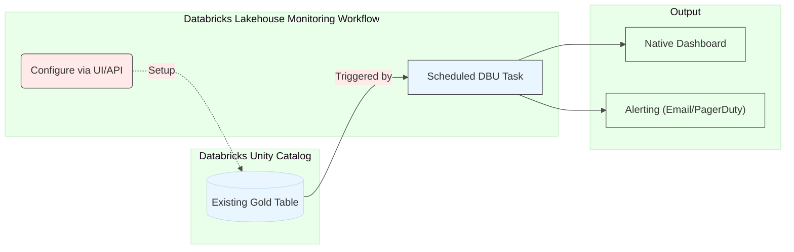
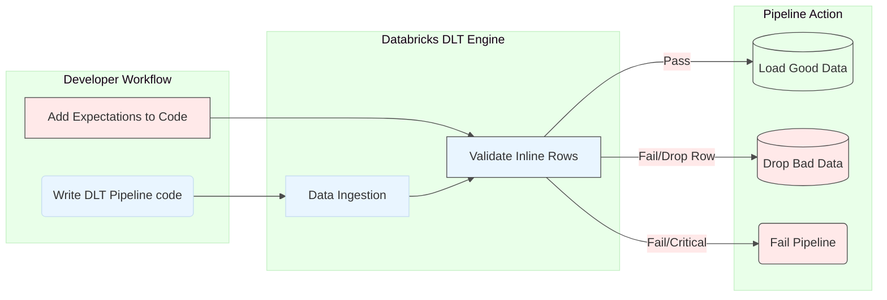
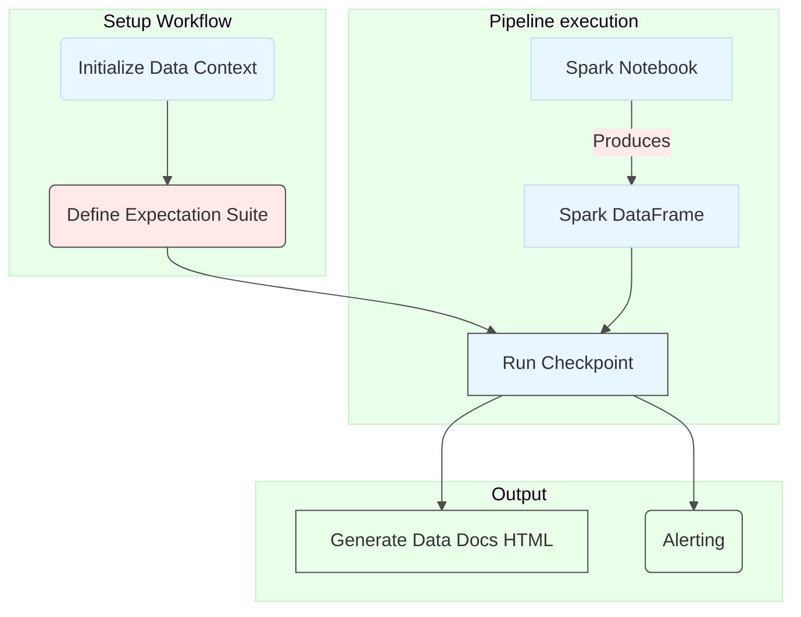
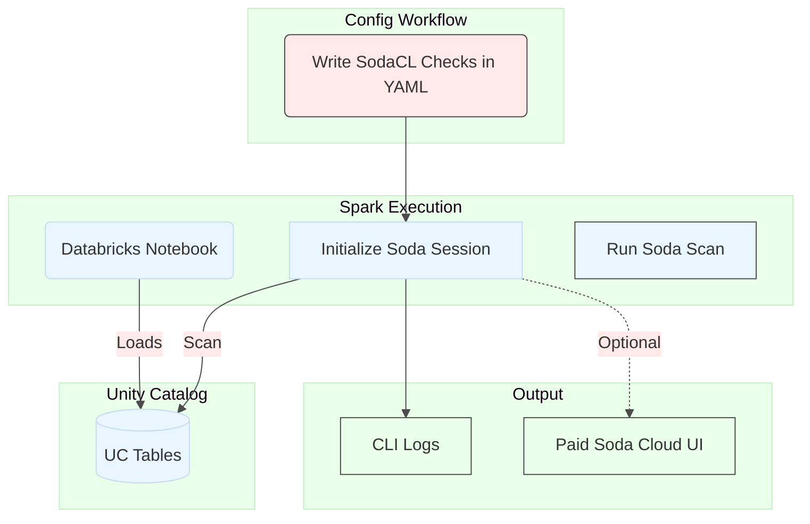
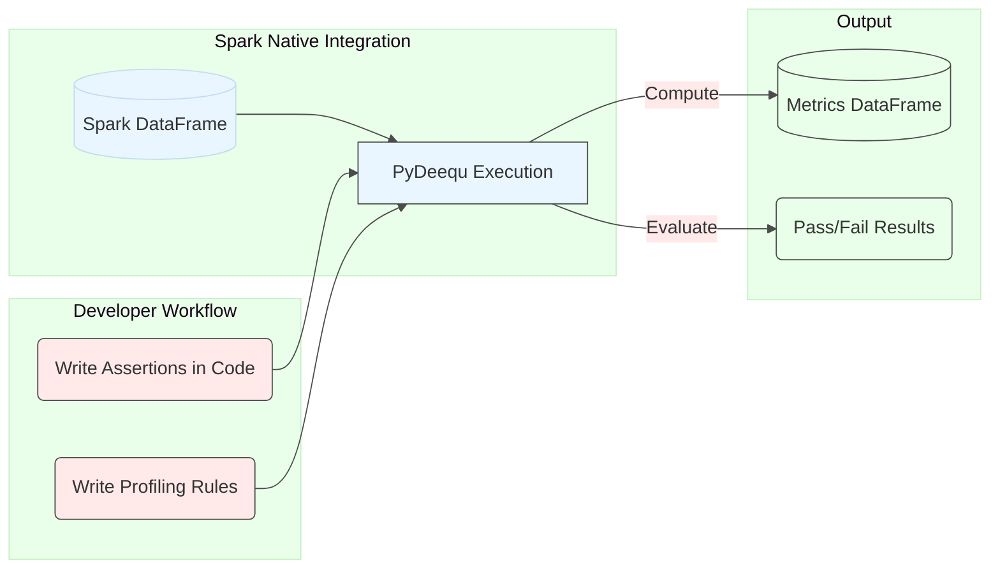
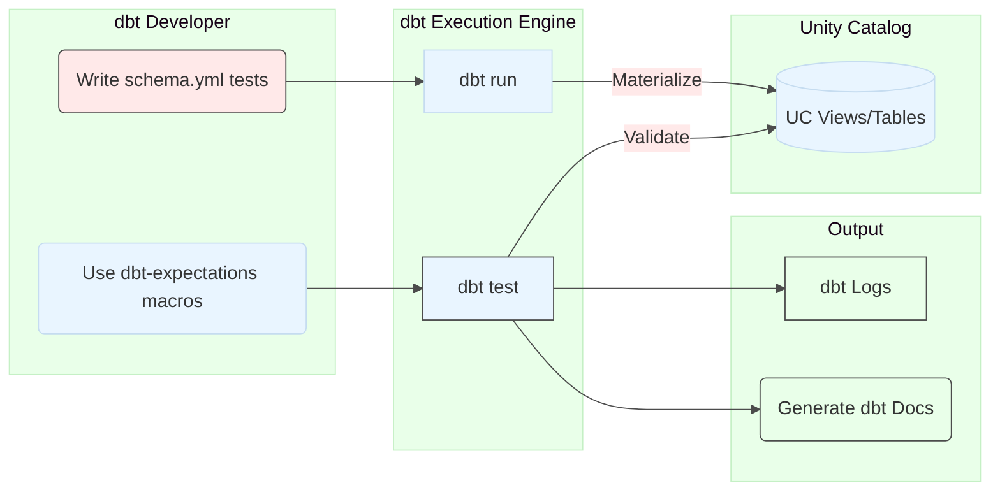
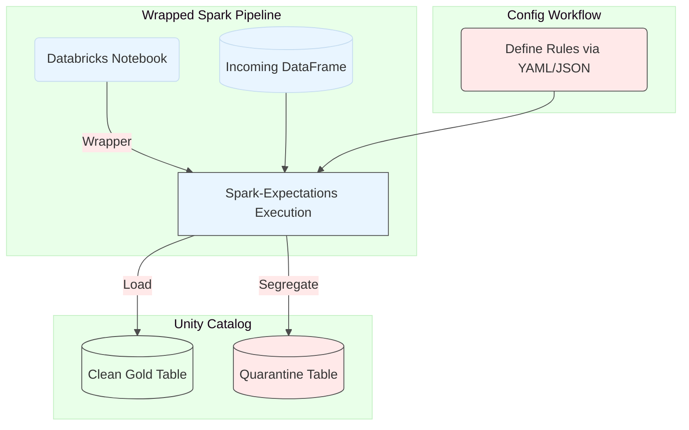
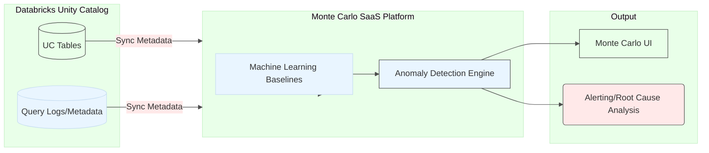

# Data Quality Frameworks — Competitive Analysis

## 1. Executive Deep-Dive: Competitive Analysis Matrix

This table compares frameworks on granular criteria relevant to an established Databricks environment.

| Criteria | Databricks Lakehouse Monitoring | Delta Live Tables (DLT) Expectations | Great Expectations (GX Core) | Soda Core | PyDeequ | dbt Core + dbt-expectations | Nike Spark-Expectations | Monte Carlo |
| --- | --- | --- | --- | --- | --- | --- | --- | --- |
| **Framework Type** | Native Databricks | Native Databricks (DLT specific) | Open Source (Python Lib) | Open Source (Python Lib + YAML) | Open Source (Java/Scala/Python Lib) | Open Source (CLI + YAML) | Open Source (Python Lib) | Commercial (SaaS + Agent) |
| **Code Change Required for Existing Pipelines** | None | High (requires full rewrite of pipelines to DLT) | Moderate (explicit injection into notebooks) | Moderate (explicit injection into notebooks) | Moderate (explicit injection into notebooks) | High (requires adoption of dbt transformation layer) | Moderate (wrap Spark reads/writes) | None (SaaS integration) |
| **Validation Flow (How are tests written?)** | Metadata configuration / UI | Python/SQL inline decorators | Python Code (Expectations) | YAML syntax (SodaCL) | Scala/Python Code | YAML (macros/contracts) | YAML/JSON configurations | Automated ML (Zero-code) |
| **Integration Style** | Native / Metadata | Native / Internal DLT Engine | External Library | External Library | Native Spark Application | External Adapter | Wrapped Spark Session | API/Metadata Sync |
| **Unity Catalog (UC) Compatibility** | Exceptional (Tightly coupled) | Exceptional (Primary target) | Strong | Strong | Strong | Strong (via Adapter) | Strong | Exceptional |
| **Execution Model** | Asynchronous (Runs after data lands) | Inline (Active enforcement) | Inline (Active enforcement) | Flexible (In-line or post-run) | Inline (Active enforcement) | Post-run (Validates target view) | Inline (Row-level quarantining) | Asynchronous (Runs after data lands) |
| **Quality Posture (Reactive vs. Proactive)** | 🔭 **Reactive** — DQ runs *after* data lands in the table, never before | 🛡️ **Proactive** — validates inline, *before* the row is written | 🛡️ **Proactive** — validation-as-code gates the load | ⚖️ **Hybrid** — proactive if run in-line, reactive if run post-run | 🛡️ **Proactive** — inline assertions halt the job before bad data persists | 🔭 **Reactive** — tests run *after* the model is materialized to the target | 🛡️ **Proactive** — row-level quarantine diverts bad rows before they load | 🔭 **Reactive** — scans metadata *after* data lands and propagates |
| **Cost of This Posture** | Bad data is already in Bronze/Silver/Gold and consumable downstream; you get a **human-review** safety net but must remediate via backfill/cleanup. | Bad data **never loads** (drop/fail); you rely heavily on **automation** and risk pipeline halts / false positives blocking good data. | Load is gated by code; you rely on **automation** to act on failures, and misconfigured suites can block otherwise-good data. | Cost follows placement: in-line = automation reliance (data doesn't load); post-run = bad data lands first for human review. | Job stops on failed assertions; you depend on **automation** and there is no built-in human-review path for blocked data. | Model is already materialized to UC before tests run, so failing data is **visible/consumable** until the model is rebuilt. | Clean data loads while bad rows auto-route to a quarantine table; relies on **automation** plus monitoring of the quarantine table for human review. | Anomalies are flagged *after* data lands and may already be consumed; alerts drive **human** root-cause and remediation. |
| **Key Validation Level** | Column Stats, Data Drift | Row-level, Schema, Cardinality | Column, Schema, Aggregate, Custom | Column, Cross-table, Aggregate | Aggregate, Cardinality, Stats | Column, Schema, Referential | Row-level | Anomaly, Volume, Schema, Freshness, Lineage |
| **Reporting / UI** | Native Databricks Dashboards | Native DLT Pipeline UI | Exceptional HTML "Data Docs" | CLI Output (Paid Cloud UI) | Metrics JSON/Text only | CLI Output (or dbt docs UI) | Textual reports | Exceptional full enterprise UI |
| **Performance at Scale** | High (Built by Databricks) | High (Native optimization) | Moderate (can bottle-neck depending on execution) | Good | Exceptional (Scales with Spark) | Good | Good | N/A (runs on MC infrastructure) |
| **Major Disadvantage** 🔴 | 🔴 Fail-open only. Cannot block pipeline. | 🔴 Limited to DLT framework. Cannot use with vanilla jobs. | 🔴 Steep learning curve; verbose setup. | 🔴 Advanced features (anomalies) locked behind paid version. | 🔴 Poor reporting layer. Code-heavy. | 🔴 Dependent on dbt. Cannot run independently of dbt models. | 🔴 Lacks broad community support; complex config. | 🔴 Significant cost. Not open source. |
| **Niche Superpower (Where it Shines)** 🟢 | 🟢 Instantly observe existing data health with zero effort. | 🟢 Hard-stop enforcement of rules during pipeline execution. | 🟢 Automatically generating data contracts and documentation for stakeholders. | 🟢 Writing DQ tests in a highly readable, low-code syntax (YAML). | 🟢 Calculating complex statistics on multi-petabyte datasets with maximal Spark efficiency. | 🟢 Integrating DQ directly into the transformation layer of dbt-driven data warehouses. | 🟢 Handling row-level data errors through automated quarantining. | 🟢 Providing hands-off, total data observability and lineage through automated ML. |

### 1.1. Cost Dimension: Reactive vs. Proactive

Posture is not just a design choice — it determines *where* and *when* you pay. Reactive frameworks are cheaper to stand up but defer cost downstream, where it compounds; proactive frameworks front-load cost into every pipeline run but contain the blast radius of bad data.

| Cost Component | 🔭 Reactive (runs after data lands) | 🛡️ Proactive (runs before data loads) | Higher in general |
| --- | --- | --- | --- |
| **Upfront engineering / setup** | Low — often zero-code or metadata-only | High — must wire validation + automated actions into every pipeline | Proactive |
| **Per-run compute overhead** | Low — scan is decoupled / scheduled separately | High — validation executes on every load | Proactive |
| **Storage cost** | Higher — bad data is persisted into Bronze/Silver/Gold | Lower — bad data is dropped or quarantined, not fully loaded | Reactive |
| **Remediation / rework** (backfill, cleanup, reprocessing) | High — bad data must be found, fixed, and reloaded | Low — bad data never propagated | Reactive |
| **Downstream blast radius** (bad data consumed by reports/ML/consumers) | High — failures surface only after consumption | Low — contained at the gate | Reactive |
| **Operational risk** (pipeline halts, false positives blocking good data) | Low — pipelines keep running (fail-open) | High — a bad rule can stop production loads | Proactive |
| **Human-review burden** | High — relies on people to catch and triage | Low — relies on automation to act | Reactive |
| **Total Cost of Ownership (TCO)** | **Higher overall** — cost is deferred and compounds with every downstream consumer of bad data | **Lower overall** — cost is paid upfront and prevents propagation | **Reactive is higher** |

**Bottom line:** Reactive is *cheaper to start, more expensive to live with*. Its low setup cost is offset by storage of bad data, expensive backfills, and a large downstream blast radius — so its **total cost is generally higher**, with the gap widening as more consumers depend on the data. Proactive carries higher upfront and per-run cost (engineering effort, validation compute, and the operational risk of false positives halting pipelines), but it caps the cost of failure by stopping bad data at the gate. As data volume and the number of downstream consumers grow, proactive (or hybrid) approaches typically win on TCO.

## 2. Detailed Analysis of Frameworks

### 2.1. Databricks Lakehouse Monitoring (Native)

Databricks Lakehouse Monitoring automatically profiles and monitors data quality and drift for your Unity Catalog tables. It operates outside your execution pipelines, scanning the data as it lands.

**Pros:**

- **Zero-Code implementation:** You can enable this directly via the Unity Catalog UI or API for any table. It requires no modifications to your 2-year-old codebase.
- **Native Integration:** Deepest integration with Databricks Unity Catalog, using the best underlying Databricks engines for profiling.
- **Automatic Drift Detection:** It automatically compares data over time and can alert you to statistical shifts in critical columns (e.g., if a column suddenly becomes 90% NULL when it was previously 10%).

**Cons:**

- **Fail-Open:** This is a purely "observability" framework. It does not stop pipelines from running or bad data from loading into critical tables.
- **SQL/API Focus:** Custom metrics require writing SQL, rather than intuitive Python definitions.

**Sample Syntax** — provision a time-series monitor with a custom metric and slicing, via the Databricks SDK:

```python
from databricks.sdk import WorkspaceClient
from databricks.sdk.service.catalog import (
    MonitorTimeSeries,
    MonitorMetric,
    MonitorMetricType,
    MonitorCronSchedule,
)

w = WorkspaceClient()

w.quality_monitors.create(
    table_name="prod.sales.fct_orders",
    output_schema_name="prod.monitoring",
    assets_dir="/Workspace/Shared/lhm/fct_orders",
    time_series=MonitorTimeSeries(timestamp_col="order_ts", granularities=["1 day"]),
    slicing_exprs=["region", "channel"],          # per-segment drift & stats
    custom_metrics=[
        MonitorMetric(
            type=MonitorMetricType.CUSTOM_METRIC_TYPE_AGGREGATE,
            name="pct_negative_amount",
            input_columns=["amount"],
            definition="100.0 * sum(case when amount < 0 then 1 else 0 end) / count(*)",
            output_data_type="DOUBLE",
        )
    ],
    schedule=MonitorCronSchedule(quartz_cron_expression="0 0 6 * * ?", timezone_id="UTC"),
)
```

**How to read it:** A single `create` call attaches a monitor to an *existing* table (`prod.sales.fct_orders`) — the table itself is never modified. `output_schema_name` is where Databricks writes the generated profile and drift metric tables; `assets_dir` is where it stores the auto-generated dashboard. `time_series` tells it to bucket metrics by day using the `order_ts` column (so it can compare today vs. history). `slicing_exprs` computes every metric separately per `region` and `channel`, so drift can be caught in one segment even if the overall table looks healthy. `custom_metrics` injects your own SQL aggregate (here, the % of negative amounts), and `schedule` runs the whole thing asynchronously every day at 06:00.

**Features demonstrated:**

- **Zero-touch attachment** — monitoring added via API against a live table, no pipeline/code change.
- **Time-series profiling** with explicit granularity for historical comparison.
- **Segmentation** via `slicing_exprs` (per-region / per-channel metrics).
- **Custom SQL metrics** layered on top of the built-in profile.
- **Scheduled, asynchronous execution** (the reactive posture) producing metric tables + a native dashboard.



### 2.2. Delta Live Tables (DLT) Expectations (Native)

DLT is a declarative framework for building data pipelines. "Expectations" are the DQ rules embedded within that pipeline definition.

**Pros:**

- **Active Enforcement:** Unlike Lakehouse Monitoring, DLT can actively block or discard data. You can choose to `EXPECT` (warn), `EXPECT OR DROP ROW`, or `EXPECT OR FAIL` the entire pipeline.
- **Performance:** DLT handles data flow optimizations natively.
- **UI Insight:** The DLT pipeline UI provides an immediate, granular look at DQ pass/fail counts at the table level.

**Cons:**

- **Total Rewrite Required:** You cannot use this in your existing notebooks. You must completely refactor your legacy ingestion pipelines into the Delta Live Tables framework. This is a massive impediment for 2-year-old projects.
- **Limited Scope:** It can only validate data during a DLT execution.

**Sample Syntax** — a declarative contract with mixed enforcement levels (warn / drop / fail):

```python
import dlt
from pyspark.sql import functions as F

VALID_ORDER = {
    "valid_id": "order_id IS NOT NULL",
    "positive_amount": "amount > 0",
    "known_currency": "currency IN ('USD', 'EUR', 'GBP')",
}

@dlt.table(name="silver_orders", table_properties={"quality": "silver"})
@dlt.expect_all(VALID_ORDER)                                       # track + warn, keep rows
@dlt.expect_all_or_drop({"fresh": "order_ts > current_date() - INTERVAL 7 DAYS"})
def silver_orders():
    return (
        dlt.read_stream("bronze_orders")
        .withColumn("amount", F.col("amount").cast("decimal(18,2)"))
    )

@dlt.table(name="gold_orders")
@dlt.expect_or_fail("pk_present", "order_id IS NOT NULL")          # hard-stop the pipeline
def gold_orders():
    return dlt.read("silver_orders").dropDuplicates(["order_id"])
```

**How to read it:** Each table is a Python function that *returns* a DataFrame; DLT figures out the dependency graph between them. `VALID_ORDER` is a dictionary of named rules, each a boolean SQL expression. The decorators stack different enforcement levels on the same table: `@dlt.expect_all` records pass/fail counts but **keeps** failing rows (warn-only); `@dlt.expect_all_or_drop` silently **drops** rows older than 7 days; and on the gold table, `@dlt.expect_or_fail` **aborts the entire pipeline run** if a null `order_id` ever appears. `dlt.read_stream` consumes Bronze incrementally, the `cast` is an inline transformation, and `dlt.read` (batch) feeds the gold dedupe.

**Features demonstrated:**

- **Declarative pipeline definition** — tables as decorated functions, dependencies inferred.
- **Three enforcement tiers** on real data: warn (`expect_all`), drop (`expect_all_or_drop`), fail (`expect_or_fail`).
- **Named, reusable rule sets** expressed as plain SQL predicates.
- **Streaming + batch reads** and inline transformation within the same framework.
- **Medallion layering** (Bronze → Silver → Gold) with DQ enforced at each hop; counts surface in the DLT UI.



### 2.3. Great Expectations (GX Core) (Open Source)

The industry leader for "validation-as-code." You express tests in Python, which GX compiles into optimized Spark execution plans.

**Pros:**

- **Expressiveness:** Offers hundreds of pre-built "expectations" and a powerful API for writing complex custom validations.
- **Data Docs:** Automatically generates clean HTML documentation detailing exactly what tests were run and where data passed or failed. This is the ultimate "living documentation" of your data assets.
- **Extensibility:** Strong ecosystem of plugins.

**Cons:**

- **Steep Learning Curve:** GX is developer-heavy. The initial setup requires understanding its abstraction layers (Data Contexts, Checkpoints, Suites).
- **Requires Code Modification:** You will need to inject GX validation logic into your existing Python notebooks.

**Sample Syntax** — GX Core 1.x Fluent API: register a Spark DataFrame, build a suite, run a validation definition, and gate the pipeline:

```python
import great_expectations as gx
from great_expectations import expectations as gxe

context = gx.get_context(mode="file")

batch_def = (
    context.data_sources.add_spark("spark_ds")
    .add_dataframe_asset("orders")
    .add_batch_definition_whole_dataframe("batch")
)

suite = context.suites.add(gx.ExpectationSuite(name="orders_contract"))
suite.add_expectation(gxe.ExpectColumnValuesToNotBeNull(column="order_id"))
suite.add_expectation(gxe.ExpectColumnValuesToBeBetween(column="amount", min_value=0, strict_min=True))
suite.add_expectation(gxe.ExpectColumnValuesToBeInSet(column="currency", value_set=["USD", "EUR", "GBP"]))

validation_def = context.validation_definitions.add(
    gx.ValidationDefinition(data=batch_def, suite=suite, name="orders_vd")
)

result = validation_def.run(batch_parameters={"dataframe": orders_df})
context.build_data_docs()                         # publish the HTML "Data Docs"
if not result.success:
    raise ValueError("Data contract violated — see Data Docs for failing expectations")
```

**How to read it:** `get_context(mode="file")` loads/persists GX config on disk so suites and results are reusable across runs. The chained `data_sources → asset → batch_definition` builds a *batch definition* — a reusable pointer to "a whole Spark DataFrame" whose actual data is supplied later. The `suite` is a named bundle of expectations (each `gxe.*` is one typed, parameterized rule). A `ValidationDefinition` marries one batch definition to one suite; calling `.run(...)` feeds the live `orders_df` in via `batch_parameters` and validates it. `build_data_docs()` renders the HTML report, and the `if not result.success` check turns the validation into a hard gate.

**Features demonstrated:**

- **Fluent (GX 1.x) API** with a Spark datasource — no SQL round-trips.
- **Separation of *what* from *when*** — batch definitions and suites are defined once, run against runtime DataFrames.
- **Typed, parameterized expectations** (null, range, set membership) from the large built-in library.
- **Data Docs** auto-generated HTML as living documentation.
- **Programmatic gating** — raise on failure to block downstream steps.



### 2.4. Soda Core (Open Source)

Soda Core is a lightweight, SQL-focused data quality tool that uses a simple declarative YAML configuration syntax called SodaCL.

**Pros:**

- **YAML Simplicity:** Highly readable and accessible to data analysts, not just data engineers. Tests like `row_count > 0` or `duplicate_count(user_id) = 0` are trivial to write.
- **Cross-table Checks:** Excels at comparative validations (e.g., ensure `count(gold)` matches `count(silver)`).
- **Fast Integration:** It is easier to inject a Soda Core scan into an existing notebook than it is to configure Great Expectations.

**Cons:**

- **Passive Core Offering:** Similar to GX Core, it validates but does not natively handle row-level filtering.
- **Anomaly detection:** Advanced features like anomaly detection require a paid Soda Cloud license.

**Sample Syntax** — declarative SodaCL checks (incl. a failed-rows query and cross-table referential check), then a programmatic scan that gates the job:

```yaml
# checks/orders.yml
checks for orders:
  - row_count > 0
  - missing_count(order_id) = 0
  - duplicate_count(order_id) = 0
  - invalid_percent(currency) < 1:
      valid values: [USD, EUR, GBP]
  - failed rows:
      name: Negative order amounts
      fail query: |
        SELECT order_id, amount FROM orders WHERE amount <= 0
  - values in (customer_id) must exist in dim_customers (customer_id)
```

```python
from soda.scan import Scan

spark.read.table("prod.sales.silver_orders").createOrReplaceTempView("orders")

scan = Scan()
scan.set_scan_definition_name("orders_silver")
scan.set_data_source_name("spark_df")
scan.add_spark_session(spark, data_source_name="spark_df")
scan.add_sodacl_yaml_file("checks/orders.yml")

scan.execute()
scan.assert_no_checks_fail()      # raises on any failed check → use for pipeline gating
```

**How to read it:** The YAML is the whole test definition — `checks for orders` targets a dataset called `orders`. The first lines use built-in metrics (`row_count`, `missing_count`, `duplicate_count`). `invalid_percent(currency) < 1` with a `valid values` list says "fewer than 1% of currency values may fall outside this set." The `failed rows` block runs an arbitrary SQL query and surfaces the *actual offending rows* for debugging, not just a count. The last line is a cross-table referential check (every `customer_id` must exist in `dim_customers`). On the Python side, the DataFrame is registered as a temp view named `orders` (matching the YAML), the `Scan` is wired to the Spark session, the YAML is loaded, and `assert_no_checks_fail()` raises to gate the pipeline.

**Features demonstrated:**

- **Low-code SodaCL** — analyst-readable checks, no Python required to author them.
- **Built-in metrics** (row count, missing, duplicate) and **threshold checks** with `valid values`.
- **Custom failed-rows SQL** that returns the bad records themselves.
- **Cross-table reconciliation / referential integrity.**
- **Programmatic Spark scan** with explicit gating (`assert_no_checks_fail`).



### 2.5. PyDeequ (Open Source)

The Python implementation of Deequ, which Amazon uses internally. It calculates data quality metrics by integrating directly into the Spark query optimization engine.

**Pros:**

- **Performance:** Unmatched speed at extreme scales. It doesn't run sequential SQL queries; instead, it uses the Spark Catalyst optimizer to generate highly optimized, distributed metric calculations in one pass.
- **Native Spark integration:** Written primarily in Scala with a Python API, making it feel very native within Databricks.

**Cons:**

- **Code-First:** No YAML or declarative syntax. Writing Deequ assertions requires writing significant code.
- **Poor Reporting:** It is focused on computing metrics, not visualizing them. You must process the resulting JSON/DataFrame yourself to create reports.

**Sample Syntax** — a `VerificationSuite` of constraints compiled into a single optimized Spark pass, with results materialized as a DataFrame:

```python
from pydeequ.checks import Check, CheckLevel
from pydeequ.verification import VerificationSuite, VerificationResult

check = (
    Check(spark, CheckLevel.Error, "Orders integrity")
    .hasSize(lambda s: s > 0)
    .isComplete("order_id")
    .isUnique("order_id")
    .isContainedIn("currency", ["USD", "EUR", "GBP"])
    .isNonNegative("amount")
    .satisfies("amount < 1000000", "amount_within_bounds", lambda frac: frac >= 0.99)
)

result = VerificationSuite(spark).onData(orders_df).addCheck(check).run()

VerificationResult.checkResultsAsDataFrame(spark, result).show(truncate=False)
if result.status != "Success":
    raise ValueError("PyDeequ verification failed")
```

**How to read it:** A `Check` is a group of constraints at a severity (`CheckLevel.Error`). The methods chain to express, in order: the table must be non-empty (`hasSize`), `order_id` must be fully populated (`isComplete`) and unique (`isUnique`), `currency` must be one of an allowed set (`isContainedIn`), and `amount` must be non-negative. `satisfies` is the powerful one — an arbitrary SQL predicate plus a *tolerance fraction*: here at least 99% of rows must have `amount < 1000000`. `.onData(orders_df).run()` compiles all of these into a **single** distributed Spark job (rather than one query per rule). `checkResultsAsDataFrame` converts the outcome into a DataFrame you can persist or display, and `result.status` drives the gate.

**Features demonstrated:**

- **Fluent constraint builder** with severity levels (Error vs. Warning).
- **Single-pass, Catalyst-optimized execution** — all metrics computed in one scan (the scale advantage).
- **Completeness, uniqueness, set-membership, and range** constraints out of the box.
- **Custom predicate with a tolerance fraction** (`satisfies`) for "must hold for ≥ N%".
- **Results as a DataFrame** — you build the reporting layer yourself.



### 2.6. dbt Core + dbt-expectations (Open Source)

dbt (Data Build Tool) is the market leader for modeling data inside modern data warehouses. Its native testing ecosystem allows you to add assertions via YAML.

**Pros:**

- **Workflow Integration:** If your pipelines are already built using dbt, adding tests is trivial. Adding `unique` or `not_null` constraints requires minimal configuration.
- **YAML-based:** Similar to Soda, tests are readable configuration files.
- **Referential Integrity:** Excels at validating relationships across many tables.

**Cons:**

- **dbt Dependency:** Only useful if your pipeline architecture already revolves around dbt transformation models. It cannot validate data that is not managed within a dbt project.

**Sample Syntax** — column-, relationship-, and table-level tests declared in `schema.yml`, mixing native dbt tests with `dbt-expectations` macros:

```yaml
# models/marts/schema.yml
version: 2

models:
  - name: fct_orders
    description: "Order fact table"
    columns:
      - name: order_id
        tests: [unique, not_null]
      - name: amount
        tests:
          - dbt_expectations.expect_column_values_to_be_between:
              min_value: 0
              strict_min: true
          - dbt_expectations.expect_column_values_to_be_of_type:
              column_type: decimal
      - name: currency
        tests:
          - accepted_values:
              values: ['USD', 'EUR', 'GBP']
      - name: customer_id
        tests:
          - relationships:                     # referential integrity to a dimension
              to: ref('dim_customers')
              field: customer_id
    tests:
      - dbt_expectations.expect_compound_columns_to_be_unique:
          column_list: ["order_id", "line_number"]
```

**How to read it:** This is pure configuration attached to an existing dbt model (`fct_orders`) — no procedural code. Under each column, `tests:` lists assertions. `unique` and `not_null` are dbt's built-in generic tests. The `dbt_expectations.*` entries are macros from the add-on package that bring GX-style richness (value ranges, type checks). `accepted_values` constrains `currency` to a fixed set. `relationships` is the referential-integrity test: every `customer_id` must resolve to a `customer_id` in the `dim_customers` model (`ref()` makes it dependency-aware). The model-level `tests:` block applies across columns — here a compound uniqueness check on `(order_id, line_number)`. Running `dbt test` executes all of these as SQL against the already-materialized tables.

**Features demonstrated:**

- **Declarative, version-controlled tests** living beside the model definition.
- **Native generic tests** (`unique`, `not_null`, `accepted_values`).
- **`dbt-expectations` macros** for richer column/type/range assertions.
- **Referential integrity** via `relationships` + `ref()` (lineage-aware).
- **Both column-level and model-level (compound) tests**, executed by `dbt test`.



### 2.7. Nike Spark-Expectations (Open Source)

A specialized framework open-sourced by Nike that addresses a common pain point: row-level error handling.

**Pros:**

- **Built-in Quarantining:** When validation fails, Spark-Expectations can automatically segment the bad rows and write them to a separate "quarantine" Delta table, allowing only clean data to load into the gold table.
- **Data Integrity:** It provides the mechanism for active enforcement that GX/Soda Core often require manual coding to implement.

**Cons:**

- **Community:** Smaller community and less detailed documentation compared to Soda or GX.
- **Config Overload:** Setting up the configurations for quarantining and reporting can be complex.

**Sample Syntax** — rules live in a Delta registry (one row per check); the `@with_expectations` decorator wraps the load and auto-quarantines failing rows:

```sql
-- Rule registry: row_dq drops/fails individual rows, agg_dq validates the batch
INSERT INTO dq.rules
  (product_id, table_name, rule_type, rule, column_name, expectation, action_if_failed, tag)
VALUES
  ('sales','silver_orders','row_dq','amount_positive','amount','amount > 0','drop','validity'),
  ('sales','silver_orders','row_dq','id_not_null','order_id','order_id IS NOT NULL','fail','completeness'),
  ('sales','silver_orders','agg_dq','min_volume',NULL,'count(*) > 0','fail','volume');
```

```python
from spark_expectations.core.expectations import SparkExpectations, WrappedDataFrameWriter
from spark_expectations.config.user_config import Constants as user_config

writer = WrappedDataFrameWriter().mode("append").format("delta")

se = SparkExpectations(
    product_id="sales",
    rules_df=spark.table("dq.rules"),
    stats_table="dq.dq_stats",
    stats_streaming_options={user_config.se_enable_streaming: False},
)

@se.with_expectations(
    target_table="prod.sales.silver_orders",
    write_to_table=True,
    user_conf={
        user_config.se_notifications_on_fail: True,
        user_config.se_notifications_on_error_drop_threshold: 15,   # alert if >15% dropped
    },
)
def load_orders():
    return spark.read.table("prod.sales.bronze_orders")

load_orders()      # clean rows land in silver_orders; failures routed to *_error table
```

**How to read it:** Rules are *data*, not code — each row in the `dq.rules` Delta table is one check. `rule_type` distinguishes `row_dq` (evaluated per row) from `agg_dq` (evaluated over the whole batch). `action_if_failed` decides the consequence per rule: `drop` removes the offending rows, `fail` aborts the load. On the Python side, `SparkExpectations` is initialized once with a pointer to that rules table plus a `stats_table` for run metrics. The `@with_expectations` decorator then *wraps* an ordinary function that returns a DataFrame: when `load_orders()` is called, clean rows are written to `prod.sales.silver_orders` while dropped rows are automatically diverted to a companion `*_error` (quarantine) table. `user_conf` enables failure notifications and raises an alert if more than 15% of rows get dropped.

**Features demonstrated:**

- **Rules-as-data** in a Delta registry — checks managed/audited without code deploys.
- **Row-level vs. aggregate** rules (`row_dq` / `agg_dq`).
- **Per-rule actions** (`drop` / `ignore` / `fail`).
- **Automatic quarantine** of bad rows to an error table (the proactive, row-level superpower).
- **Stats table + threshold-based notifications**, wrapped around an existing load with one decorator.



### 2.8. Monte Carlo (Commercial)

Monte Carlo is the premiere commercial "Data Observability" platform. It provides end-to-end lineage and anomaly detection by scanning metadata, query logs, and data assets.

**Pros:**

- **Zero-code ML:** It connects to Unity Catalog and uses machine learning to automatically establish baselines and detect volume anomalies, schema changes, and freshness delays without you writing a single test.
- **Full End-to-End Lineage:** Maps out exactly how your data moves and transforms across notebooks, jobs, and tables in UC.

**Cons:**

- **Cost:** High enterprise SaaS pricing.
- **Dependency:** This is a SaaS solution, not a tool you control completely within your environment.

**Sample Syntax** — most coverage is auto-generated by ML, but teams codify custom checks as "Monitors-as-Code" YAML (applied via the `montecarlo` CLI), supplementing it with the `pycarlo` SDK for programmatic access:

```yaml
# montecarlo.yml  →  montecarlo monitors apply --namespace sales
montecarlo:
  field_health:                      # ML-baselined health on specific fields
    - table: prod:sales.silver_orders
      timestamp_field: order_ts
      fields: [amount, currency]
      schedule:
        type: fixed
        interval_minutes: 720
  custom_sql:                        # explicit rule with a hard threshold
    - name: orders_no_negative_amounts
      sql: |
        SELECT COUNT(*) AS breaches
        FROM prod.sales.silver_orders
        WHERE amount < 0
      comparisons:
        - type: threshold
          operator: GT
          threshold_value: 0
      schedule:
        type: fixed
        interval_minutes: 60
```

```python
# Programmatic access / CI gating via the pycarlo SDK (GraphQL)
from pycarlo.core import Client, Query, Session

client = Client(session=Session())          # reads MCD_DEFAULT_API_ID / MCD_DEFAULT_API_TOKEN
query = Query()
query.get_table(dwId="<warehouse-id>", fullTableId="prod:sales.silver_orders").__fields__(
    "full_table_id", "is_deleted", "freshness_anomaly"
)
print(client(query))
```

**How to read it:** The YAML is "Monitors-as-Code" applied with the `montecarlo` CLI, so observability config is version-controlled like any other artifact. `field_health` points Monte Carlo at specific fields and lets its **ML establish baselines automatically** — you declare *what* to watch, not the thresholds. `custom_sql` is the escape hatch for explicit business rules: it runs your query and compares the result against a hard threshold (here, any negative amount is a breach). Both have `schedule` blocks because everything runs asynchronously against the warehouse. The Python `pycarlo` snippet shows programmatic access via the GraphQL API: a `Client` authenticated from environment credentials issues a typed `Query` for table metadata, including ML-derived attributes like `freshness_anomaly` — useful for wiring Monte Carlo state into CI or custom dashboards.

**Features demonstrated:**

- **ML-baselined field health** — anomaly detection with zero thresholds authored by hand.
- **Monitors-as-Code** — declarative, version-controlled monitor definitions.
- **Custom SQL rules** with explicit threshold comparisons for business logic.
- **Scheduling** of asynchronous, metadata-driven scans.
- **Programmatic GraphQL access** (`pycarlo`) exposing anomaly/freshness/lineage metadata.


