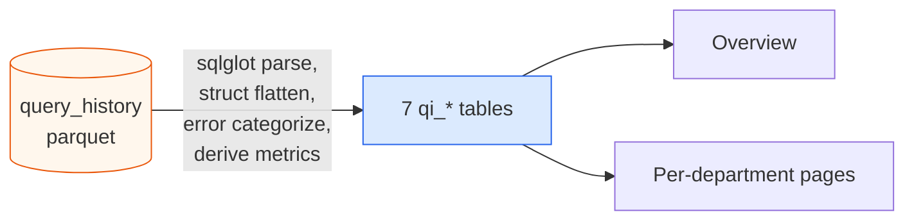

# Databricks Billing & Observability — User Guide

A self-hosted analytics + observability layer over the full Databricks
system-tables surface — billing, compute, query history, Unity Catalog
metadata, lineage, audit, and node-pool telemetry — plus an LLM
chatbot, an admin SQL console, and view-mode-isolated demo data so
non-Databricks customers can explore the platform safely. It exists so
finance, platform, and data-product teams can answer the same cost,
performance, governance, and adoption questions from the same numbers,
without each team writing their own SQL.

---

## Table of contents

1. [What the app does](#what-the-app-does)
2. [Signing in](#signing-in)
3. [Navigation overview](#navigation-overview)
4. [Pages and use cases](#pages-and-use-cases)
   - [Dashboard](#dashboard)
   - [Cost Explorer](#cost-explorer)
   - [User Footprint](#user-footprint)
   - [Trends & Forecast](#trends--forecast)
   - [Compute Resources](#compute-resources)
   - [Advanced Analytics](#advanced-analytics)
   - [Query Profiler](#query-intel)
   - [Chatbot](#chatbot)
   - [Data Management](#data-management)
   - [Database Explorer](#database-explorer)
   - [Admin: Users & Roles](#admin-users--roles)
5. [Themes](#themes)
6. [Data exports](#data-exports)
7. [Common workflows](#common-workflows)

---

## What the app does

In one sentence: it extracts every Databricks system table relevant to
cost / performance / governance / audit / compute telemetry into
Postgres, exposes them through a FastAPI backend, and renders
dashboards, scenario analytics, an LLM chatbot, and admin tooling in a
React UI.

**Tables in scope** — every row is tagged `data_origin = 'real'` or
`'demo'` so the same UI works against either partition cleanly:

| Group | Postgres table(s) | Source | Powers |
|---|---|---|---|
| Billing | `billing_usage`, `list_prices` | `system.billing.*` | Billing Explorer + Cost Explorer + User Footprint + Trends + SKU & Billing Origin + Advanced Analytics |
| Compute (catalogue) | `clusters`, `warehouses`, `jobs`, `workspaces` | `system.compute.*`, `system.lakeflow.*`, `system.access.workspaces_latest` | Compute Resources page + workspace name lookups |
| Query history | `query_history` | `system.query.history` | Verbatim SQL audit trail; source for the Query Profiler ETL |
| Query Profiler (derived) | `qi_statements`, `qi_statement_tables`, `qi_statement_columns`, `qi_statement_tags`, `qi_statement_parameters`, `qi_statement_errors` | sqlglot ETL over `query_history` | Query Profiler dashboards (10 departmental sub-pages) |
| Unity Catalog metadata | `databricks_meta` | per-catalog `INFORMATION_SCHEMA` crawl | Meta Explorer overview (catalog → schema → table → column browser + bulk export) |
| Lineage | `table_lineage`, `column_lineage`, `lineage_rollups` *(derived)* | `system.access.table_lineage` / `column_lineage` | Lineage — Tables + Lineage — Columns dashboards |
| Audit | `audit_events`, `assistant_events` | `system.access.audit` / `assistant_events` | Meta Explorer → Audit dashboard |
| Node Pool / compute telemetry | `node_timeline`, `warehouse_events`, `node_types`, `instance_events`, `instance_pools` | `system.compute.node_timeline` / `warehouse_events` / `node_types` / `node_events` / `instance_pools` | Meta Explorer → Node Pool dashboard |

**Inputs**: parquet files extracted from Databricks (or live Databricks
extraction via the isolated extractor service), or the built-in demo
seed that synthesises ~30 k rolling-window rows on first boot.

**Outputs**:

- Pre-built dashboards across cost, query performance, lineage, audit,
  compute telemetry, and Unity Catalog browsing
- 10 departmental scenarios over `qi_*` (Platform, Catalog Usage,
  FinOps, Executive, Data Eng, BI, Data Science, Security, DevEx,
  Cross-cutting)
- Natural-language SQL chatbot that runs against either DuckDB
  (Postgres-backed) or Spark (Delta-backed) engine
- Admin Spark SQL Editor over the local spark-warehouse + JDBC-view
  surface
- CSV / Excel exports on every chart and the chatbot result
- View-mode toggle (Real ↔ Demo) so the same UI partitions cleanly

**Auth**: email/password with email verification, plus Google / Microsoft /
GitHub OAuth. Role-based access control: built-in `admin` and `user` roles
plus admin-defined custom roles that constrain *which data* a user can see
**and** which features are unlocked (toggle matrix on the Role editor).

---

## Signing in

The whole app is behind login (`/login`). Three options:

1. **Email + password** — register at `/register`, click the verification
   link in your email, then sign in.
2. **OAuth** — click any of Google / Microsoft / GitHub on the login page.
   Buttons are greyed out for providers your admin hasn't configured.
3. **Bootstrap admin** — if `DEFAULT_ADMIN_EMAIL` and `DEFAULT_ADMIN_PASSWORD`
   are set in the backend `.env`, that account is created on first start
   already-verified and granted the `admin` role.

After login, where you land depends on your role:

- `user` (default): full read-only access to the analytics dashboards.
- `admin`: same, plus **Data Management**, **Database Explorer**, and the
  **Users** / **Roles** pages (all admin-only, grouped under "Admin").
- Any custom role with a data-scope filter (e.g. "finance-readonly" with
  `workspace_ids: ["ws-001","ws-002"]`): you'll only see those workspaces'
  data on **every** page — Dashboard, Cost Explorer, Trends, Compute,
  Analytics, User Footprint. Holding the default `user` role at the same
  time does **not** widen this; a scoped custom role always restricts.

Sign out from the bottom of the sidebar.

---

## Navigation overview

The left sidebar is the only top-level navigation. From top to bottom:

| Page | Path | What it answers |
|---|---|---|
| **Dashboard** | `/` | Landing hub — four big cards link to the four primary surfaces (Billing Explorer, Query Profiler, Meta Explorer, Chatbot). |
| **Billing Explorer** ▼ | `/billing-explorer` | Aggregated cost dashboard (KPIs + four charts). Collapsible — expand to reach the six legacy sub-pages: |
| · Cost Explorer | `/cost-explorer` | Slice spend by any one dimension over a date range. |
| · User Footprint | `/user-footprint` | Spend across users vs SKUs; per-user drill-down. |
| · Trends & Forecast | `/trends` | Cost trend + cost-per-DBU + MoM growth + 30-day forecast. |
| · Compute Resources | `/compute` | Clusters and warehouses inventory + cost. |
| · SKU & Billing Origin | `/sku-origin` | SKU split by billing origin product. |
| · Advanced Analytics | `/analytics` | Anomalies, workspace × product heatmap, utilisation. |
| **Query Profiler** ▼ | `/query-intel` | Analytics over every query in `query_history` — sub-views per department (Platform, FinOps, Executive, Data Eng, BI, Data Science, Security, DevEx, Cross-cutting). |
| **Meta Explorer** ▼ | `/meta-explorer` | Three-pane catalog → tables → columns browser over the Unity Catalog `databricks_meta` snapshot. Bulk CSV / XLSX export. Two lineage sub-pages: |
| · Lineage — Tables | `/meta-explorer/lineage/tables` | Table-grain lineage dashboard (KPI tiles, event class, type breakdowns, top sources/targets/producers, orphans, terminals, direct/indirect filter, depth-1 graph). |
| · Lineage — Columns | `/meta-explorer/lineage/columns` | Column-grain lineage dashboard (most-fanned-out, most-depended-on, tables by column edges, depth-1 column graph). See [`LINEAGE.md`](features_grouped/LINEAGE.md). |
| · Audit | `/meta-explorer/audit` | `system.access.audit` + `system.access.assistant_events` dashboards — KPI tiles, service / audit-level / status-class breakdowns, top actions and users, filterable recent-events table, substring search. See [`AUDIT.md`](features_grouped/AUDIT.md). |
| · Node Pool | `/meta-explorer/node-pool` | `system.compute.*` dashboards: per-minute `node_timeline` utilization, `warehouse_events`, `instance_events` (sourced from `node_events`), plus the `node_types` and `instance_pools` reference catalogs. KPI tiles, event-type / category breakdowns, cluster utilization aggregates, recent-events tables. See [`COMPUTE.md`](features_grouped/COMPUTE.md). |
| Chatbot | `/chatbot` | Ask anything in plain English; get SQL + result. Includes `qi_*` tables in either DuckDB or Spark mode. |
| **Data Management** | `/data` | Extract from Databricks; LOAD (full + incremental); Transform (Query Profiler ETL + lineage rollups); Query Engine picker; Erase Data (**admin only**). |
| **Database Explorer** | `/data/explorer` | Browse Postgres objects + run read-only SQL (**admin only**). |
| **Spark SQL Editor** | `/spark-sql` | Run Spark SQL against the local `data/spark-warehouse/` Delta tables (**admin only**). |
| **Admin · Users** | `/admin/users` | Manage / create users (admin only). |
| **Admin · Roles** | `/admin/roles` | Define custom RBAC roles — data-scope filters **and** the per-role feature matrix (Toggle Features section, collapsed by default) — see [Admin · Roles](#admin--users--roles). |

Top-right of every page: view-mode toggle (real / demo), notifications bell,
theme switcher (6 themes). Each of these is itself a toggleable feature in
the role-builder matrix — admins can hide them per pricing tier.

The two ▼ markers indicate collapsible sidebar groups. Sub-items appear
indented when expanded; the parent auto-expands when you're currently
inside that section.

---

## Pages and use cases

### Dashboard

Landing hub. Four large cards link to the four primary surfaces of the app:

| Card | Where it goes |
|---|---|
| **Billing Explorer** | `/billing-explorer` — aggregated cost dashboard plus the six sub-pages (Cost Explorer, User Footprint, Trends & Forecast, Compute Resources, SKU & Billing Origin, Advanced Analytics). |
| **Query Profiler** | `/query-intel` — parsed `query_history` analytics, sub-views per department. |
| **Meta Explorer** | `/meta-explorer` — Unity Catalog browser + the two Lineage dashboards. |
| **Chatbot** | `/chatbot` — natural-language SQL with parser-validated execution. |

A signed-in user lands here first. The cards are intentionally large and
unscrolled so a new user immediately sees the four destinations they can
navigate to. Aggregated billing analytics have moved to **Billing
Explorer** below.

### Billing Explorer

Four-up grid: daily cost trend, cost by SKU, cost by billing-origin product,
top-10 SKUs. Above it: KPI cards (total cost, total DBUs, avg daily cost,
active workspaces).

**Use cases**

- Monthly review meeting: open at the latest 30-day window and screenshot.
- "Did anything change recently?" — daily trend visually shows spikes;
  hovering shows exact $.
- "Where's the money going at the highest level?" — Origin donut +
  top-10 SKU bar.

The six sub-pages below it (Cost Explorer, User Footprint, Trends &
Forecast, Compute Resources, SKU & Billing Origin, Advanced Analytics)
all share the same `ui.billing_explorer` feature gate — turning that flag
off on a role hides this whole section for users with that role.

### Cost Explorer

Pick a **dimension** (SKU / Workspace / Origin / Usage Type / Cloud / User)
and a date range. You get:

- Horizontal bar chart with all values for that dimension, sorted by cost.
- Donut showing top-10 distribution + center total.
- Sortable, paginated breakdown table.
- Daily area chart at the bottom — click a bar/donut/row to filter the
  trend to just that value.

**Use cases**

- "How much does each workspace cost this quarter?" → Dimension = Workspace,
  date = last 90d, sort table by cost.
- "Who are our top 10 cost drivers (users)?" → Dimension = User, look at the
  table.
- "PREMIUM_JOBS_COMPUTE — when does it spike?" → Dimension = SKU, click that
  bar, look at the trend below.

### User Footprint

Two sections:

1. **SKU × User Cost Matrix** — heatmap of top-N SKUs (rows) × top-N users
   (columns). Click a cell → drill into that pair's daily trend below.
2. **User Utilization Pivot** — pick a user, see four panels:
   - SKUs they consumed
   - Clusters they ran on
   - Warehouses they own (attribution: `warehouses.created_by`, because
     `billing_usage.run_as` is rarely populated for warehouse rows)
   - Daily cost trend for that user

**Use cases**

- Cost allocation: "How much did each engineer spend last month?"
- Investigation: "User X said their workload is small — but they're top 3.
  Which SKU?" → matrix shows it instantly.
- Onboarding review: "What does this new hire have access to? What did they
  use?"

### Trends & Forecast

Three charts, all responsive to the same date range + group-by selector:

1. **Cost Over Time** — area chart of cost + DBUs.
2. **Cost per DBU** — aggregate cost-per-DBU as a thick line, with the top-5
   SKUs as dotted lines so you can see whether trends come from price-mix
   shifts vs. volume changes.
3. **Month-over-Month Growth** — bar = month total, line = % change vs.
   prior month. Bars are colored red (growth) / green (decline) automatically.
4. **30-Day Cost Forecast** — historical cost up to today, then a dashed
   linear-regression projection for the next 30 days.

**Use cases**

- "Are we tracking to budget?" — MoM growth.
- "Are we shifting to more expensive tiers?" — Cost per DBU trending up.
- "What should I budget for next month?" — Forecast.

### Compute Resources

Two tabs (Clusters / Warehouses).

**Clusters list**
- Cards with cluster name, source pill, total vCPUs / memory (computed from
  a built-in cloud node-spec lookup), workers, runtime, security mode.
- Sort by CPU, memory, workers, name, created.
- Filters: cluster source, security mode, node family, GPU only, min vCPUs,
  min memory.
- Click a card → slide-out detail panel: aggregate capacity, per-node
  hardware (driver + worker), config, lifecycle, lifetime billing with SKU
  breakdown.

**Warehouses list**
- Cards with type (Classic / Pro / Serverless), size, cluster scaling range,
  auto-stop.
- Click → slide-out: peak DBU/hr at max scale (from t-shirt-size lookup),
  cluster range, lifetime billing + SKU breakdown.

**Use cases**

- Right-sizing: filter clusters by `min_vcpus > 64` to find oversized ones.
- GPU audit: GPU-only filter → who's running which GPU instances.
- Cost per resource: detail panel shows lifetime $ on every cluster/warehouse.

### Advanced Analytics

Three sections:

1. **Cost Anomalies Detection** — actual vs. 30-day-rolling-average cost
   with the ±2σ band. Days outside the band are red dots; a sortable table
   below lists every anomaly with z-score and severity badge.
2. **Cost Allocation Heatmap** — workspace (rows) × billing-origin (columns)
   grid, color-coded by cost. Quick read of which team spends most on which
   product.
3. **Workspace Utilization** — bar chart of avg vs. peak daily DBU per
   workspace. Big gap = bursty workload, candidate for autoscaling.

**Use cases**

- Daily check: any anomalies in the last 7 days?
- Chargeback: heatmap as a one-pager for a quarterly cost review.
- Cluster sizing: workspaces with high peak-to-avg ratios should consider
  serverless.

### Query Profiler

A whole sub-menu (expandable in the sidebar) of dashboards driven by
**Query Profiler** — a derived dataset built from `query_history`. It tells you
who is running what against your lakehouse, how those queries are performing,
which tables / columns are hot, where the failures are clustered, and how it
all rolls up by department.

**Sub-pages** — under `/query-intel/<name>`:

| Sub-page | Lens | Use cases |
|---|---|---|
| **Overview** | KPI tiles + last-extract status + sub-page index | Quick health check of the platform's query traffic. |
| **Platform / IT Admin** | Hot-spots, queueing heatmap, error trends, cache effectiveness | "What's making queries slow this week?" "Where are users getting denied?" |
| **Catalog Usage** | Top tables, top columns by role, partitioning candidates, zombie tables | "Which tables would benefit most from partitioning / Z-ORDER?" "Which tables are written but never read?" |
| **FinOps** | Duration by surface, project-keyword search, failed-query waste, tag coverage | "How much duration did Project X consume?" "What % of spend is going to failed queries?" |
| **Executive** | Monthly adoption (users, dashboards, jobs, notebooks, Genie spaces), serverless transition curve, weekly reliability KPI | Board-deck KPIs. |
| **Data Engineering** | Job failure rates, slowest pipelines, compile-heavy queries | "Which jobs are flakiest?" "Which pipelines are drifting slower?" |
| **BI / Analytics** | Slowest dashboards by p95, BI vendor footprint, SELECT * audit | "Which dashboards do execs wait on?" "What's the PowerBI vs Tableau mix?" |
| **Data Science** | Notebook activity, Genie / AI-assist adoption trend | "Are people actually using AI/BI Genie spaces?" |
| **Security & Governance** | Permission-denied trail, off-hours activity, bulk-export sessions, GRANT/REVOKE audit, connector versions, delegated executions | "Who got denied what?" "Any service-principal anomalies?" "What driver versions are out there?" |
| **Developer Experience** | Per-user footprint, tool mix, syntax-error pain | "Which power users dominate spend?" "Who's hitting the most PARSE errors?" |
| **Cross-cutting** | SQL feature mix, hour-of-day load, duplicate queries (materialized-view candidates), statement-type mix | "How much of our workload is repeat queries?" "When does load peak?" |

**Project / keyword search (FinOps page).** Type a catalog name, schema name,
or table substring. The page rolls up: number of statements, distinct users,
workspaces, total duration, read bytes, failed count, and a daily series of
statements that touched the keyword. The single best "what did Project X
cost?" answer.

**Source of truth.** All Query Profiler pages read from the seven `qi_*` tables:
`qi_statements`, `qi_statement_tables`, `qi_statement_columns`,
`qi_statement_tags`, `qi_statement_parameters`, `qi_statement_errors`,
`qi_extract_runs`. See
[`QUERY_PROFILER_TRANSFORMATION.md`](technical/QUERY_PROFILER_TRANSFORMATION.md) for the
column-by-column derivation rules, and
[`QUERY_HISTORY_SCENARIOS.md`](scenarios/QUERY_HISTORY_SCENARIOS.md) for the full
~100-question catalogue these pages are designed to answer.

**Empty state.** If `qi_*` tables are empty, the Overview page tells you to
go to Data Management → **Transform**, check **Query Profiler (real)** or
**(demo)**, and click **Run**.

### Meta Explorer

Three-pane view of the Unity Catalog snapshot stored in `databricks_meta`
(populated by the extractor service's INFORMATION_SCHEMA crawl). Use it as
a discoverability surface: "what tables exist in `system.billing`?", "which
columns are named like PII?", "which tables have no owner / no comment?".

**Layout**
- **Left pane** — catalog tree with table counts per catalog and per schema.
- **Middle pane** — table list for the selected schema, with owner /
  type (MANAGED · EXTERNAL · VIEW · MATERIALIZED_VIEW) / column count.
- **Right pane** — selected-table detail with full column list, types, and
  per-column comments. Heading shows the table-level comment + owner.
- **Top bar** — KPI tiles (catalogs / schemas / tables / columns) and a
  full-text **search** across table names, column names, and any comment
  string. Hits are categorized by `matched_in` (table / column / comment).

**Data freshness.** `as_of` on every row is the date the meta crawl ran.
The Meta KPI tile shows the most recent `as_of`. To refresh, go to Data
Management → check the **Unity Catalog Meta** box → click **Full Extract**
or **Incremental Extract** (meta is always full-snapshot replaced because
it's small).

**Scope.** Like every other page, all queries here are filtered by the
caller's `viewing_data_mode` (`real` vs `demo`) and `deleted_at IS NULL`.

**Going deeper.** The notebook `scripts/query_meta_dbx.ipynb` runs all the
scenarios documented in [DBX_META_SCENARIOS.md](scenarios/DBX_META_SCENARIOS.md) —
PII heuristics, ownership gaps, documentation coverage KPIs, canonical-key
reuse, view footprint, and meta-∩-query-profiler "zombie tables".

**Bulk exports.** A toolbar near the top exposes three pairs of CSV / XLSX
buttons:

- **Catalogs** — one row per catalog with rollup counts.
- **Tables** — every table with `catalog`, `database`, `table_name`,
  `table_type`, `table_owner`, `table_comment`, `column_count`.
- **Columns** — every column with the same context columns plus
  `col_name`, `data_type`, `comment`. Each row stands alone — no need to
  join.

### Meta Explorer — Lineage (Tables / Columns)

Two dashboards under the Meta Explorer sub-menu, backed by
`system.access.table_lineage` and `system.access.column_lineage`.
Full details (schemas, semantics, dashboards, extraction strategy,
Transform job): **[LINEAGE.md](features_grouped/LINEAGE.md)**.

**Tables dashboard (`/meta-explorer/lineage/tables`)** — KPI tiles for
table edges / distinct tables / direct edges / indirect edges / distinct
producers; breakdown bars for event class (read-only / write-only /
read-write), `entity_type` (NOTEBOOK · JOB · PIPELINE · DASHBOARD_V3 ·
DBSQL_QUERY · DBSQL_DASHBOARD), and `source_type` (TABLE · VIEW ·
MATERIALIZED_VIEW · METRIC_VIEW · STREAMING_TABLE · PATH); top
sources/targets/producers/column-edges; orphan + terminal table lists;
`direct_access` checkbox filter; depth-1 SVG graph.

**Columns dashboard (`/meta-explorer/lineage/columns`)** — KPI tiles,
most-fanned-out columns, most-depended-on columns, tables by column
edges, column-grain producers, depth-1 column graph. Note: column
lineage drops events without a source (e.g. `INSERT VALUES`), so its
counts are not a strict subset of the Tables dashboard.

**Empty dashboards?** Most common cause: the lineage partition is empty.
Either re-run `python scripts/simulate_demo_data.py` and `LOAD → Load
Demo Data (full)` (for demo view-mode) or `Extract from Databricks` with
the `lineage` checkbox on (for real). See [LINEAGE.md › Common
questions](features_grouped/LINEAGE.md#common-questions).

### Meta Explorer — Audit

Dashboards over `system.access.audit` and `system.access.assistant_events`.
Full details: **[AUDIT.md](features_grouped/AUDIT.md)**.

**At a glance:** KPI tiles for audit events / distinct users / distinct
services / distinct (service, action) pairs / error events / Assistant
prompts. Breakdown bars for service_name (`unityCatalog` / `notebook` /
`SQL` / `accounts` / `clusters` / `jobs` / `dbfs` / `mlflow`),
`audit_level` (ACCOUNT_LEVEL = workspace_id `'0'` vs WORKSPACE_LEVEL),
and response status class (2xx / 4xx / 5xx). Three top-N lists: top
actions (`service:action`), top users (audit), top users (Assistant).

**Recent-events table** with three live filters — errors-only,
`service_name` dropdown, `user_identity_email` dropdown. Substring
search across user / service / action / source IP / error message
returns the same shape with a `matched_in` indicator.

Empty? Extract with the `audit` group checked. Per-table defaults:
`audit_events` **3 days** (highest-cardinality; bump only if you need
historic coverage), `assistant_events` **30 days** (low-volume so a
wider window is safe). Or run the demo simulator and switch to demo
view-mode.

### Chatbot

Pick a provider (Google / OpenAI / Anthropic / DeepSeek / Azure / Ollama /
vLLM) and model, type a question. The flow:

1. The LLM gets a system prompt built from the metadata workbook (table
   descriptions, column descriptions, sample values, relationships) as
   structured JSON. **Includes the `qi_*` Query Profiler tables**, so you can
   ask questions like "which user has the most permission-denied errors"
   directly.
2. The LLM emits one SQL statement. The dialect depends on the active
   Query Profiler engine — DuckDB SQL or Spark SQL.
3. The backend safety-checks (must be a single SELECT), runs it via the
   right engine:
   - **DuckDB engine** (default): in-memory DuckDB with parquet views for
     billing tables PLUS a Postgres ATTACH for live `qi_*` reads.
   - **Spark engine**: routed through Spark Connect at `sc://spark-connect:15002`
     against the Delta `qi_*` tables.
4. Optionally a **second** LLM call summarizes the result in 2–4 sentences.

You see the explanation, the generated SQL (collapsible), the result table,
and a fully-expanded **LLM call details** panel with both calls' system
prompts, user messages, and raw responses.

**Use cases**

- "Top 10 users by total cost in May 2026" — instant.
- "Which clusters used Photon and what's their total spend?" — instant.
- "What's the median daily DBU on warehouse `wh-foo`?" — instant.
- One-off ad-hoc questions you'd normally write SQL for.

CSV / Excel buttons on the result re-execute the SQL and return the **full**
result set (not just the 200-row preview).

### Data Management

Admin-only page. Organised top-to-bottom into the canonical ETL stages:

1. **Connection Status** — Databricks host + token wiring; current data source.
2. **Extract from Databricks** — pulls system tables and writes parquet.
3. **LOAD** — ingests parquet into Postgres (full or incremental).
4. **Transform** — derived tables (Query Profiler `qi_*` + `lineage_rollups`).
5. **Query Engine** — picker that decides where the `qi_*` tables live.
6. **Erase Data** — soft / hard delete per `data_origin`.

#### Extract from Databricks

- **Full Extract** overwrites the `data_origin='real'` partition for the
  selected groups. **Incremental Extract** appends new rows using the
  high-watermark cursor (for `query_history`) or `record_id` upserts (for
  `billing_usage`). Meta and lineage are always full-snapshot replaced.
- Group checkboxes pick which slices to refresh. Seven groups total:
  - **Billing** — `billing_usage` + `list_prices`
  - **Compute** — `clusters` / `warehouses` / `jobs` / `workspaces`
  - **Query History** — `system.query.history`
  - **Unity Catalog Meta** — `INFORMATION_SCHEMA` crawl → `databricks_meta`
  - **Lineage** — `system.access.table_lineage` + `column_lineage` *(OFF by default)*
  - **Audit** — `system.access.audit` + `system.access.assistant_events`
  - **Node Pool** — `system.compute.node_timeline` / `warehouse_events` / `node_types` / `node_events` (→ `instance_events`) / `instance_pools` *(OFF by default — `node_timeline` is per-minute-per-instance)*
- **Per-table lookback knobs** appear as amber callouts under the
  groups they belong to. Each is bounded with a defensible default
  because these tables can run to tens of millions of rows otherwise.
  Extraction for time-bounded tables is also **chunked week-by-week**
  (or 3-day for the heaviest) to keep the driver heap bounded:

  | Table | Default lookback | Chunk size |
  |---|---|---|
  | `table_lineage` | 14 d | 7 d |
  | `column_lineage` | 7 d | 3 d |
  | `audit_events` | 3 d | 7 d |
  | `assistant_events` | 30 d | one shot |
  | `node_timeline` | 3 d | 3 d |
  | `warehouse_events` | 30 d | 7 d |
  | `instance_events` | 14 d | 7 d |

  Reference tables (`node_types`, `instance_pools`) have no date bound.
  See the feature deep-dives in `docs/features_grouped/` for the
  heuristics.
- The button proxies to the dedicated **extractor service** over the docker
  network (`http://extractor:8000/extract`). The backend image does NOT
  ship `databricks-connect` — it lives only in the extractor image to
  avoid a pyspark version war with the local Spark Connect 4.1.1 client.
  Parquet files go to whatever store is configured
  (`DATA_STORE=local|s3|azure|gcs`) — see the Architecture doc in
  `docs/technical/` (§ Pluggable parquet storage).
- **Live progress card** appears below the buttons while Extract is running.
  It ticks through "Calling extractor service…" → "Extractor finished.
  Ingesting N table(s)…" → per-table "Ingested billing_usage (1,250,332
  rows)" with a percentage bar and elapsed seconds.

#### LOAD

Combined section with two sub-sections (was "Switch Data Source" plus
"Incremental Load"):

- **Full load** — two large cards:
  - **Load Demo Data (full)** — ingests the latest `demo_*.parquet` files
    into `data_origin='demo'`.
  - **Load Real Data (Parquet) (full)** — ingests the latest non-demo
    `<table>_*.parquet` files into `data_origin='real'`.
  Each card surfaces a progress card with per-table substeps while loading.
- **Incremental load** — two `EraseButton` cards for `demo` and `real`.
  Reads only rows newer than the per-table `update_time` cursor; appends.
  Runs as a background job (the notifications bell shows progress).

There is intentionally **no "Clear All Data"** button here — destructive
ops live exclusively in the **Erase Data** section at the bottom of the
page (soft / hard delete, per origin).

#### Transform

A check-list of derived-table refreshes that all share one **Run** button.
Tasks are independent and idempotent — pick what you want, click Run.

| Task | Description | Status |
|---|---|---|
| Query Profiler (real) | Parse `query_history` with sqlglot, rebuild `qi_*` tables. | wired |
| Query Profiler (demo) | Parse `demo_query_history` with sqlglot, rebuild `qi_*`. | wired |
| Lineage rollups (real) | Aggregate `table_lineage` (real) → `lineage_rollups`. | wired |
| Lineage rollups (demo) | Aggregate demo lineage → `lineage_rollups`. | wired |

Every box is unchecked by default — Run is a deliberate fan-out, not a
"do everything I might want" button. Each running task gets its own
progress card with phase-by-phase updates:

- **Query Profiler**: "Reading query_history parquet…" → "Parsing…" → counts.
- **Lineage rollups**: "Wiping previous partition…" → "Aggregating
  source-side edges…" → "Aggregating target-side edges…" → "Building N
  rollup rows…" → done.

#### Query Engine

(Was "Query Profiler Engine" — renamed for broader framing now that
Transform covers more than Query Profiler.)

Two radio cards pick the **top-level engine**:

- **DuckDB** (default) — `qi_*` and base tables both live in Postgres.
  Chatbot uses an in-memory DuckDB session that ATTACHes Postgres.
- **Spark** — query execution routes through Spark Connect. Spark sees
  every Postgres-resident table according to the **sub-mode** below.

When **Spark** is the active engine, a sub-section appears with two more
side-by-side cards:

| Sub-mode | What it does | When to pick it |
|---|---|---|
| **Spark over Postgres** (`jdbc_views`, default) | Postgres tables are exposed as **session JDBC temp views**. Queries reference tables unqualified (`SELECT * FROM table_lineage`). The QI ETL writes to Postgres. Predicate / `LIMIT` / aggregate pushdown enabled. | Default for "Spark dialect without the move." Free to flip in either direction. |
| **Materialize Postgres data** (`materialized`) | One-time copy of every Postgres-resident table into `spark_catalog.default` as managed Delta tables under `data/spark-warehouse/`. Queries use the 3-part name. QI ETL writes Delta. | Multi-million-row reads where JDBC round-trips dominate. |

The Materialize card click confirms ("makes a one-time copy of
billing_usage, query_history, table_lineage, etc…"), then runs the
copy via `POST /api/admin/materialize-postgres-to-spark`. A
**Materialize Postgres → Spark warehouse** progress card appears with
per-table ticks (`Materialised table_lineage (8,415,229 rows)`); on
completion you get a green summary card showing `{table: row_count}` and
elapsed seconds.

Switching from `materialized` → `jdbc_views` is free — the API just
flips the flag, drops the leftover Delta-table catalog shadows from
the editor list, and the JDBC temp views take over. The Delta files
**stay on disk** so re-materialising later is just an overwrite.

- Persisted in `system_config` (two keys: `query_intel_engine` and
  `spark_mode`); takes effect on the next Transform > Run and on every
  subsequent Query Profiler / Chatbot read.
- Switching engines does NOT move existing data. After switching, open the
  **Transform** section and click **Run** to populate the new engine's
  storage. The exception is the Materialize button, which **does** do the
  one-time copy for you.
- Decision guide + ops notes: [`QUERY_ENGINE.md`](technical/QUERY_ENGINE.md).

##### What changes in the **Spark SQL Editor** and **Chatbot**

Both surfaces honor the active `spark_mode` automatically:

| Surface | `jdbc_views` mode | `materialized` mode |
|---|---|---|
| **Spark SQL Editor** | Lists base + qi_* tables with a small sky `temp` badge. Clicking a row drops `SELECT * FROM <name> LIMIT 100;` (unqualified). Materialized Delta copies are hidden from the list so the active set is unambiguous. | Lists the same tables as managed Delta (no badge). Clicking drops `SELECT * FROM spark_catalog.default.<name> LIMIT 100;`. |
| **Chatbot (Spark engine)** | System prompt tells the LLM to reference base + qi_* + lineage tables **unqualified**. | System prompt switches to the **three-part name** so the LLM emits `spark_catalog.default.<table>`. |

#### View mode toggle (real vs demo)

The toggle lives in the top-right cluster of every page (next to the
notifications bell and theme switcher), not inside Data Management. It
flips `auth_users.viewing_data_mode` between `real` and `demo`. Every read
endpoint applies `WHERE data_origin = :user.viewing_data_mode AND
deleted_at IS NULL` so the same Postgres serves both partitions
concurrently. Switching is instant and per-user. The whole top-right
cluster is itself feature-flagged — admins can hide the toggle on
tier-restricted roles.

#### Background jobs and notifications

Incremental Load is the only Data Management surface that runs as a true
background job — its progress shows up in the **header bell icon**.
Everything else (Extract, full LOAD, Transform) is synchronous in the
backend and reports progress via the new **in-process progress tracker**
(`/api/data-ops/progress`) which is polled by the UI's `useProgress()` hook
roughly once per second while a mutation is in flight.

### Database Explorer

Admin-only page (`/data/explorer`) for ad-hoc Postgres inspection:

- **Object catalog** (left): every table/view in the user schemas,
  grouped by schema and collapsible. Click an object to drop a
  `SELECT * FROM schema.object LIMIT 100` into the editor; hover for its
  column list and row estimate.
- **SQL editor**: write a query and press **Run** (or `Ctrl/⌘+Enter`).
- **Read-only & safe**: only a *single* `SELECT` / `WITH` statement is
  accepted. Mutations, multi-statements, and DDL are rejected before
  execution, and the query runs inside a `READ ONLY` transaction with a
  15-second timeout, capped at 1,000 rows.
- **Result grid**: click any column header to sort (numeric-aware), and
  use the per-column filter inputs to search within the result set.

It is not data-scoped (admin-only by design) and never touches the
operational data — purely a diagnostic console.

### Admin · Users & Roles

Visible only with the `admin` role.

**Users** — table of every user with email, status badges (active /
disabled / unverified), roles assigned, OAuth providers linked. Toggle
active, delete, and click role pills to assign / unassign.

- **New user** (top-right button): create an account directly. Set email,
  optional full name, a temporary password, and tick any additional
  roles (checkboxes). "Mark email as verified" is on by default so the
  user can sign in immediately with the password you set. The base
  `user` role is always granted.

**Roles** — list of `admin` + `user` (system, read-only) and any custom
roles. New / edit role form has:

- name (kebab-case, locked once created)
- description
- **Data-scope filter builder**: **checkbox** lists for workspaces,
  clouds, billing origins, and cluster sources (grouped, with
  show-all/fewer), plus a SQL-LIKE pattern field for SKU names.
  Empty = no constraint.
- **IT-Admin scopes** (amber callout, off by default): two coarse
  toggles — `allow_query_history` and `allow_databricks_meta` — that
  unlock the two workspace-wide datasets. Intended for IT-Admin-style
  roles only because both span the entire workspace.
- **Toggle Features** (collapsed by default): the per-role feature
  matrix. Two sub-sections, **Frontend** and **Backend**, with 21
  feature keys (`ui.billing_explorer`, `ui.query_profiler`,
  `ui.meta_explorer`, `ui.chatbot`, `ui.data_management`,
  `ui.database_explorer`, `ui.spark_sql_editor`, `ui.view_mode_toggle`,
  `ui.notifications_bell`, `ui.theme_switcher`, `ui.exports_csv_xlsx`,
  `backend.databricks_extractor`, `backend.spark_engine`,
  `backend.chatbot_llm`, …). Every box starts **checked** for a new
  role — uncheck what you want to remove for this tier. "Enable all" /
  "Disable all" shortcuts speed this up. Admins and the built-in `user`
  role always get every feature regardless of what you set here. This
  matrix is the seed for future pricing-tier offerings.

Users with a custom role only see data matching the filter across **every**
data page. Multi-role users get the **union** of allowed values per
dimension. Note: the always-assigned `user` system role does *not* cancel
a scoped custom role — assigning a scoped role is sufficient to restrict
the account (you don't need to remove `user`).

**Effective features at request time**: the backend computes the union
of `features` across the user's *non-system* roles. A custom role with
`features=null` (legacy) counts as "grants everything"; with `features=[]`
counts as "grants nothing". Disabled features are both hidden from the
sidebar **and** unreachable by direct URL — `RequireFeature` redirects
the route to `/`.

**Use cases**

- "Finance only sees PROD workspaces." → Custom role with
  `workspace_ids = [ws-prod-1, ws-prod-2]`.
- "ML team only sees PREMIUM SKUs." → `sku_name_pattern = "PREMIUM%"`.
- "Marketing only sees Azure spend." → `clouds = ["AZURE"]`.
- "Starter tier hides the Chatbot and Lineage." → Custom role with
  `ui.chatbot`, `ui.meta_explorer` unchecked in Toggle Features.

---

## Themes

Top-right of every page is a theme picker. Six themes:

| Theme | Vibe |
|---|---|
| Light | Default Apple-ish white / blue |
| Dark | Neutral dark grey |
| Midnight | Deep purple / pink accent |
| Forest | Cream + emerald + amber |
| Sunset | Warm orange + coral |
| Ocean | Cool teal + cyan |

Choice is persisted to `localStorage` per browser, and the dashboards swap
colors live without a page reload.

---

## Data exports

Every chart card has a **CSV** and **Excel** download button in the top-right.
The exported file matches the data shown — including filters, sort, and
date range.

The chatbot result also has CSV / Excel buttons; those download the
**full** result set (capped server-side at 100,000 rows).

---

## Common workflows

### "We over-spent last month — what happened?"

1. **Trends → Cost Over Time** at month-month grouping. Big jump?
2. **Advanced Analytics → Cost Anomalies** for the offending month — which
   day(s)?
3. **Cost Explorer**, dimension = Origin, filter to that day or week. Which
   product?
4. Drill into SKU; click bar to see its daily trend.
5. **User Footprint** to find the user(s) responsible.

### "Who should pay for the SQL warehouse spend?"

1. **User Footprint** → pick each user → Warehouses panel.
2. Or **Cost Explorer**, dimension = Workspace, filter date range to last
   month — gives total $ per workspace from SQL warehouses.

### "Right-size our clusters."

1. **Compute Resources → Clusters**, sort by Total Memory desc.
2. Filter `min_vcpus = 64` and look at usage in the detail panel — if low,
   resize.
3. **Advanced Analytics → Workspace Utilization** for avg-vs-peak signal.

### "Onboard a new viewer who only needs PROD numbers."

1. Admin opens **Roles**, creates `prod-readonly` with `workspace_ids`
   ticked for the prod workspaces.
2. Admin opens **Users → New user**, enters the person's email + a
   temporary password, ticks the `prod-readonly` role, and leaves
   "verified" on. (Or: the person self-registers at `/register` and
   verifies email, then the admin assigns `prod-readonly` from the role
   pills.)
3. New user logs in with the temporary password — every chart and table
   is scoped to PROD.

> You do **not** need to remove the default `user` role. A scoped custom
> role restricts the account on its own; the `user` system role no longer
> overrides it.

### "What did Project X cost — and who's running it?"

1. **Query Profiler → FinOps**. Type the project keyword (catalog/schema/table
   substring) in the search box.
2. Read off statements, distinct users, workspaces, total duration, read
   bytes, failed count.
3. Scroll down for the daily series + top-10 users.

### "We have a slow dashboard. Where's the time going?"

1. **Query Profiler → BI / Analytics** — sort by `p95_ms` desc.
2. Note the offending dashboard_id.
3. **Query Profiler → Cross-cutting → Duplicate Queries** — is its SQL among
   the top repeat queries? If yes, candidate for a materialized view.
4. **Query Profiler → Catalog → Partitioning Candidates** — is its main table
   in the list? If yes, low pruning ratio = scan-heavy.

### "Spin up the Spark engine for a large extract."

1. **Data Management → Query Engine → Spark**. Wait a moment for the
   active badge to flip to orange.
2. Make sure the Spark services are up:
   `docker compose up -d spark-master spark-worker spark-connect`. First
   start downloads Delta JARs (~30 s); subsequent starts are instant.
3. **Transform → check Query Profiler (real) → Run**. Watch the progress
   card. A 1.2 M-row dataset takes ~45–55 min on a
   2-core / 2-GB Spark worker — mostly the row-by-row sqlglot loop.
4. When done, qi_* Delta tables live in `data/spark-warehouse/qi_*/`. Every
   Query Profiler page and the Chatbot now read from Spark.
