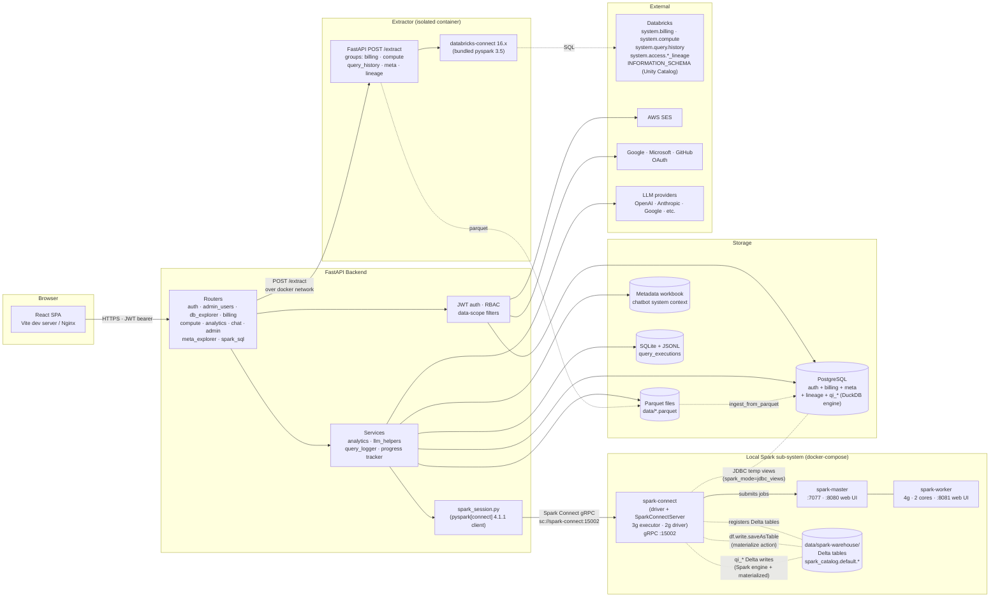
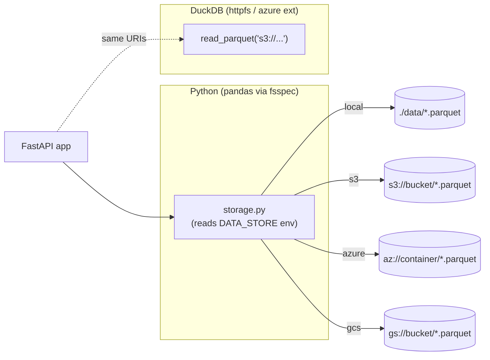
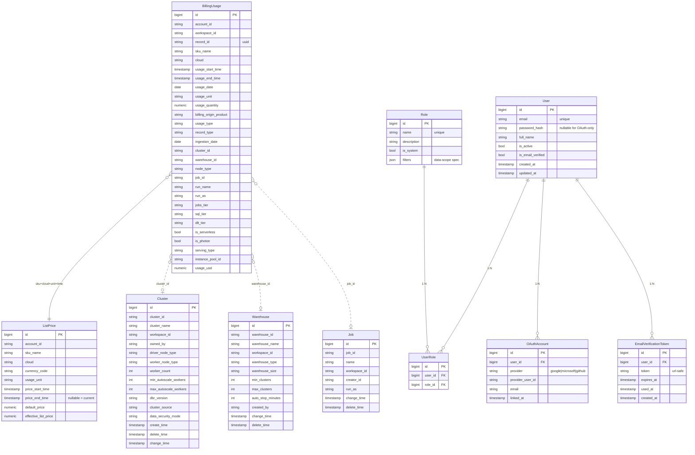
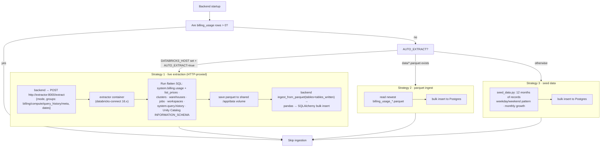
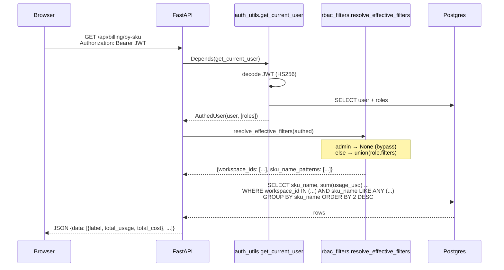
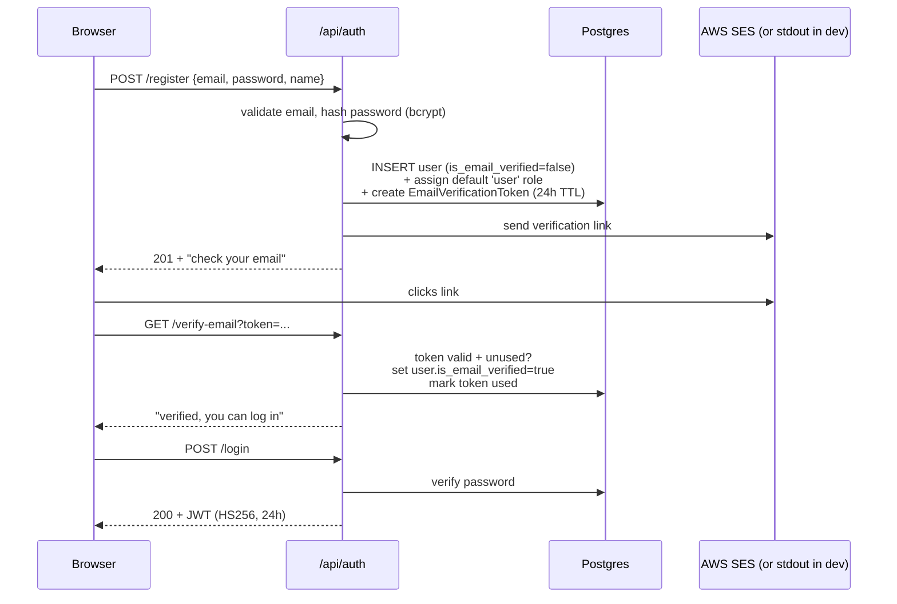
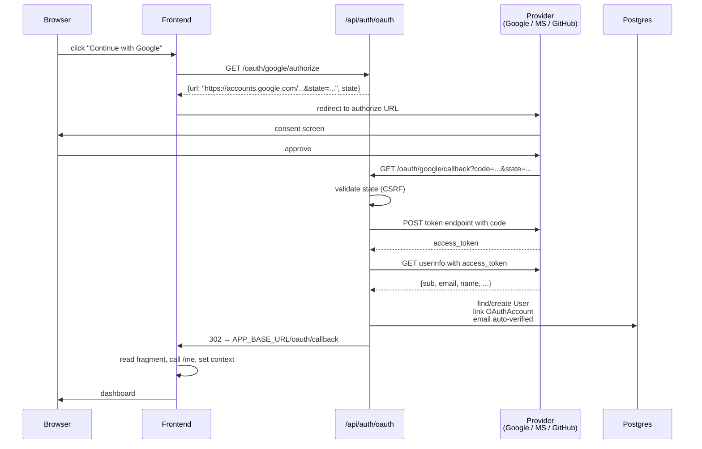
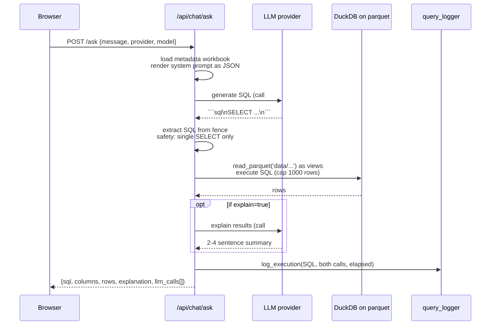

# Architecture

How the Databricks Billing Dashboard is built and why each piece looks the
way it does.

---

## Table of contents

1. [Stack at a glance](#stack-at-a-glance)
2. [System diagram](#system-diagram)
3. [Tool & framework choices (with rationale)](#tool--framework-choices-with-rationale)
4. [Database model](#database-model)
5. [Data ingestion flow](#data-ingestion-flow)
6. [Request lifecycle](#request-lifecycle)
7. [Auth flow](#auth-flow)
8. [Chatbot flow](#chatbot-flow)
9. [Query Profiler — dual-engine pipeline](#query-intel--dual-engine-pipeline)
10. [RBAC & data-scope filtering](#rbac--data-scope-filtering)
11. [Caching, performance, and limits](#caching-performance-and-limits)
12. [Project layout](#project-layout)

---

## Stack at a glance

| Layer | Tech | Version |
|---|---|---|
| Frontend | React + Vite + TypeScript + Tailwind 4 | React 19 / TS 5.8 / Tailwind 4.1 |
| Frontend data | TanStack Query 5 | 5.75 |
| Charts | Recharts | 2.15 |
| Icons | lucide-react + custom SVG | 0.487 |
| Tabular export | SheetJS (`xlsx`) | 0.18 |
| Backend | FastAPI + Uvicorn | FastAPI 0.115 |
| ORM | SQLAlchemy 2.0 (async) + asyncpg | 2.0.40 |
| Validation | Pydantic 2 | 2.11 |
| Database | PostgreSQL | 16 |
| Parquet engine | DuckDB | ≥1.1 |
| SQL parser (Query Profiler ETL) | sqlglot (databricks dialect) | ≥25.0 |
| Query Profiler engine — option A (default) | DuckDB-on-Postgres (qi_* tables in Postgres + Postgres ATTACH from chatbot) | – |
| Query Profiler engine — option B | Apache Spark + Delta + Spark Connect | Spark 4.1.1 / Delta 4.1.0 / pyspark[connect] 4.1.1 |
| Databricks extraction (isolated service) | extractor container — databricks-connect + databricks-sdk | 16.x |
| Auth | bcrypt + python-jose (JWT HS256) | – |
| Email | boto3 SES (with dev stdout fallback) | – |
| LLM clients | google-genai, anthropic, openai (also wired for Azure / Ollama / vLLM / OpenRouter) | – |
| Container | Docker + docker-compose | – |
| Python | 3.12 | – |
| Node | 20+ | – |

---

## System diagram



The diagram has three distinct execution surfaces — pick the one you
need by the **engine** + **spark_mode** combo (see
[`QUERY_ENGINE.md`](QUERY_ENGINE.md)):

- **Extractor sub-system** is always remote-only — it talks to
  Databricks and writes parquet. It never participates in serving
  reads.
- **Postgres** is the operational store. All web reads go here. In
  DuckDB engine mode it's also where `qi_*` lives; in Spark
  + `jdbc_views` mode it's where `qi_*` AND the base tables live (the
  Spark Connect session exposes them as temp views via JDBC).
- **Local Spark sub-system** (master + worker + connect) is the
  alternative execution surface for the chatbot, the Query Profiler
  pages, and the Spark SQL Editor. It either pulls rows from Postgres
  via JDBC (with predicate / `LIMIT` / aggregate pushdown) or reads
  managed Delta tables from `data/spark-warehouse/` depending on
  `spark_mode`.

> **Why a separate extractor container?** The backend pins `pyspark==4.1.1`
> to talk to the local Spark Connect 4.1.1 server. `databricks-connect 16.x`
> is built on `pyspark 3.5`. The two can't coexist in one venv (they fight
> over `pyspark.sql.connect.expressions`). Splitting extraction into its
> own image is the only clean fix.

> **Why three Spark containers?** The Spark stack uses the standard
> Apache Spark master / worker / connect split so the backend stays
> driver-agnostic — it only speaks the gRPC `sc://spark-connect:15002`
> wire protocol, not pyspark internals. The bind-mounted
> `data/spark-warehouse/` directory makes Delta files survive container
> restarts (the in-memory catalog gets re-populated by
> `_attach_warehouse_delta_tables()` on every cold start). Full
> deployment + ops reference: [`SPARK_STACK.md`](SPARK_STACK.md).

---

## Tool & framework choices (with rationale)

### Backend: FastAPI + SQLAlchemy 2.0 async + Pydantic

- **FastAPI** — async, auto-generates OpenAPI, dependency injection makes
  RBAC + data-scope filtering trivial to plumb. A typed Python web framework
  with the lowest ceremony.
- **SQLAlchemy 2.0** in async mode (`asyncpg` driver). Why an ORM at all?
  Type-safe joins, migrations-friendly, and the `case()` / `select_from()`
  primitives let us build the cluster-spec lookup CASE expressions cleanly.
  The async stack matters — most endpoints are I/O-bound on Postgres.
- **Pydantic 2** for response models. Decoupling storage models from API
  shapes is non-negotiable; v2's speed makes the round-trip cheap.

### Frontend: React + Vite + TanStack Query

- **Vite** — sub-second HMR; the dashboard is data-heavy and we iterate fast.
- **React Query** — handles every server-state concern (caching, retry,
  background refetch, deduplication). Pairs well with FastAPI's REST shape.
- **Tailwind 4** + CSS variables — the entire app uses `var(--color-*)`
  tokens, so the **6 themes** are 6 CSS blocks. No theme provider state
  needs to plumb through components.
- **Recharts** — declarative, ResponsiveContainer + composable elements
  (Bar/Line/Area/Composed). Sufficient for everything we draw; we drop to
  plain `<table>` for matrices/heatmaps.

### Postgres for OLTP, DuckDB for ad-hoc

- **PostgreSQL** for the primary store. Indexed lookups (workspace, sku,
  date) drive every dashboard.
- **DuckDB on parquet** for the chatbot. The LLM produces SQL that we don't
  control, and DuckDB:
  1. Doesn't need a schema migration
  2. Reads parquet directly with `read_parquet('...')`
  3. Has predictable performance with millions of rows in-process
  4. Forgives a wider SQL dialect than Postgres
  Running LLM-generated SQL against the *operational* Postgres would be
  unsafe; this isolation is intentional.

### Pluggable parquet storage (local / S3 / Azure Blob / GCS)

`backend/storage.py` is a thin abstraction over the parquet location.
The backend's storage type is selected at runtime by `DATA_STORE` (one
of `local`, `s3`, `azure`, `gcs`):

- **Python side** (pandas reads/writes for ingest + metadata workbook
  generation): we let `pd.read_parquet` / `pd.to_parquet` see a URI
  (`s3://`, `az://`, `gs://`) and rely on the `fsspec` adapters
  `s3fs`, `adlfs`, `gcsfs` to handle the network I/O.
- **DuckDB side** (chatbot SQL execution): `storage.duckdb_setup(con)`
  installs and loads the right native extension (`httpfs` for S3 or GCS,
  `azure` for Azure Blob) and pushes credentials in via
  `SET s3_access_key_id='...'` etc. DuckDB then reads the same URI
  directly via `read_parquet('s3://bucket/...')`.

Both sides honor the same env-var configuration, so swapping the data
store is purely an environment change — no code edits.



### Charts: Recharts (not Plotly / Highcharts)

- React-first composition (`<BarChart><Bar /><Tooltip /></BarChart>`)
- MIT licensed
- Bundle ~100 KB gzipped — meaningful for a SPA
- Trade-off: weaker than Plotly on heatmaps and scatter; we render those
  manually.

### Auth: JWT (HS256) over OAuth-only or Sessions

- **JWT** so the SPA can hold one short-lived bearer in localStorage and
  every API call is stateless. Refresh tokens are not implemented yet.
- **Bcrypt** for password hashing (cost factor 12 default).
- **python-jose** for JWT, picked over `pyjwt` because we may want JWE in
  the future.
- **OAuth 2.0** (Google / Microsoft / GitHub) implemented from scratch
  rather than via Authlib — the flow is small, the dependency chain is
  smaller, and provider-specific quirks (GitHub's separate emails endpoint,
  MS's tenant routing) are easier to inline.
- **AWS SES** for verification email with a dev-fallback that logs the
  link to stdout — hard requirement that local dev has *zero* cloud
  dependencies.

---

## Database model



**Key invariants**

- `clusters` and `warehouses` are change-event tables — one row per config
  change for the same `cluster_id` / `warehouse_id`. Always `DISTINCT ON
  (id) ORDER BY change_time DESC` when joining for the latest config.
- `ListPrice.price_end_time = NULL` means the price is currently active.
- `BillingUsage.run_as` is rarely populated for warehouse rows in
  Databricks' source data — for per-user warehouse spend, attribute via
  `Warehouse.created_by`.
- `BillingUsage.usage_usd` is pre-calculated when extracted from real
  Databricks; missing in seed data, where we fall back to the
  `usage_quantity * effective_list_price` join.

**Indexes** (auto-created by `init_db`)

- `billing_usage(usage_date)`, `(sku_name)`, `(workspace_id)`,
  `(billing_origin_product)`, `(usage_type)`
- `auth_users(email)`
- `auth_roles(name)`
- `auth_user_roles(user_id)`, `(role_id)`
- `auth_oauth_accounts(user_id)`, `(provider, provider_user_id)` unique
- `auth_email_verification_tokens(token)` unique

---

## Data ingestion flow



The strategy chain is intentional: production hits #1, dev with previously-
extracted parquet hits #2, fresh dev hits #3. **No external dependency is
required to boot the app locally.**

---

## Request lifecycle

A typical "Top SKUs" request:



---

## Auth flow

### Email + password registration



### OAuth authorization-code flow



---

## Chatbot flow



The metadata workbook (`consolidated_metadata_with_descriptions.xlsx`) is
the canonical schema description. It's regenerated by
`scripts/update_consolidated_metadata.py` whenever models change, and rendered to JSON at
request time so the LLM gets structured context (avoiding the formatting
ambiguity of free-form text).

**Token cap.** The SQL-generation call in `backend/routers/chat.py` is
configured with `max_tokens=65000`. Earlier caps (1500/4000/8000)
truncated complex multi-CTE Spark queries mid-statement, leaking
partial SQL to the executor as `PARSE_SYNTAX_ERROR`. 65k gives ample
headroom for the new 80-column `qi_statements` schema, the 14-column
`databricks_meta` cross-catalog joins, and reasoning-style models that
emit chain-of-thought before the SQL. Providers whose models can't
honor that ceiling will return a 400 from the chat endpoint — the
in-app error UI surfaces it verbatim.

---

## Query Profiler — dual-engine pipeline

Query Profiler is a derived dataset built from `query_history` that powers the
**Query Profiler** sub-menu and is also visible to the chatbot. It has the
deepest moving parts of any module in the app.

### Why two engines?

`query_history` can be tiny (50 k in the demo) or huge (millions in
production). Two profiles, two storage backends:

| Profile | Engine | Sub-mode | Storage | When |
|---|---|---|---|---|
| Small / dev | `duckdb` (default) | — | Postgres tables `qi_*` + base tables. Chatbot uses DuckDB with `ATTACH postgres`. | Up to ~500 K statements. |
| Spark — light | `spark` | `jdbc_views` (default Spark sub-mode) | Postgres tables `qi_*` + base tables. Spark exposes them as session **JDBC temp views**. Queries reference tables **unqualified**. | "Spark dialect without the move." Free to toggle back to DuckDB. |
| Spark — heavy | `spark` | `materialized` | Managed Delta tables in `spark_catalog.default` under `data/spark-warehouse/`. Queries use the **three-part name**. | Multi-million-row reads where JDBC round-trips dominate. One-time copy via the **Materialize** button. |

Choice is persisted in `system_config` under TWO keys:
`query_intel_engine` (`duckdb` | `spark`) and, when the engine is Spark,
`spark_mode` (`jdbc_views` | `materialized`). Both are read by the ETL,
the Query Profiler router, the chatbot, and the Spark SQL Editor.
Detailed comparison + the operator's decision guide:
[`QUERY_ENGINE.md`](QUERY_ENGINE.md).

When the operator switches between sub-modes, the live Spark session is
brought in line in-process — `apply_spark_mode()` either re-registers
the JDBC temp views (`jdbc_views`) or drops them so the materialized
Delta catalog tables aren't shadowed (`materialized`). The
**Materialize** action publishes per-table progress to
`/api/data-ops/progress` so the Data Management UI renders a live
progress card while the copy runs.

The Spark SQL Editor's `/api/spark-sql/tables` endpoint reads the
active `spark_mode` from `system_config` and, in `jdbc_views` mode,
hides any leftover Delta-table catalog shadows of names that also have
a JDBC temp view — so the active set is unambiguous even when the user
has previously materialised and is now back on JDBC views. The Delta
files stay on disk so flipping back to materialized doesn't recopy.

### Audit — `audit_events` + `assistant_events`

Two more Postgres tables mirror `system.access.audit` and
`system.access.assistant_events`. They participate in the same Spark
sub-mode model (JDBC temp views when `jdbc_views`, Delta tables in
`spark_catalog.default` when `materialized`) and the same per-table
progress publishing on extract. A dedicated router (`backend/routers/
audit.py`) backs the **Meta Explorer → Audit** dashboard at
`/api/meta/audit/*` with stats, recent events, and substring search.
Inline chatbot grounding lives in `backend/routers/chat_audit_schema.py`
so the LLM knows the open-ended `service_name` / `action_name`
vocabulary and the audit-level / status-code semantics. See
[`AUDIT.md`](AUDIT.md) for the full schema and dashboard tour.

### Node Pool — `system.compute.*` telemetry

Five more Postgres tables cover the `system.compute.*` schema:
`node_timeline` (per-minute instance utilization — by far the heaviest),
`warehouse_events` and `instance_events` (lifecycle event streams,
the latter sourced from `system.compute.node_events` and renamed
downstream), plus the reference catalogs `node_types` and
`instance_pools`. The `node_pool` extraction group covers all five
with a single `node_pool_days_back` knob bounding the three
time-bounded tables (`node_timeline` uses 3-day chunks; the other
two use 7-day chunks). Same Spark sub-mode model and same per-table
progress publishing as audit. A dedicated router (`backend/routers/
node_pool.py`) backs the **Meta Explorer → Node Pool** dashboard at
`/api/meta/node-pool/*`. Inline chatbot grounding in
`backend/routers/chat_node_pool_schema.py` carries the time-window
warning on `node_timeline`, the event-type enums, and the foreign-key
topology back to `clusters` / `warehouses` / `node_types`. See
[`COMPUTE.md`](COMPUTE.md) for the full schema and dashboard tour.

### Pipeline diagram

```mermaid
flowchart TB
    subgraph Source
        QH[(query_history<br/>parquet)]
    end

    subgraph Transform["Transform (engine-independent)"]
        SG[sqlglot parse<br/>databricks dialect]
        FS[Flatten compute / query_source /<br/>query_parameters / query_tags structs]
        EX[Extract tables · columns · errors ·<br/>tags · params · derived metrics]
    end

    subgraph EngineSwitch["engine = ?"]
        EC{system_config.<br/>query_intel_engine}
    end

    subgraph DuckDB["engine = duckdb"]
        PG_QI[(Postgres qi_* tables)]
    end

    subgraph SparkMode["engine = spark"]
        SC[Spark Connect<br/>sc://spark-connect:15002]
        SW[spark-worker<br/>2 CPU / 2 GB]
        SM[spark-master]
        DL[(Delta tables<br/>spark-warehouse/qi_*)]
    end

    subgraph Readers
        QI_RT[Query Profiler router<br/>routers/query_intel.py]
        CHAT[Chatbot router<br/>routers/chat.py]
    end

    QH --> SG --> FS --> EX
    EX --> EC
    EC -- duckdb --> PG_QI
    EC -- spark --> SC
    SC --> SM --> SW
    SW --> DL
    SC --> DL

    PG_QI -. duckdb engine .-> QI_RT
    DL -. spark engine .-> QI_RT
    PG_QI -. duckdb engine (ATTACH) .-> CHAT
    DL -. spark engine (spark.sql) .-> CHAT
```

### Transform stage — engine-independent

The core ETL (`backend/extract/query_intel.py`) is purely Python and runs
regardless of engine. For each row of `query_history`:

1. **`_looks_like_sql`** — fast heuristic: starts with a SQL keyword and
   no Python tells (`dbutils.`, `import `, `df.write`, …). If not SQL, fall
   back to a free-text regex for `catalog.schema.table` references.
2. **sqlglot parse** with `dialect='databricks'` → AST.
3. From the AST: tables (with role `read`/`write`/`cte`), columns (with role
   `select`/`where`/`groupby`/`orderby`/`join`/`having`/`aggregate`), and
   SQL feature flags (`has_select_star`, `has_cross_join`, `has_cte`, …).
4. Flatten compute / query_source / query_parameters / query_tags structs
   into scalar columns (`compute_type`, `source_category`, `job_id`,
   `dashboard_id`, `genie_space_id`, etc.).
5. Categorize `error_message` into one of `PERMISSION`, `NOT_FOUND`,
   `PARSE`, `OOM`, `TIMEOUT`, `ANALYSIS`, `DEPENDENCY`, `OTHER`.
6. Derive `pruning_ratio`, `selectivity_ratio`, `waiting_pct`,
   `compile_pct`, `is_full_scan`, `is_off_hours`, `is_weekend`,
   `principal_kind`, project keywords.
7. Post-pass: flag the top 1% of statements by duration as `is_expensive`.

This is a single-threaded Python loop that runs at ~22 k rows/min on a
dev box. It dominates the wall-clock time for large extracts.

Column-by-column derivation rules:
[`QUERY_PROFILER_TRANSFORMATION.md`](QUERY_PROFILER_TRANSFORMATION.md).

### Persistence stage — engine-dependent

**DuckDB mode (default):** SQLAlchemy bulk insert into Postgres tables, 1k
rows per batch. `qi_extract_runs` audit row updated at start (`status='running'`)
and end (`status='success'` with counts + duration). Idempotent — every
run TRUNCATEs then re-inserts.

**Spark mode:** the transformed `list[dict]` is converted to a pandas
DataFrame, then `spark.createDataFrame(pdf)` over Spark Connect, then
`df.write.format("delta").mode("overwrite").saveAsTable(
"spark_catalog.default.qi_*")`. Same idempotency; same audit row in
Postgres.

### Read stage — `qi_runner.run_qi(db, sql, params)`

All 23 Query Profiler endpoints funnel through one helper:

```python
async def run_qi(db, sql, params=None) -> list[dict]:
    engine = await get_engine(db)
    if engine == "spark":
        sql = _to_spark_sql(sql)                  # dialect rewrite
        sql, _ = _to_spark_params(sql, params)    # inline substitution
        return await asyncio.to_thread(_run_spark, sql)
    return [dict(r) for r in (await db.execute(text(sql), params or {})).mappings()]
```

`_to_spark_sql` rewrites three Postgres-only idioms to Spark equivalents:
`::date`, `::decimal`, `FILTER (WHERE …)`. Everything else (PERCENTILE_CONT
WITHIN GROUP, DATE_TRUNC, CASE WHEN, double-quoted identifiers) works on
both engines as-is.

### Chatbot integration

The chatbot has two **separate** code paths — no shared dialect translator,
because the LLM emits the SQL and we want it to be dialect-aware from the
start.

- **DuckDB mode:** `_execute_duckdb_sql(sql)` opens an in-memory DuckDB
  with parquet views for billing tables AND a Postgres ATTACH that exposes
  `qi_*` as views. The system prompt asks for DuckDB-flavored SQL.
- **Spark mode:** `_execute_spark_sql(sql)` calls `spark.sql(sql)` over
  Spark Connect against `spark_catalog.default.qi_*`. The system prompt
  asks for Spark SQL 4.x and explicitly bans the Postgres idioms above.

Schema JSON (passed to the LLM in both modes) is built from the metadata
workbook AND a static `chat_qi_schema.QI_TABLES_METADATA` block — that
way the LLM knows about `qi_*` even if the workbook hasn't been
regenerated.

### Spark deployment shape

Three docker-compose services for Spark mode:

- `spark-master` — standalone master at `:7077` (web UI `:8080`).
- `spark-worker` — 2 cores / 2 GB executor. **Must** have the
  `spark-warehouse` volume mounted (executor writes Delta files).
- `spark-connect` — runs the gRPC Connect server at `:15002` AND the Spark
  driver JVM. Loads Delta JARs from Maven on first start. Same
  `spark-warehouse` volume (driver reads Delta logs).

Full operational reference: [`SPARK_STACK.md`](SPARK_STACK.md).

---

## Meta Explorer — Unity Catalog snapshot + lineage

A flat per-(catalog, schema, table, column) Postgres table, `databricks_meta`, populated by the extractor's `INFORMATION_SCHEMA.COLUMNS ⋈ TABLES` crawl across every accessible Unity Catalog catalog. Powers the **Meta Explorer** sidebar page (`/meta-explorer`, three-pane catalog → tables → columns drill-down with full-text search across names + comments, plus bulk CSV/XLSX exports for catalogs / tables / columns). The router is `backend/routers/meta_explorer.py` with the meta endpoints + six lineage endpoints under `/api/meta/lineage/*`. `databricks_meta` is also exposed to the local Spark Connect as a JDBC temp view (`_BASE_TABLES` in `backend/spark_session.py`) so the chatbot can SQL-join it when the Spark engine is selected.

- Refreshed by the **Unity Catalog Meta** checkbox in Data Management → Extract from Databricks. Always full-snapshot replaced — meta is small (~100K–500K rows) and INFORMATION_SCHEMA has no deterministic change marker.
- `as_of` is stamped to `today()` on every run; keep multiple `as_of` rows for time-series drift.
- Carries the same `data_origin`/`deleted_at` isolation columns as the rest of the model.

Per-role scenarios live in [`DBX_META_SCENARIOS.md`](DBX_META_SCENARIOS.md); an executable notebook with all of them is in `scripts/query_meta_dbx.ipynb`.

### Lineage — `table_lineage`, `column_lineage`, `lineage_rollups`

Two parallel models mirror `system.access.table_lineage` and
`system.access.column_lineage` row-for-row, including the full Databricks
contract (`metastore_id`, `record_id`, `event_id`, `direct_access`,
`entity_metadata` JSON, etc.). A third table, `lineage_rollups`, holds
materialised per-FQN aggregates rebuilt by the Transform job. Source
files: `backend/models.py` (`TableLineage`, `ColumnLineage`,
`LineageRollup`), `backend/extract/ingest.py` (per-table parquet ingest),
`extractor/databricks_extractor.py` (chunked SQL extraction).

- **Extraction is unchecked by default** in the UI and uses two separate,
  short lookback windows (`table_lineage_days_back`, default 14;
  `column_lineage_days_back`, default 7). The extractor loops the query
  week-by-week and concats — a 2-year unbounded scan would OOM the
  driver on busy accounts. See [`LINEAGE.md`](LINEAGE.md) for the full
  story.
- Two dashboards under `/meta-explorer/lineage/{tables,columns}` consume
  the data: KPI tiles for direct/indirect/event-class split,
  `entity_type` + `source_type` breakdowns, depth-1 SVG graphs that
  re-centre on click, plus a column-lineage-specific tops endpoint
  (`most_fanned_out`, `most_depended_on`).
- The Transform job (`Admin → Data Management → Transform → Lineage
  rollups`) rebuilds `lineage_rollups` in-place, one row per
  `(data_origin, full_name)`, for fast tile rendering as the lineage
  partition grows.

---

## Progress tracker — live updates for synchronous endpoints

`backend/progress.py` is an in-process, async-safe registry that the
long-running Data Management endpoints publish phase updates to. The
frontend's `useProgress()` hook polls `/api/data-ops/progress` every
~1.2 s while any mutation is in flight (slows to ~6 s when idle), and
renders a `<ProgressCard>` per active operation.

Each kind has a short stable key — `extract`, `ingest-parquet`,
`seed-demo`, `query-intel-real`, `query-intel-demo`,
`transform-lineage-real`, `transform-lineage-demo`. Starting a new run
overwrites the previous entry; finished entries linger for ~5 min so
the UI can show the terminal state. Per-table progress for parquet
ingest flows through a `progress_cb` callback threaded through
`ingest_from_parquet` and `ingest_all`.

The notifications bell is unchanged — it still reads from the
`background_jobs` table for true background ops (incremental load,
soft/hard delete, restore). The progress tracker covers the
synchronous-but-slow endpoints that don't go through that queue.

---

## Data isolation — real vs demo, per-user view mode

Every domain table (`billing_usage`, `list_prices`, `clusters`, `warehouses`, `jobs`, `workspaces`, `query_history`, `databricks_meta`, and the `qi_*` family) carries two governance columns:

- `data_origin VARCHAR(8)` — `'real'` for live Databricks pulls, `'demo'` for the Acme Corp synthetic shape.
- `deleted_at TIMESTAMP NULL` — soft-delete marker; non-NULL rows are hidden by every read endpoint.

Each user has a sticky `viewing_data_mode` on `auth_users`. The Data Management page exposes a "View mode" toggle that flips it. Every read endpoint applies `WHERE data_origin = :user.viewing_data_mode AND deleted_at IS NULL` so the same database can serve real and demo data concurrently.

The Extract from Databricks panel exposes four per-group checkboxes (Billing / Compute / Query History / Unity Catalog Meta) plus two buttons:
- **Full Extract** — replaces the `data_origin='real'` partition for selected groups.
- **Incremental Extract** — appends only new rows; `query_history` uses the `ingest_cursors.max_update_time` high-watermark, billing uses `record_id` upsert, meta is always full-replaced.

Tables outside the selected groups are not touched — the extractor only writes parquet for the requested groups, and the backend's `ingest_from_parquet(tables=tables_written)` only reads what the extractor just wrote.

---

## RBAC, data-scope filtering, and feature flags

Roles fall into three categories:

1. **System** roles `admin` and `user` — created on startup, can't be
   deleted or have filters / features edited.
2. **Custom** roles — defined by admins through the UI, may carry a JSON
   filter spec **and** a per-role list of feature keys.

The role record has two JSON columns:

```json
// roles.filters — data-scope filter (legacy, applied at query time)
{
  "workspace_ids":         ["ws-001", "ws-002"],
  "clouds":                ["AZURE"],
  "billing_origins":       ["JOBS", "ALL_PURPOSE"],
  "cluster_sources":       ["JOB"],
  "sku_name_pattern":      "PREMIUM%",
  "allow_query_history":   true,
  "allow_databricks_meta": true
}

// roles.features — feature-grant matrix (new, pricing-tier-shaped)
["ui.billing_explorer", "ui.query_profiler", "ui.meta_explorer", ...]
```

`features=null` (legacy) means "grants everything". An explicit list
means "only these keys". The canonical key list lives in
`backend/features_registry.py`; the UI fetches it from
`/api/admin/feature-registry` when rendering the Toggle Features section
of the role editor. Effective features for a user are the **union**
across non-system roles (admins + the bootstrap `user` role get
everything regardless). Disabled features are blocked both in the
sidebar (`useFeatures().isEnabled()`) **and** at the route level
(`<RequireFeature>` redirects to `/`). State is served via
`/api/features/state`, recomputed per-user.

`rbac_filters.resolve_effective_filters(authed)` does the merge:

- Admins → returns `None` (bypass).
- Logged-in but role-less → `{"__deny_all__": True}` (sees nothing).
- **Only non-system (custom) roles define data scope.** The built-in
  `user` / `admin` system roles never constrain *or* unlock data on their
  own. This matters because every verified user is *always* granted the
  `user` role — if `user` counted as "unrestricted" it would cancel every
  custom scoped role an admin assigns. (This was a real bug; the rule is
  now: system roles are neutral for scoping.)
- A user with no custom role behaves like plain `user`: unrestricted.
- A user whose custom roles all have empty `filters`: unrestricted.
- Otherwise compute the **union** of allowed values per dimension across
  the user's *custom* roles. If any custom role has no constraint on a
  dimension, that dimension is unrestricted.

Then `apply_billing_filters(stmt, filters)` adds `WHERE` clauses to the
SQLAlchemy statement before execution. List values are coerced to `str`
(`_as_strs`) because ID/category columns are `String` while a role's
filter spec may carry ints (the web client coerces numeric-looking
strings to numbers) — without coercion the `IN` clause silently matches
nothing.

Data-scope filtering is now plumbed into **every** billing endpoint
(`usage-summary`, `usage-summary-by-sku`, all `by-*` breakdowns,
`by-user`, `by-sku-user`, `daily-trend`, `top-skus`, `user-utilization`),
**every** analytics endpoint (`cost-anomalies`, `forecast`, `mom-growth`,
`cost-breakdown-matrix`, `utilization-summary`, `kpi-summary` — the
service-layer helpers in `analytics_service.py` take an optional
`filters` arg), and the cluster/warehouse listings. There are no
remaining unscoped data paths.

---

## Caching, performance, and limits

| Concern | Implementation |
|---|---|
| Server-state caching (frontend) | TanStack Query: 5-min staleTime on slow endpoints, automatic refetch on focus elsewhere |
| Bearer token cache | localStorage key `auth.access_token` |
| Theme cache | localStorage key `app.theme` |
| Backend metadata workbook | parsed once per process (`_SCHEMA_JSON_CACHE`, `_SYSTEM_PROMPT_CACHE`) |
| LLM model list | enumerated at request time per-provider; not cached |
| Chatbot result cap (preview) | 200 rows in API payload, 1,000 server-side |
| Chatbot download cap | 100,000 rows (configurable per-request, max 1,000,000) |
| OAuth state | in-memory dict (single-process only — prod needs Redis) |
| Email verification token TTL | 24h |
| JWT TTL | 24h (configurable via `JWT_TTL_HOURS`) |

---

## Project layout

```
databricks_cost_app/
├── backend/                         FastAPI app
│   ├── main.py                      App entry, lifespan, CORS, router includes
│   ├── database.py                  Async engine + session factory
│   ├── models.py                    SQLAlchemy declarative models
│   ├── schemas.py                   Pydantic response models
│   ├── seed_data.py                 12-month demo seed
│   ├── auth_utils.py                Password / JWT / SES / dependencies
│   ├── rbac_filters.py              Data-scope filter resolver + applicators
│   ├── metadata.py                  Generates the chatbot metadata workbook
│   ├── llm_helpers.py               Multi-provider LLM client (copied from /helpers)
│   ├── query_logger.py              SQLite + JSONL logger for chatbot calls
│   ├── node_specs.py                VM type → vCPU/memory lookup
│   ├── warehouse_specs.py           T-shirt size → DBU/hr lookup
│   ├── routers/
│   │   ├── auth.py                  Login / register / OAuth
│   │   ├── admin_users.py           User & role mgmt incl. create-user (admin)
│   │   ├── db_explorer.py           Read-only Postgres explorer (admin)
│   │   ├── admin.py                 Data-management ops; /extract proxies to extractor
│   │   ├── billing.py               Usage / breakdowns / daily trend
│   │   ├── compute.py               Clusters & warehouses + details
│   │   ├── analytics.py             Anomalies / forecast / heatmap
│   │   ├── chat.py                  Chatbot endpoints
│   │   └── meta_explorer.py         Unity Catalog browser (databricks_meta)
│   ├── services/
│   │   └── analytics_service.py     Detection / forecasting helpers
│   └── extract/
│       ├── groups.py                billing/compute/query_history/meta → table list
│       ├── ingest.py                Parquet → Postgres loader (tables= filter)
│       └── query_intel.py           qi_* ETL (sqlglot)
├── extractor/                       ISOLATED DATABRICKS WORKER
│   ├── Dockerfile                   databricks-connect 16.x + databricks-sdk + pandas
│   ├── pyproject.toml               NO standalone pyspark pin (db-connect bundles its own 3.5)
│   ├── main.py                      FastAPI /extract /health /info
│   ├── databricks_extractor.py      Spark SQL queries (was in backend)
│   ├── meta_extractor.py            INFORMATION_SCHEMA crawler (was in backend)
│   └── groups.py                    Same mapping as backend/extract/groups.py
├── frontend/                        React + Vite
│   ├── src/
│   │   ├── App.tsx                  Routes, sidebar, RequireAuth, RequireAdmin
│   │   ├── api/client.ts            Typed REST client + auth header injection
│   │   ├── auth/AuthContext.tsx     JWT lifecycle
│   │   ├── theme/                   ThemeContext + ThemeSwitcher (6 themes)
│   │   ├── components/              ChartCard, KpiCard, BrandIcons, ...
│   │   └── pages/
│   │       ├── Dashboard.tsx
│   │       ├── CostExplorer.tsx
│   │       ├── UserFootprint.tsx
│   │       ├── Trends.tsx
│   │       ├── Compute.tsx
│   │       ├── Analytics.tsx
│   │       ├── Chatbot.tsx
│   │       ├── DataManagement.tsx
│   │       ├── Login.tsx · Register.tsx · VerifyEmail.tsx · OAuthCallback.tsx
│   │       └── admin/
│   │           ├── Users.tsx
│   │           └── Roles.tsx
│   └── index.html / vite.config.ts / package.json
├── data/                            Parquet exports + metadata workbook
├── docs/                            (this directory)
├── deploy/                          Cloud deploy scripts (AWS / Azure / GCP)
└── docker-compose.yml               Local dev: postgres + backend + frontend
```
