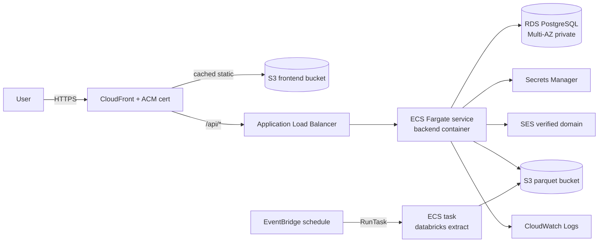
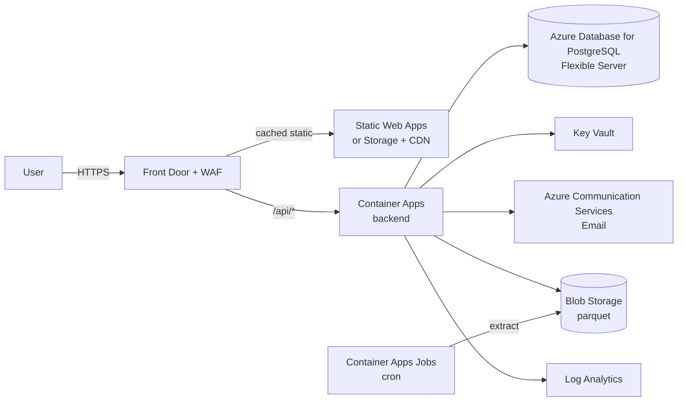
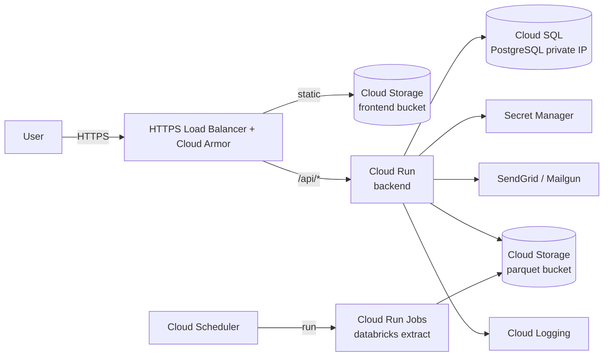

# Cloud Migration Guide

How to take this app from `docker-compose up` on a laptop to a production
deployment on AWS, Azure, or GCP. Each section is structured the same way
so you can compare costs / patterns side-by-side.

The runnable scripts that implement these patterns live in
[`/deploy/{aws,azure,gcp}`](../deploy).

---

## Local components → managed services (overview)

| Local component | AWS | Azure | GCP |
|---|---|---|---|
| Postgres container | **RDS for PostgreSQL** (Multi-AZ) | **Azure Database for PostgreSQL Flexible Server** | **Cloud SQL for PostgreSQL** |
| Backend container | **ECS Fargate** (or App Runner) | **Container Apps** | **Cloud Run** |
| **Extractor container** (NEW — `./extractor`) | **ECS Service** (private) or **Scheduled RunTask** | **Container App** (internal-only) or **Container Apps Job** | **Cloud Run service** (internal) or **Cloud Run Job** |
| Frontend (Vite dev) | **S3 + CloudFront** | **Static Web Apps** (or Storage + Front Door) | **Cloud Storage + Cloud CDN** (or Firebase Hosting) |
| Container registry | **ECR** (two repos: backend + extractor) | **ACR** (two repos) | **Artifact Registry** (two repos) |
| Email (SES dev fallback) | **SES** (already supported) | **Azure Communication Services — Email** | **SendGrid / Mailgun** (no first-party transactional service) |
| Secret store (`.env`) | **Secrets Manager** + Parameter Store | **Key Vault** | **Secret Manager** |
| Object store (parquet) | **S3** (shared by backend + extractor) | **Blob Storage** (shared) | **Cloud Storage** (shared) |
| Logs / metrics | **CloudWatch Logs / Metrics** | **Log Analytics + Application Insights** | **Cloud Logging + Cloud Monitoring** |
| TLS / edge | **ALB + ACM** | **Front Door / App Gateway** | **HTTPS Load Balancer + Managed Certs** |
| WAF / DDoS | **AWS WAF + Shield** | **Front Door WAF** | **Cloud Armor** |
| Identity (workload) | **IAM Role** per task (backend + extractor get different roles) | **Managed Identity** per app | **Workload Identity** per service |
| Identity (workforce SSO) | OAuth providers (Google / MS / GitHub) — same on every cloud |
| Cron / batch (Databricks extract) | **EventBridge → ECS RunTask** on the extractor image | **Container Apps Job** scheduled via CRON (extractor image) | **Cloud Scheduler → Cloud Run Job** on the extractor image |

> **Why two containers?** The backend pins `pyspark==4.1.1` to talk to a local Spark Connect server (chatbot / SQL editor). `databricks-connect 16.x` is built on `pyspark 3.5` and the two cannot coexist in one venv — they fight over the `pyspark.sql.connect.expressions` namespace. The extractor image is the only thing that ships `databricks-connect`. Backend → extractor is HTTP-over-docker-network locally and HTTP-over-cluster-DNS in the cloud (`EXTRACTOR_URL=http://<extractor-service-name>:8000`).

---

## Code & config changes you'll need (every cloud)

These are **independent of the cloud you pick** — required before any
cloud cutover:

| Change | File(s) | What |
|---|---|---|
| **Switch data store from local volume to cloud blob** | env only | Set `DATA_STORE=s3` / `azure` / `gcs` and the corresponding bucket/container vars (see [§ Data store configuration](#data-store-configuration) below). Removes the docker-compose volume mount entirely. |
| Pull Postgres creds from a secret | `database.py` | Replace `os.getenv("DB_PASS")` with a secret-fetch helper for Secrets Manager / Key Vault / Secret Manager |
| Pull JWT + LLM keys from secrets | `auth_utils.py`, `llm_helpers.py` | Same pattern |
| CORS allowlist | `main.py` | `allow_origins=os.getenv("CORS_ALLOW_ORIGINS").split(",")` |
| Container healthcheck endpoint | `main.py` | `/health` already exists — wire it into the platform's health probe |
| Disable auto-seeding in prod | `main.py` `_auto_populate` | Gate by `APP_ENV != "production"` or by a `RUN_SEED=true` flag |
| Distinct DB user for migrations | new | One role for app (`SELECT/INSERT/UPDATE`), one for `init_db` / Alembic |
| Logging to stdout in JSON | `main.py` logging config | Containers expect line-delimited JSON logs |
| Static-asset hashing | `vite.config.ts` | already on by default — verify your CDN respects it |
| Pin docker image tag | `Dockerfile` / compose | replace `:latest` with `:<git-sha>` |
| HEALTHCHECK in Dockerfile | `backend/Dockerfile` | Add `HEALTHCHECK CMD curl -f http://localhost:8000/health \|\| exit 1` |

### Data store configuration

The app keeps parquet files (the `billing_usage_*.parquet`,
`clusters_*.parquet`, etc. that power both the chatbot and the periodic
ingest into Postgres) in a pluggable backend selected by `DATA_STORE`.

| `DATA_STORE` | Where files live | Required env vars | Auth |
|---|---|---|---|
| `local` *(default)* | local filesystem | `DATA_DIR` (default `data`) | n/a |
| `s3` | AWS S3 (or any S3-compatible — MinIO, etc.) | `DATA_S3_BUCKET`, optional `DATA_S3_PREFIX`, `AWS_REGION` | IAM role / IMDS preferred; or `AWS_ACCESS_KEY_ID` + `AWS_SECRET_ACCESS_KEY` |
| `azure` | Azure Blob Storage | `DATA_AZURE_ACCOUNT`, `DATA_AZURE_CONTAINER`, optional `DATA_AZURE_PREFIX` | `AZURE_STORAGE_CONNECTION_STRING` (simplest) or `AZURE_STORAGE_ACCOUNT_KEY` or managed identity |
| `gcs` | Google Cloud Storage | `DATA_GCS_BUCKET`, optional `DATA_GCS_PREFIX` | `GOOGLE_APPLICATION_CREDENTIALS` (path to JSON) or workload identity. **DuckDB also needs HMAC keys** (`GCS_HMAC_ACCESS_KEY`/`GCS_HMAC_SECRET_KEY`) because the chatbot uses DuckDB's S3-compatible reader for GCS |

The same env vars are read by:
- `backend/storage.py` — for pandas reads/writes (via fsspec)
- `backend/routers/chat.py::_build_duckdb` — for DuckDB's native cloud
  extensions (`httpfs` for S3/GCS, `azure` for Azure)

So **switching is purely env-variable**: set the vars, restart the
backend, and the chatbot + ingest both pick up the new location. No
code change.

**Removing the volume mount**: with a cloud backend, the
`./data:/app/data` mount in `docker-compose.yml` is no longer needed.
Cloud-deployed containers should drop it entirely.

**Mixing**: you can keep the metadata workbook
(`consolidated_metadata_with_descriptions.xlsx`) under `data/` locally
even when `DATA_STORE=s3`, since the chatbot loads it as a regular file
(`METADATA_XLSX` env var). Or upload it to the same bucket and point
`METADATA_XLSX` at the URI.

---

# AWS

## Architecture

## Service mapping (detailed)

| Local | AWS | Why this | Approx cost (us-east-1) |
|---|---|---|---|
| Postgres container | **RDS for PostgreSQL 16**, db.t4g.medium, Multi-AZ, gp3 100 GB | Native encryption, PITR, automated minor upgrades | ~$130/mo |
| Backend container | **ECS Fargate**, 0.5 vCPU / 1 GB, 2 tasks | Managed control plane, integrates with ALB + CloudWatch | ~$30/mo per task |
| Frontend | **S3 (static) + CloudFront** | Global edge cache, ACM TLS for free | <$5/mo at light traffic |
| Container registry | **ECR private** | IAM-gated, scan-on-push | ~$0.10/GB-mo |
| Object store (parquet) | **S3 bucket**, SSE-S3, lifecycle to Glacier after 90 d | Cheap, durable, lifecycle for old extracts | ~$0.023/GB-mo |
| Secrets | **Secrets Manager** for rotated creds (DB pass, JWT secret), **Parameter Store** for non-secret config | Rotation built-in for DB; Parameter Store is cheaper for the rest | ~$0.40/mo per secret |
| Email | **SES** (already wired in `auth_utils.send_verification_email`) | First-party, cheapest at $0.10/1000 emails | <$1/mo |
| Identity | **IAM role** attached to ECS task (no key handling) | Boto3 picks it up automatically | free |
| Cron | **EventBridge rule → ECS RunTask** for the Databricks extract | Serverless, integrates with ECS | <$1/mo |
| TLS | **ACM certificate** on ALB + CloudFront | Free public certs, auto-renewal | free |
| WAF | **AWS WAF** managed rule sets on ALB | DDoS / SQLi / XSS baseline | ~$10/mo + $1/M req |

## What changes in code

| File | Change |
|---|---|
| `database.py` | Read DB password from Secrets Manager: `boto3.client('secretsmanager').get_secret_value(SecretId=...)`. Cache the value. |
| `main.py` | `allow_origins` from env (`CORS_ALLOW_ORIGINS=https://billing.your-domain.com`). Skip `_auto_populate` when `APP_ENV=production`. |
| `auth_utils.py` | Already uses `boto3.client('ses')` — works with task-role credentials. Set `SES_FROM_EMAIL` to a verified address. |
| Dockerfile (backend) | Add `HEALTHCHECK` and `EXPOSE 8000`. Build with `--platform linux/amd64` if pushing from arm Mac. |
| Frontend Vite config | Set `define: { 'import.meta.env.VITE_API_BASE': JSON.stringify('https://billing.your-domain.com') }` so the SPA hits the ALB through CloudFront. |
| `extract` job | Build `./extractor` into its own image (`databricks-cost-app-extractor`) and run it via `ECS RunTask` in a separate task definition. This already matches the local `docker-compose` topology where the extractor is its own container — `databricks-connect 16.x` lives there, not in the backend image, to avoid a pyspark version war with the local Spark Connect client. The backend's `/api/admin/extract` calls the extractor over the cluster network. |

## Step-by-step migration

1. `aws ecr create-repository --repository-name databricks-cost-app-backend`
2. Build & push the image with the deploy script in
   [`/deploy/aws`](../deploy/aws).
3. Provision RDS + Secrets Manager + S3 buckets.
4. Deploy ECS service + ALB.
5. Sync `frontend/dist` to S3, point CloudFront at it.
6. Verify SES sender domain (DKIM / SPF records).
7. Register OAuth callback URL `https://billing.your-domain.com/api/auth/oauth/<provider>/callback`
   at each provider.

---

# Azure

## Architecture

## Service mapping (detailed)

| Local | Azure | Why this | Approx cost |
|---|---|---|---|
| Postgres container | **Azure Database for PostgreSQL Flexible Server** Standard_B2ms | Cheaper than Hyperscale for this size, supports HA | ~$70/mo (B2ms, 32GB, no HA) |
| Backend container | **Container Apps**, 0.5 vCPU / 1 Gi, 1-3 replicas | Auto-scale to zero, KEDA-based | pay-per-vCPU-second |
| Frontend | **Static Web Apps** (free for SPAs, includes auth+routes) OR **Blob Storage + CDN** | SWA bundles preview environments + global edge for free tier | $0 free tier or <$10/mo |
| Container registry | **ACR** Basic | Multi-region replication on Standard+ | ~$5/mo |
| Object store | **Blob Storage**, RA-GRS | Cross-region read replica | ~$0.018/GB-mo (cool) |
| Secrets | **Key Vault** | Pulled into Container Apps via env var bindings | $0.03/10K ops |
| Email | **Azure Communication Services Email** | First-party in-Azure transactional | $0.25/1000 emails |
| Identity | **Managed Identity** on Container Apps → Key Vault | Token automatic via IMDS | free |
| Cron | **Container Apps Jobs** with cron expression | Same image, different invocation | ~$1/mo |
| TLS | **Front Door managed certs** | Free | free |
| WAF | **Front Door Premium WAF** | $330/mo entry — switch to App Gateway WAF (~$30/mo) for cost-sensitive | $$$ |

## What changes in code

| File | Change |
|---|---|
| `database.py` | Use `azure.identity.DefaultAzureCredential` + `keyvault-secrets` to fetch `DB_PASSWORD`. |
| `auth_utils.py` | **Replace SES** with ACS Email SDK: `from azure.communication.email import EmailClient`. Or: keep SES code path, treat it as "no email" and use Azure Logic Apps sidecar. We provide a stub in [`deploy/azure/email_acs.py`](../deploy/azure). |
| `main.py` | CORS env-driven; skip auto-populate in prod. |
| Frontend | If using Static Web Apps, the `staticwebapp.config.json` sets API rewrites and route fallbacks. |
| Container Apps `revision.yaml` | Bind Key Vault secrets via `secretRef`; ingress `external: true`, `targetPort: 8000`. |

## Step-by-step migration

1. `az acr create --resource-group databricks-cost-app --name databrickscostappacr --sku Basic`
2. Build + push backend image.
3. Provision Postgres Flex Server (private endpoint preferred).
4. Provision Container Apps environment + Container Apps service.
5. Static Web Apps deployment (GitHub Action) for the frontend.
6. Front Door in front for global edge + WAF.
7. ACS Email — provision a Communication Services resource and verify a
   sender domain.

---

# GCP

## Architecture

## Service mapping (detailed)

| Local | GCP | Why this | Approx cost |
|---|---|---|---|
| Postgres container | **Cloud SQL for PostgreSQL 16**, db-custom-1-3840 | Lowest-effort managed Postgres on GCP | ~$50/mo |
| Backend container | **Cloud Run** | Scale to zero, sub-second cold start, billed per 100ms | pay-per-request, often <$10/mo |
| Frontend | **Cloud Storage + Cloud CDN** behind the same HTTPS LB as the backend | One LB, one cert, path-based routing | <$5/mo |
| Container registry | **Artifact Registry** | Replaces deprecated GCR | ~$0.10/GB-mo |
| Object store | **Cloud Storage** with Nearline class | Best $/GB on GCP | ~$0.010/GB-mo |
| Secrets | **Secret Manager** | Mounted as env vars in Cloud Run | $0.06/10K ops |
| Email | **SendGrid** (recommended) or Mailgun | GCP has no first-party transactional email service | $20/mo SendGrid Essentials |
| Identity | **Workload Identity** on Cloud Run service account | No keys ever | free |
| Cron | **Cloud Scheduler → Cloud Run Jobs** | Cloud Run Jobs is the right primitive (vs the always-on service) | <$1/mo |
| TLS | **Google-managed certs** on the LB | Free | free |
| WAF | **Cloud Armor** | Per-rule pricing | ~$5/policy + $0.75/M req |

## What changes in code

| File | Change |
|---|---|
| `database.py` | Use `google-cloud-secret-manager` SDK to fetch `db-password`; or rely on Cloud Run's automatic env-var binding with `--set-secrets`. |
| `auth_utils.py` | **Replace SES** with SendGrid / Mailgun. Stub in [`deploy/gcp/email_sendgrid.py`](../deploy/gcp). Same interface. |
| Dockerfile | Make sure `EXPOSE` matches `--port` you give Cloud Run (default 8080). Set `CMD ["uvicorn", "main:app", "--host", "0.0.0.0", "--port", "8080"]`. |
| `main.py` | CORS env-driven; skip auto-populate; respect `PORT` env var (Cloud Run injects it). |
| Frontend `vite.config.ts` | `VITE_API_BASE` points to `https://billing.example.com` (the LB hostname). |
| LB url-map | `/api/*` → backend service (Cloud Run NEG); everything else → frontend bucket backend. |

## Step-by-step migration

1. `gcloud artifacts repositories create databricks-cost-app --repository-format=docker --location=us-central1`
2. Build + push backend image.
3. Provision Cloud SQL with private IP + a serverless VPC connector.
4. Deploy Cloud Run service with Secret Manager bindings.
5. Sync `frontend/dist` to a public-readable bucket; configure Cloud CDN.
6. Provision HTTPS Load Balancer with two backend services (bucket + Cloud
   Run NEG) and a managed cert.
7. SendGrid: create API key, store in Secret Manager, swap the email
   sender helper.

---

## Side-by-side cost rough-cut (light prod, ~50 users, ~5 GB data)

| Component | AWS | Azure | GCP |
|---|---|---|---|
| Backend compute | ~$60/mo (2x Fargate 0.5/1) | ~$50/mo (2x ACA replicas) | ~$10/mo (Cloud Run, scale-to-zero) |
| Postgres (HA) | ~$130/mo (Multi-AZ t4g.medium) | ~$70/mo (B2ms, no HA) → ~$140/mo HA | ~$50/mo (db-custom-1) |
| Frontend hosting | ~$5/mo CF+S3 | $0 (SWA free) | ~$5/mo GCS+CDN |
| Object storage 5 GB | ~$0.12/mo | ~$0.09/mo | ~$0.05/mo |
| Email (1k/mo) | ~$0.10/mo | ~$0.25/mo | ~$20/mo SendGrid |
| WAF | ~$10/mo | ~$30/mo (App Gw) | ~$5/mo |
| **Estimate** | **~$205/mo** | **~$150-220/mo** | **~$90/mo** |

GCP is cheapest for this workload because Cloud Run scales to zero and
Cloud SQL has the cheapest entry point. AWS is the most familiar and has
the deepest ecosystem. Azure shines if you're already paying for an
Office tenant and want SSO with the same AAD users that signed in to the
billing dashboard.

---

## Decision flow: which cloud should you pick?

1. **Are you already on Databricks-on-X?** Match the cloud — Databricks
   regional egress is non-trivial.
2. **Is the workspace small (<10 users) and intermittent?** GCP Cloud
   Run scale-to-zero saves money.
3. **Is the workspace heavy chatbot users?** Same answer — but watch LLM
   provider costs separately.
4. **Do you need O365 SSO?** Azure with Microsoft OAuth.
5. **Are your auditors familiar with one ecosystem?** Pick that one.

There is no wrong answer. The app's surface area is small enough that
you can re-platform in a sprint.
