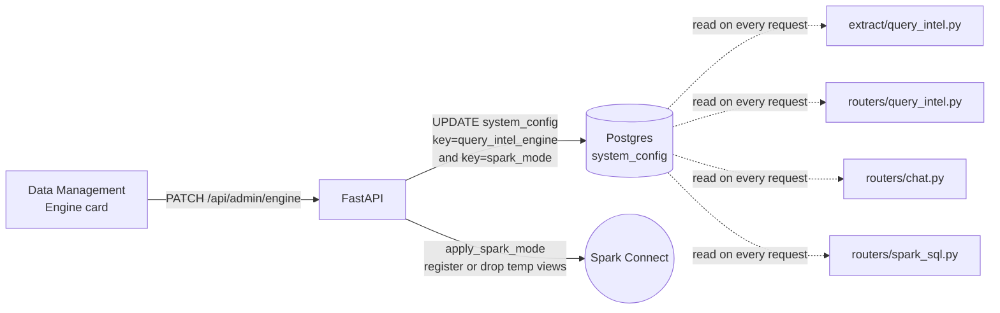
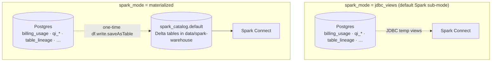
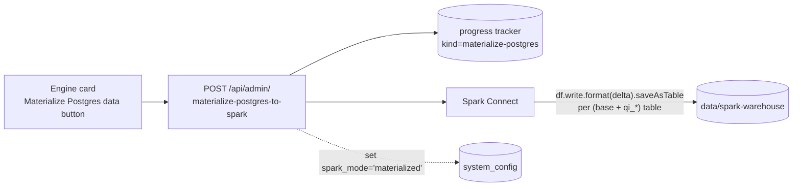
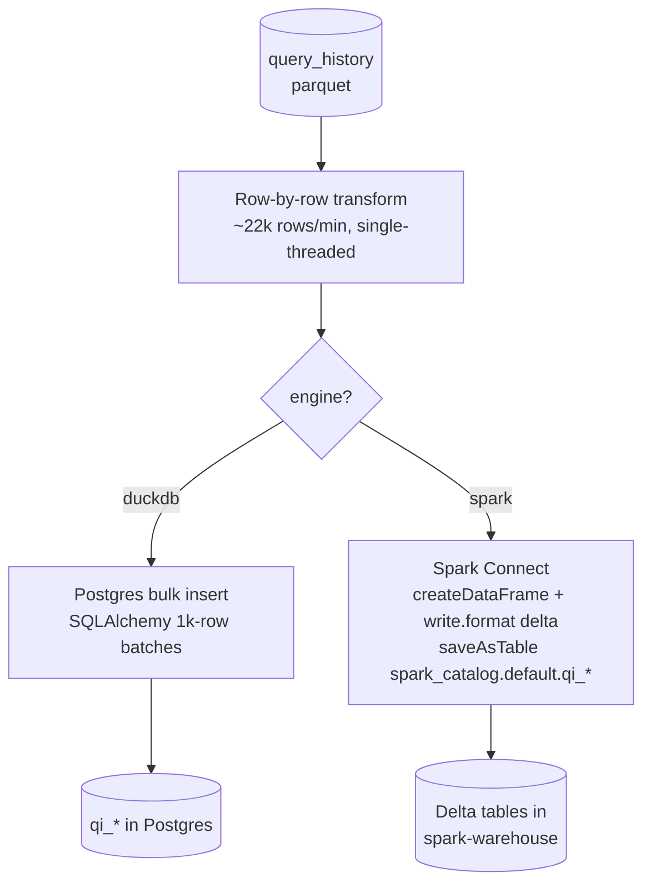
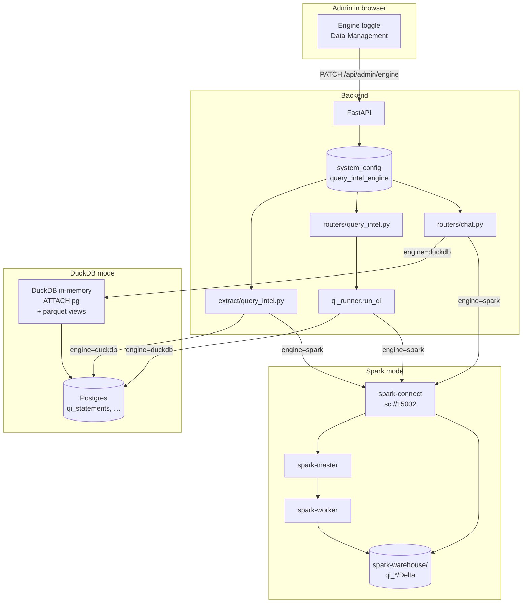

# Query Engine — DuckDB vs Spark

The "Query Engine" picker in **Admin → Data Management** chooses where the
Query Profiler's `qi_*` tables physically live, and which SQL dialect the
Chatbot speaks. **Two interchangeable persistence engines** are supported;
the choice is persisted in Postgres and is honored by every Query Profiler
read, the ETL, and the Chatbot.

Only one engine is active at a time. Switching engines does **not** move
existing data — you re-run **Transform → Query Profiler (Run)** to populate the new
engine's storage.

> Renamed from "Query Profiler Engine" once the **Transform** section
> started covering more than the Query Profiler (lineage rollups, etc.).
> The picker still backs the Query Profiler pipeline; the broader name
> just acknowledges that other transforms read the same engine choice
> when they need a SQL execution surface.

---

## TL;DR

There are two top-level engines and — for Spark — two sub-modes:

| Engine | Sub-mode | Where qi_* + base tables live | When to pick it |
|---|---|---|---|
| **`duckdb`** (default) | — | Postgres. Chatbot uses DuckDB with `ATTACH postgres`. | Up to ~500 K statements. Local dev. Single-node demos. |
| **`spark`** | **`jdbc_views`** (default Spark sub-mode) | **Postgres.** Spark exposes the tables as session **JDBC temp views** (referenced unqualified). | "Spark dialect without the move" — keeps writes in Postgres so toggling back to DuckDB requires zero copy. The QI ETL writes to Postgres so the JDBC view has data. |
| **`spark`** | **`materialized`** | **`spark_catalog.default.*` managed Delta tables** under `data/spark-warehouse/`. | Multi-million-row reads. Want Delta features (time travel, ACID, large scans without JDBC round-trip). Requires a one-time copy via the **Materialize** button. |

Operational footprint of the Spark path: +3 containers (master, worker,
connect) + ~3 GB image + ~30 s first-time JAR download.

---

## 1 · The switch



**Storage:** TWO rows in the `system_config` Postgres table:
- key `query_intel_engine` → `'duckdb'` or `'spark'` (default `'duckdb'`).
- key `spark_mode` → `'jdbc_views'` or `'materialized'` (default `'jdbc_views'`;
  only consulted when the engine is `'spark'`).

Set by `PATCH /api/admin/engine` (which accepts both fields) and read by
`engine_config.get_engine(db)` / `engine_config.get_spark_mode(db)`.

**Default:** `'duckdb'`. No migration needed.

### 1.1 · The Spark sub-modes side by side



In **`jdbc_views`** mode the QI ETL writes `qi_*` to Postgres and the
Spark session registers every Postgres-resident table (`_BASE_TABLES +
_QI_TABLES`) as a JDBC temp view. The Spark SQL Editor lists those rows
with a **`temp`** badge; queries push predicates / `LIMIT` / aggregates
down to Postgres (`pushDownPredicate`, `pushDownLimit`,
`pushDownAggregate` all enabled). The chatbot's Spark prompt tells the
LLM to reference tables **unqualified**.

In **`materialized`** mode the same tables are real Delta tables under
`spark_catalog.default`. The temp views are dropped on mode-switch so
they can't shadow the catalog. The Spark SQL Editor lists them as
managed Delta (no `temp` badge) and the chatbot's Spark prompt switches
to the **three-part name** `spark_catalog.default.<table>`. The QI ETL
also flips its write target to Delta.

### 1.2 · The Materialize action



The button confirms (it's an expensive copy on real-sized lineage),
then calls `POST /api/admin/materialize-postgres-to-spark`. The backend:

1. Publishes a `materialize-postgres` progress entry the UI polls.
2. For each table in `_BASE_TABLES + _QI_TABLES`:
   reads JDBC with `fetchsize=10000`, writes Delta with
   `mode("overwrite")` to `spark_catalog.default.<table>`, calls back
   with the row count.
3. Persists `spark_mode='materialized'` so future reads use the catalog.
4. Returns `{table: row_count}` + duration; UI renders an emerald
   summary card.

Re-running is idempotent (overwrite-in-place). Switching back to
`jdbc_views` is **free** — the API just persists the flag and drops the
materialized data's catalog shadows from the editor list; the underlying
Delta files stay on disk so the next Materialize click is even cheaper
(but you'd still rerun to pick up newer Postgres rows).

---

## 2 · What each engine changes

### 2.1 Extract path (`backend/extract/query_intel.py`)

The Python transform loop (sqlglot parsing, struct flattening, error
categorization, metric derivation) is **identical** in both engines. The
difference is only in the persistence step at the end of the loop:



Audit row in `qi_extract_runs` lives in Postgres **regardless** of engine.

### 2.2 Read path (`backend/routers/query_intel.py`)

Every endpoint funnels through `qi_runner.run_qi(db, sql, params)`. The runner:

1. Reads the engine setting (one lookup per request, cached implicitly via
   short-lived session).
2. **Postgres path:** runs the SQL via SQLAlchemy `text()` against `qi_*`
   tables in Postgres — unchanged from the original.
3. **Spark path:**
   - Rewrites Postgres-only idioms (`::date`, `::decimal`, `FILTER (WHERE …)`)
     to Spark-compatible forms.
   - Inline-substitutes `:name` placeholders (Spark Connect's parameter
     binding is brittle when the same placeholder appears multiple times).
   - Calls `spark.sql(translated_sql)` via Spark Connect.
   - Converts the Spark DataFrame back to a list of dicts.

The SQL itself is **identical** for both engines — the runner handles the
dialect quirks transparently. Aliases like `AS "user"` work in Spark because
the singleton SparkSession sets `spark.sql.ansi.doubleQuotedIdentifiers=true`.

### 2.3 Chatbot path (`backend/routers/chat.py`)

The chatbot has **two completely separate code paths** — no shared dialect
translator, because the LLM emits the SQL and we want it to be dialect-aware
from the start.

| Engine | System prompt | Execution |
|---|---|---|
| `duckdb` | `_DUCKDB_RULES` — asks for DuckDB-flavored SQL. Mentions that qi_* are Postgres-attached views. | `_execute_duckdb_sql(sql)` — DuckDB in-memory connection, with parquet views for billing tables AND a `pg.public.*` ATTACH for live qi_* read. |
| `spark` | `_SPARK_RULES` — asks for Spark SQL 4.x. Explicitly forbids `::cast`, `FILTER (WHERE)`, `DISTINCT ON`. | `_execute_spark_sql(sql)` — `spark.sql(sql)` via Spark Connect, against `spark_catalog.default.qi_*`. |

Both prompts inject the same schema JSON (which already includes the `qi_*`
tables), so the LLM sees the full lakehouse + qi_* schema in either mode.

---

## 3 · End-to-end shape



---

## 4 · Picking an engine — a decision checklist

| Ask yourself | Pick `duckdb` if | Pick `spark` if |
|---|---|---|
| "How many statements do I expect in `query_history`?" | < 500 K (demo or small org) | > 500 K (full-org or year+ snapshot) |
| "Do I want Delta features (time travel, ACID, schema evolution)?" | Don't care | Yes |
| "Am I OK running 3 extra containers (~3 GB)?" | No — keep it light | Yes |
| "Do I want to write PySpark jobs against qi_*?" | No | Yes — that's exactly the point |
| "First-time setup matters" | Zero extra setup | First Spark Connect start downloads ~50 MB of Delta JARs (~30 s) |

You can flip back and forth at any time. The cost is one re-extract of the
underlying parquet.

---

## 5 · Performance notes

### Extract phase: the **transform** loop dominates, not the engine

The row-by-row sqlglot parse is purely Python and single-threaded. On a
typical dev box it processes ~22 k rows/min. For a 1.2 M-row real
`query_history`, **expect ~50 min before the engine-specific write even
starts**. The persistence phase itself is fast: 50 k rows lands in Postgres
in ~3 s and Delta in ~90 s; 1.2 M rows lands in Postgres in ~70 s and Delta
in ~2 min.

So if Extract is feeling slow, **the engine is not the bottleneck.** Either
let the parse loop run, or switch to the demo dataset (50 k rows in ~90 s end
to end).

A future optimization that would help: multiprocess the transform loop. Not
done today; tracked as a backlog item.

### Read phase: roughly equal up to ~50 K statements

On the demo data (50 k statements), both engines return the dashboard tiles
in ~200–400 ms.

Beyond ~500 K statements, Postgres slows on the percentile-heavy queries
(`PERCENTILE_CONT WITHIN GROUP`) because there's no per-column statistics
the planner can use. Spark with Delta wins here.

### Chatbot

LLM time dwarfs both engines (~2–8 s vs ~200 ms execution). Engine choice
won't make the chatbot feel faster — it'll only change *what dialect* the
LLM was asked to produce.

---

## 6 · Operational behaviors

### What happens to existing data when I switch engines?

Nothing — data on the inactive engine sits idle. Reads from the new engine
will return *its* state (which may be empty until you re-run Extract). The
two engines do not stay in sync.

### What happens if Spark Connect is down and engine=spark?

- Query Profiler overview returns **HTTP 503** with the gRPC error in the
  detail message ("Spark Connect is unavailable: … Switch back to DuckDB or
  start the Spark services").
- Chatbot returns **HTTP 400** with the gRPC error.
- The DuckDB path is unaffected (no Spark dependency).

Flip the engine back to `duckdb` via the UI if you don't want to fix Spark.

### How does the audit log work?

`qi_extract_runs` is in Postgres for both engines. Each run gets a row at
start (`status='running'`), updated to `success` or `failed` with counts
and duration when done. Query it directly:

```sql
SELECT id, status, source_file, statements_inserted, duration_seconds, started_at, ended_at
FROM qi_extract_runs
ORDER BY id DESC LIMIT 10;
```

### Can I keep both engines populated?

Not via the UI. If you really want to, you can:
1. Set engine to `duckdb`, click Extract → fills Postgres.
2. Switch to `spark`, click Extract → fills Delta.
3. Data in both stays static until the next extract.

Reads always come from the current engine.

---

## 7 · Where the engine setting lives

| Layer | Where |
|---|---|
| Storage | `system_config` row, key `query_intel_engine` |
| Helper | `backend/engine_config.py::get_engine`, `set_engine` |
| Admin API | `GET /api/admin/engine`, `PATCH /api/admin/engine` (body `{"engine":"duckdb"\|"spark"}`) |
| Frontend | `frontend/src/pages/DataManagement.tsx` — engine card |
| Read sites | `backend/routers/query_intel.py` (via runner), `backend/routers/chat.py` (per-request lookup), `backend/extract/query_intel.py` (at write time) |

To override without the UI:

```sql
INSERT INTO system_config (key, value) VALUES ('query_intel_engine', 'spark')
ON CONFLICT (key) DO UPDATE SET value = 'spark', updated_at = NOW();
```

The change takes effect on the next request — no backend restart required.

---

## 8 · Cross-references

- [`QUERY_PROFILER_TRANSFORMATION.md`](QUERY_PROFILER_TRANSFORMATION.md) — what's
  in the `qi_*` tables (engine-independent).
- [`SPARK_STACK.md`](SPARK_STACK.md) — how the Spark services are deployed.
- [`QUERY_HISTORY_SCENARIOS.md`](QUERY_HISTORY_SCENARIOS.md) — the questions
  these tables answer.
- `backend/qi_runner.py` — the dialect-translation source code.
