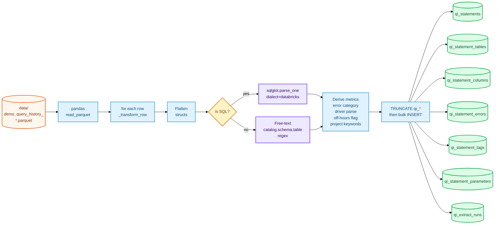
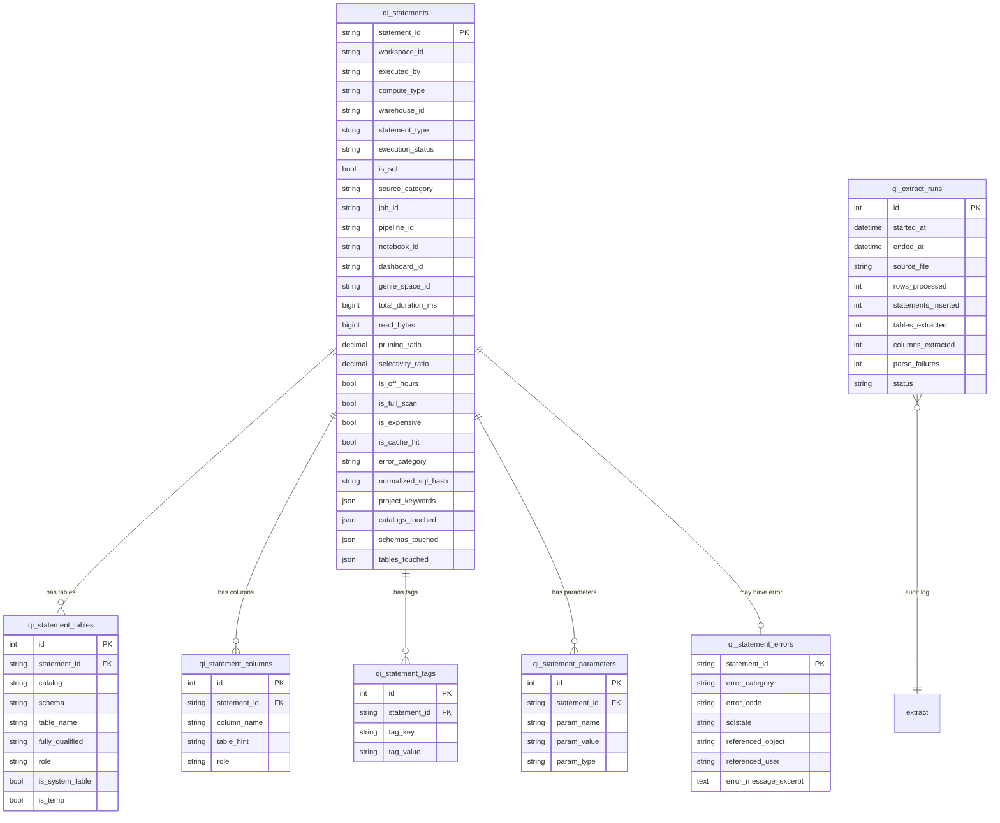

# Query Profiler — Transformation Reference

This document explains **what `backend/extract/query_intel.py` does** when you click
*Transform → Query Profiler (Run)* in Data Management — every column it produces, every derivation rule,
every heuristic, and the new tables it creates.

If `docs/QUERY_HISTORY_SCENARIOS.md` answers *"what can I ask?"*, this doc answers
*"how was every number on that page produced?"*.

---

## 1 · End-to-end flow



The transformer is **idempotent** — it `TRUNCATE`s all `qi_*` tables on entry and rebuilds
them from the chosen parquet. Failure of any single statement (bad SQL parse, unexpected
struct shape, …) is caught and recorded as `parse_failures` in the audit row; it never
aborts the whole run.

---

## 2 · Tables created

Seven tables, all prefixed `qi_` so they stay clearly separate from the raw `query_history`
and the rest of the warehouse schema.

### 2.1 Entity-relationship diagram



### 2.2 Per-table purpose

| Table | Grain | What it answers |
|---|---|---|
| **qi_statements** | 1 row per `statement_id` — fully denormalized flat view | "Give me everything I could want about this query without joining." Powers ~90% of dashboards. |
| **qi_statement_tables** | 1 row per (statement_id, catalog, schema, table, role) | "Which tables did this query touch and how?" `role ∈ {read, write, cte, reference}`. |
| **qi_statement_columns** | 1 row per (statement_id, column_name, role) | "Which columns and in which clause?" `role ∈ {select, where, groupby, orderby, join, having, aggregate}`. |
| **qi_statement_tags** | 1 row per (statement_id, tag_key) | Flattened `query_tags` map. Demo data is unTagged; live Databricks data populates this. |
| **qi_statement_parameters** | 1 row per (statement_id, param_name) | Flattened `query_parameters.named_parameters` AST. Just names + string values — the deeply-nested Spark AST is collapsed. |
| **qi_statement_errors** | 1 row per FAILED statement | Normalized error category / code / SQLSTATE / referenced object & user. |
| **qi_extract_runs** | 1 row per run of the ETL | Audit log: started_at, ended_at, counts, parse failures, success/failure. |

---

## 3 · Column-by-column transformation

### 3.1 `qi_statements` — flat, denormalized

Everything you can answer without a join. Grouped by source.

#### Identity (copied verbatim from `query_history`, then enriched)

| Output column | Source | Rule |
|---|---|---|
| `statement_id` | `query_history.statement_id` | Primary key, verbatim. |
| `account_id`, `workspace_id`, `executed_by`, `executed_by_user_id`, `executed_as`, `executed_as_user_id`, `session_id` | same-named columns | Verbatim. Cast to `str` and stripped; empty → `NULL`. |
| `is_delegated` | derived | `True` iff `executed_by != executed_as`, and both are non-null. Surfaces OAuth / on-behalf-of executions. |
| `principal_kind` | derived | `'human'` if `executed_by` contains `@` (looks like an email). `'service'` if `executed_by` is null but `executed_by_user_id` is all-digits (Databricks service principal IDs are numeric). `'unknown'` otherwise. |

#### Compute (flat from `compute` struct)

| Output column | Source | Rule |
|---|---|---|
| `compute_type` | `compute.type` | Verbatim (`'WAREHOUSE'`, `'SERVERLESS_COMPUTE'`, or `NULL`). |
| `warehouse_id` | `compute.warehouse_id` | Verbatim. Null when `compute_type='SERVERLESS_COMPUTE'`. |
| `cluster_id` | `compute.cluster_id` | Verbatim. Null when `compute_type='WAREHOUSE'`. |

#### Statement metadata + parsed SQL features

| Output column | Source | Rule |
|---|---|---|
| `statement_type` | `query_history.statement_type` | Verbatim (`SELECT`, `MERGE`, `DESCRIBE`, …). |
| `execution_status` | same | `FINISHED` / `FAILED` / `CANCELED`. |
| `statement_text_excerpt` | `statement_text` | First **2,000** characters. Full text intentionally not stored to keep `qi_statements` lean. |
| `statement_text_length` | derived | `len(statement_text)` — useful for outlier detection (huge generated SQL). |
| `statement_text_sha1` | derived | `sha1(statement_text)` — dedupe identical raw text. |
| `normalized_sql_hash` | derived | sqlglot parse → replace every literal with `?` → reserialize → `sha1`. Two queries that differ only in WHERE values share the same hash → repeat-query detection. **NULL** if not parseable as SQL. |
| `is_sql` | derived | `True` only if the cell looks like SQL **and** sqlglot parsed it. See §4. |
| `has_select_star` | sqlglot AST | Any `exp.Star` node anywhere. |
| `has_cross_join` | sqlglot AST | Any `exp.Join` without `on`/`using` and `kind ∈ {CROSS, ''}`. |
| `has_cte` | sqlglot AST | Any `exp.With` node. |
| `has_subquery` | sqlglot AST | Any `exp.Subquery` node. |
| `has_window` | sqlglot AST | Any `exp.Window` node. |
| `is_describe_or_show` | head token | First non-comment keyword is `DESCRIBE`/`DESC`/`SHOW`. |
| `is_dml` | AST type | Root expression is `Insert`/`Update`/`Delete`/`Merge`. |
| `is_ddl` | AST type | Root expression is `Create`/`Drop`/`Alter`. |
| `is_grant_revoke` | AST type / text | Root is `exp.Grant`, **or** statement starts with `GRANT `/`REVOKE `. |
| `is_parameterized` | derived | `True` iff `qi_statement_parameters` has any row for this statement. |

#### Client / connector parsing

| Output column | Source | Rule |
|---|---|---|
| `client_application` | verbatim | `'Databricks SQL Editor'`, `'PowerBI'`, `'Tableau'`, etc. |
| `client_driver` | verbatim | Raw `Name, version` string from the driver. |
| `client_driver_family` | derived | First token of `client_driver`, lowercased, matched against:<br/>• `pydatabricks*` / `pythonsql*` → `'PyConnector'`<br/>• contains `jdbc` → `'JDBC'`<br/>• contains `odbc` → `'ODBC'`<br/>• contains `execapi` → `'ExecApi'`<br/>• contains `adbc` → `'ADBC'`<br/>• contains `nodejs` → `'NodeJS'`<br/>• anything else → `'Other'` |
| `client_driver_version` | derived | Second comma-separated token of `client_driver` (trimmed). |

#### Source attribution (flat from `query_source` struct)

| Output column | Source | Rule |
|---|---|---|
| `source_category` | derived precedence | First match wins: `job_info.job_id` → `JOB`; `pipeline_info.pipeline_id` → `PIPELINE`; `notebook_id` → `NOTEBOOK`; `dashboard_id` or `legacy_dashboard_id` → `DASHBOARD`; `alert_id` → `ALERT`; `sql_query_id` → `SQL_QUERY`; `genie_space_id` → `GENIE`; else → `AD_HOC`. |
| `job_id`, `job_run_id`, `job_task_run_id` | `query_source.job_info.*` | Verbatim. |
| `pipeline_id`, `update_id` | `query_source.pipeline_info.*` | Verbatim. |
| `notebook_id`, `dashboard_id`, `legacy_dashboard_id`, `alert_id`, `sql_query_id`, `genie_space_id` | same-named in `query_source` | Verbatim. |

#### Latency, IO, time (verbatim)

`total_duration_ms`, `waiting_for_compute_duration_ms`, `waiting_at_capacity_duration_ms`,
`execution_duration_ms`, `compilation_duration_ms`, `total_task_duration_ms`,
`result_fetch_duration_ms`,
`start_time`, `end_time`, `update_time`,
`read_partitions`, `pruned_files`, `read_files`, `read_rows`, `produced_rows`, `read_bytes`,
`read_io_cache_percent`, `from_result_cache`, `spilled_local_bytes`, `written_bytes`,
`shuffle_read_bytes`, `written_rows`, `written_files`, `pruned_files_bytes`, `read_files_bytes`,
`cache_origin_statement_id`
— **all verbatim** from `query_history`. Cast to safe Python types (`int`, `float`, `bool`,
`datetime`) and `NaN`/`NaT` → `NULL`.

#### Derived temporal helpers

| Output column | Rule |
|---|---|
| `start_date` | `start_time.date()` |
| `start_hour` | `start_time.hour` (0–23) |
| `start_day_of_week` | `start_time.weekday()` (0 = Mon, 6 = Sun) |
| `is_off_hours` | `start_hour < 7 OR start_hour >= 19`. Sensible default; org can re-define. |
| `is_weekend` | `start_day_of_week >= 5` |

#### Derived performance metrics

| Output column | Formula |
|---|---|
| `pruning_ratio` | `pruned_files / (read_files + pruned_files)`, rounded to 4 dp. `NULL` if denominator 0 or columns null. |
| `selectivity_ratio` | `produced_rows / read_rows`, rounded to 6 dp. Tiny ratio + big bytes = full-scan smell. |
| `waiting_pct` | `(waiting_for_compute_duration_ms + waiting_at_capacity_duration_ms) / total_duration_ms` |
| `compile_pct` | `compilation_duration_ms / total_duration_ms` |
| `is_full_scan` | `read_bytes > 100 GB` **AND** `produced_rows < 1,000`. Hard cut-off heuristic — false positives are acceptable. |
| `is_cache_hit` | Mirrors `from_result_cache` for ergonomic naming. |
| `is_expensive` | Set in the **post-pass**: any statement at or above the 99th percentile of `total_duration_ms` for the run. |

#### Outcome (error categorization)

| Output column | Rule |
|---|---|
| `error_category` | See §5. `NULL` for successful statements. |
| `error_code` | First `[ALL_CAPS_TOKEN]` match in `error_message`. |
| `sqlstate` | Value after `SQLSTATE:` in the message. |

#### Project-attribution helpers (JSON columns)

| Output column | Rule |
|---|---|
| `project_keywords` | Tokenized union of: distinct `catalog` names, distinct `schema` names (each split on `[_\-\.\s]+`), every `tag_value`, every `param_name`. Stripped of a small stop-list (`default`, `main`, `system`, `hive_metastore`, `tmp`, env names, …) and tokens shorter than 3 chars. Capped at 30 tokens. |
| `catalogs_touched` | Sorted distinct `catalog` values from the parsed table list. |
| `schemas_touched` | Sorted distinct `schema` values. |
| `tables_touched` | Sorted distinct `fully_qualified` values, capped at 50. |

These JSON columns let the FinOps "project keyword search" hit a fast path without joining
`qi_statement_tables` for every query.

---

### 3.2 `qi_statement_tables`

One row per **(statement_id, catalog, schema, table, role)**.

| Column | How it's filled |
|---|---|
| `catalog`, `db_schema` (`schema`), `table_name` | sqlglot's `exp.Table` node has `.args['catalog']`, `.args['db']` (schema slot), and `.name` (table). Any nulls preserved. |
| `fully_qualified` | `.`.join of non-null pieces, e.g. `acme_finance.gold.fact_invoice`. |
| `role` | `'write'` if this table is the first `exp.Table` under an `Insert`/`Update`/`Delete`/`Merge`/`Create`/`Alter`/`Drop` root. Any name appearing in a `WITH` CTE → `'cte'`. Otherwise `'read'`. Free-text fallback rows (non-SQL cells matched by regex) → `'reference'`. |
| `is_system_table` | `catalog == 'system'`. |
| `is_temp` | `True` for CTE rows. |

Same (catalog, schema, table, role) is deduped per statement so a heavily-referenced table
doesn't blow up the row count.

---

### 3.3 `qi_statement_columns`

One row per **(statement_id, column_name, table_hint, role)** — deduped on that tuple.

| `role` | Detected by traversing… |
|---|---|
| `select` | Top-level projections of the outermost `exp.Select`. Star (`*`) projections contribute zero rows here — captured instead by `has_select_star`. |
| `where` | `exp.Where` subtree → `exp.Column` nodes. |
| `groupby` | `exp.Group` subtree. |
| `orderby` | `exp.Order` subtree. |
| `having` | `exp.Having` subtree. |
| `join` | `exp.Join.on` subtree (cross joins have no `on`, so they contribute nothing). |
| `aggregate` | Columns nested inside `exp.AggFunc` (count/sum/avg/min/max etc.). |

`table_hint` is `exp.Column.table` when the reference was qualified (`a.id`), else `NULL`.

---

### 3.4 `qi_statement_tags`

One row per `(statement_id, tag_key)`. Source = `query_tags` map, flattened. `tag_value` is
stringified (no type preservation — the underlying map values are already strings in
Databricks usage anyway).

Demo data has `query_tags` IS NULL across all rows, so this table is empty on demo. Live
Databricks data is expected to populate it.

---

### 3.5 `qi_statement_parameters`

The `query_parameters` column in `query_history` is a deeply nested Spark AST (one nested
struct per parameter, with literal types, lambda expressions, sort orders, etc.).

We extract only the useful surface:

```
query_parameters
  .named_parameters
    .<PARAM_NAME>
      .exprs[0]
        .literal
          .string_value   ← param_value (or int_value, long_value, etc.)
        .data_type.type_name  ← param_type
```

Any value type is coerced to its string form. Missing values are `NULL`.

---

### 3.6 `qi_statement_errors`

Populated only for FAILED statements (or any non-null `error_message`).

| Column | Rule |
|---|---|
| `error_category` | See §5 — categorical bucket. |
| `error_code` | First `[CODE]` token in the message. |
| `sqlstate` | The `SQLSTATE: XXXXX` value if present. |
| `error_message_excerpt` | First 2,000 chars of `error_message`. |
| `referenced_object` | First backticked object reference found via regex, joined with `.`. E.g. ``[TABLE_OR_VIEW_NOT_FOUND] `repo`.`schema`.`tbl` `` → `repo.schema.tbl`. |
| `referenced_user` | First `User <token>` capture from the message — handy for permission denials. |

Statement-level deduplication: only one row per `statement_id` (PK).

---

### 3.7 `qi_extract_runs`

Audit log. Every click of *Transform → Query Profiler (Run)* inserts one row. On success it's updated
with all the per-table row counts + `duration_seconds`. On failure the error message is
stored and `status='failed'`.

---

## 4 · The is-this-SQL? heuristic

`statement_text` in `query_history` is whatever the user submitted. Notebook cells can be
Python or Scala. Feeding those to sqlglot wastes CPU and pollutes the parse-error stats.

Order of checks (in `_looks_like_sql`):

1. **Empty / whitespace** → not SQL.
2. **Python tell-tales in first 200 chars** → not SQL. List: `dbutils.`, `spark.sql(`,
   `spark.read`, `df.write`, `df.show`, `df.collect`, `= set([`, `= [`, `import `, `def `,
   `lambda `, `F.col(`, `self._`, `print(`, `if __name__`.
3. **First non-comment, non-blank line's first token** is one of the SQL DDL/DML keywords.
   If not → not SQL.

If `_looks_like_sql` returns `False`, we still attempt **free-text catalog.schema.table
extraction** via regex (`_extract_tables_from_freetext`). This catches notebook cells that
mention table names in string literals — those rows get `role='reference'`.

If `_looks_like_sql` returns `True` but `sqlglot.parse_one` raises → `is_sql=False` and we
fall through to the regex extraction as well. Nothing is wasted.

---

## 5 · Error categorization rules

```python
PERMISSION  : INSUFFICIENT_PERMISSIONS | PERMISSION_DENIED | ACCESS_DENIED
NOT_FOUND   : TABLE_OR_VIEW_NOT_FOUND | UNRESOLVED_COLUMN | UNRESOLVED_TABLE
            | SCHEMA_NOT_FOUND | DATABASE_NOT_FOUND | COLUMN_NOT_FOUND
PARSE       : PARSE_SYNTAX_ERROR | PARSE_ERROR | INVALID_SYNTAX
OOM         : OUT_OF_MEMORY | OOM | MEMORY_LIMIT_EXCEEDED
TIMEOUT     : STATEMENT_TIMEOUT | TIMEOUT | QUERY_TIMEOUT
ANALYSIS    : ANALYSIS_ERROR | AMBIGUOUS_REFERENCE | DATATYPE_MISMATCH
            | GROUP_BY_POS_OUT_OF_RANGE | INVALID_PARAMETER_VALUE
DEPENDENCY  : FAILED_DEPENDENCY | DELTA_VERSIONS_NOT_CONTIGUOUS
OTHER       : any FAILED row that doesn't match the above
```

Matching is two-pass:

1. Extract the first `[BRACKETED_TOKEN]` — if it matches a code in any bucket above, use
   that bucket's category.
2. Fallback: case-insensitive substring scan of the whole message against every needle
   above. First hit wins.

If neither pass matches, the statement is still categorized as `OTHER` (provided it has an
`error_message` or `execution_status='FAILED'`), so every failure is accounted for.

---

## 6 · The "expensive" post-pass

`is_expensive` is **not** computed per-row in the main loop — it's a percentile so it needs
the full distribution. After the main loop:

```python
durations = [s['total_duration_ms'] or 0 for s in statements]
threshold = sorted(durations)[max(0, int(len(durations) * 0.99) - 1)]
for s in statements:
    if (s['total_duration_ms'] or 0) >= threshold and threshold > 0:
        s['is_expensive'] = True
```

So roughly the top 1% by duration get the flag. Threshold is recomputed per ETL run.

---

## 7 · Source-file resolution rules

The endpoint takes `use_demo: bool` (default `True`). The transformer translates that to a
`file_prefix`:

| `use_demo` | `file_prefix` | Glob pattern |
|---|---|---|
| `True`  | `'demo_'` | `demo_query_history_*.parquet` |
| `False` | `''`      | `query_history_*.parquet` (real files only — demo prefix excluded explicitly) |

Files are sorted **descending** by name. Since names use ISO dates (`_YYYY-MM-DD.parquet`),
that's effectively newest-first.

A safety fallback: if `use_demo=True` but no `demo_*` files exist, the transformer falls
back to the latest real `query_history_*.parquet` rather than failing.

---

## 8 · Idempotency, replay, and audit

Each invocation:

1. Inserts a `qi_extract_runs` row with `status='running'`.
2. `TRUNCATE`s every `qi_*` table (in FK-safe order: errors / parameters / tags / columns /
   tables / statements).
3. Bulk-inserts in `BATCH_SIZE = 1000`-sized chunks per table.
4. Updates the audit row with `status='success'`, counts, and `duration_seconds`.

On exception, the audit row is updated with `status='failed'` and the error message before
re-raising. So `qi_extract_runs` is the single source of truth for "did the last run
succeed and when?".

---

## 9 · Limitations & known edge cases

1. **`statement_text` is truncated by Databricks** at the SDK boundary for very large
   queries. Pattern-based extraction will under-count the largest queries.
2. **CTE name shadowing**: if a query has a CTE named `customer` and also reads a real
   table named `customer`, sqlglot resolves the first `exp.Table.name == 'customer'` as the
   CTE (correct). We mark it `role='cte'` and won't surface it as a real table read for
   that query.
3. **`compute.cluster_id` is null on warehouse queries** and vice-versa. Always check
   `compute_type` before joining.
4. **`from_result_cache=True` rows have zero `read_bytes`** — any "bytes scanned" rollup
   should `WHERE NOT from_result_cache` or it'll dilute the picture.
5. **`CANCELED` queries still consumed compute** up to the cancellation point — they're
   excluded from success-rate KPIs but included in cost roll-ups.
6. **`client_application` is NULL for ~12% of rows** in demo data — bucket them as
   `'Unknown'` in queries.
7. **`query_parameters` flattening** preserves only the **first** `exprs[0]` literal per
   parameter. If a parameter has multiple values (rare) only the first is captured.
8. **Free-text table extraction** matches strictly `backticked.three.parts` patterns. Bare
   two-part `schema.table` references in notebook cells are missed.
9. **Time zones**: `start_time` is whatever Databricks delivered (UTC in practice). The
   off-hours and weekend flags are computed against that — so for a globally distributed
   org the off-hours window may need to become per-user.

---

## 10 · Where to look in the code

```
backend/extract/query_intel.py
  ├── _looks_like_sql               §4 — is-it-SQL? heuristic
  ├── _categorize_error             §5 — error bucket
  ├── _extract_error_object         §3.6 — referenced object/user
  ├── _parse_driver                 §3.1 client section
  ├── _principal_kind               §3.1 identity section
  ├── _normalize_sql                §3.1 normalized_sql_hash
  ├── _extract_sql_features         §3.1 SQL feature flags + tables + columns
  ├── _extract_tables_from_freetext §4 — non-SQL fallback
  ├── _source_category              §3.1 source attribution
  ├── _flatten_query_parameters     §3.5
  ├── _flatten_query_tags           §3.4
  ├── _project_keywords             §3.1 project_keywords
  ├── _transform_row                Per-row orchestrator
  └── extract_query_intel           Entry point — orchestration + audit
```

Endpoint: `backend/routers/admin.py::extract_query_intel_endpoint`.

Models: `backend/models.py::QiStatement, QiStatementTable, QiStatementColumn,
QiStatementTag, QiStatementParameter, QiStatementError, QiExtractRun`.
