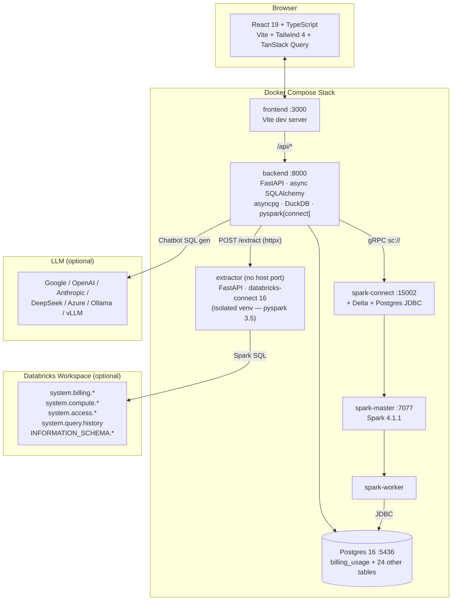
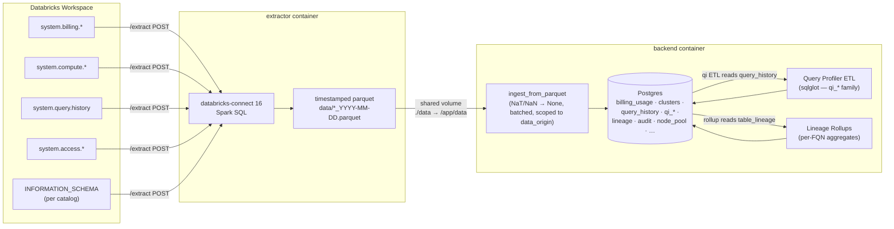
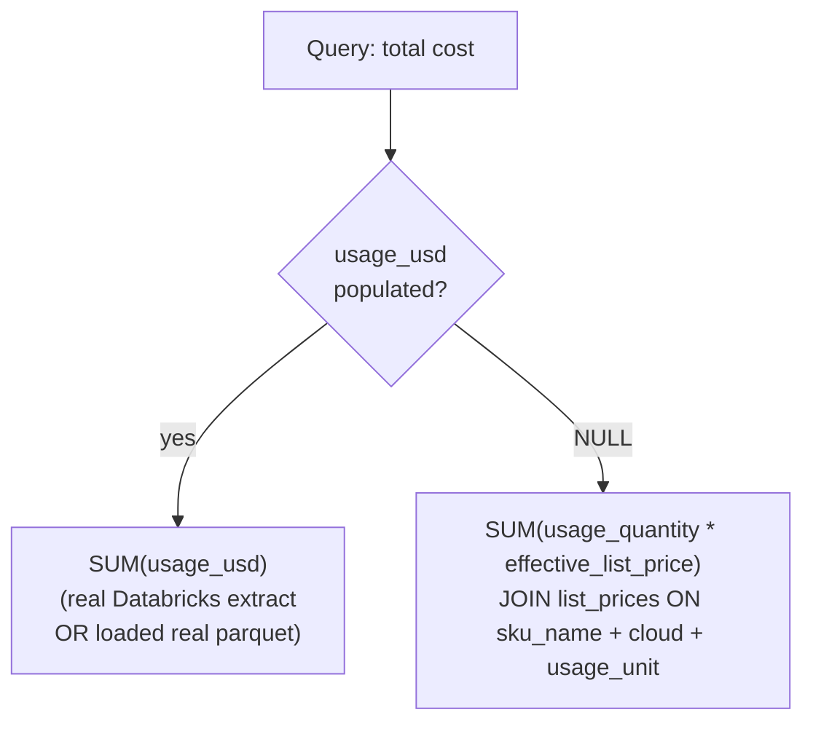
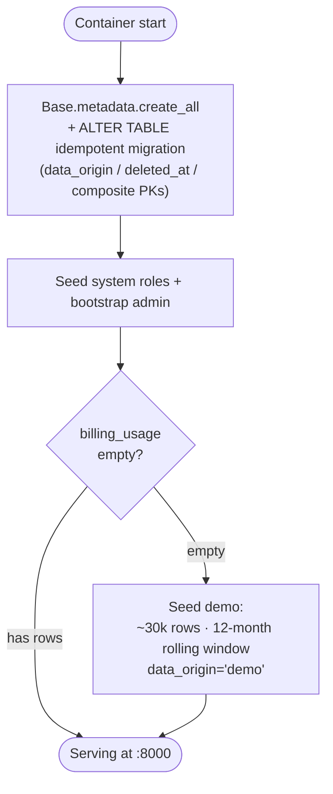

# Databricks Billing & Observability — Technical Documentation

> Self-hosted analytics + observability app over Databricks system tables.
> Billing cost analysis · query profiling · Unity Catalog browsing ·
> lineage · audit · compute telemetry · LLM chatbot — all running locally
> against extracted parquet or a live Databricks workspace.

This README is the **umbrella technical reference** and the entry-point
index for the `docs/technical/` folder. The deep-dives in this folder:

| Doc | What it covers |
|---|---|
| [`ARCHITECTURE.md`](ARCHITECTURE.md) | System diagrams — services, networking, data flow at the container level. |
| [`SPARK_STACK.md`](SPARK_STACK.md) | Spark master / worker / connect deployment for the bundled `local-spark` docker profile — Delta + Postgres JDBC packages, Ivy cache. |
| [`SPARK_EXTERNAL_DEPLOYMENT.md`](SPARK_EXTERNAL_DEPLOYMENT.md) | Pointing the app at an externally-managed Spark Connect endpoint or a Databricks workspace — env vars, JDBC driver provisioning, Postgres reachability, Databricks PAT auth. |
| [`QUERY_ENGINE.md`](QUERY_ENGINE.md) | DuckDB vs Spark engine: rationale, behaviour differences, `jdbc_views` vs `materialized` Spark sub-modes. |
| [`QUERY_PROFILER_TRANSFORMATION.md`](QUERY_PROFILER_TRANSFORMATION.md) | Column-by-column transformation rules in the `query_history` → `qi_*` ETL. |
| [`SECURITY.md`](SECURITY.md) | Auth + RBAC: JWT, email verification, OAuth, role filters, feature matrix. |
| [`CLOUD_MIGRATION.md`](CLOUD_MIGRATION.md) | Deploying to AWS / Azure / GCP — storage, networking, secrets. |

Cross-folder topics — feature deep-dives (audit, compute, lineage) live
in `docs/features_grouped/`; persona-driven scenario catalogues live in
`docs/scenarios/`; user-facing workflows + per-column schema reference
live at `docs/` root.

---

## Table of Contents

1. [Getting Started](#getting-started)
2. [System Architecture](#system-architecture)
3. [Data Sources — system tables in scope](#data-sources--system-tables-in-scope)
4. [Extract Groups + per-table Lookbacks](#extract-groups--per-table-lookbacks)
5. [View-Mode Isolation (real vs demo)](#view-mode-isolation-real-vs-demo)
6. [Data Flow Pipeline](#data-flow-pipeline)
7. [Database Schema](#database-schema)
8. [Cost Calculation Logic](#cost-calculation-logic)
9. [API Endpoints Reference](#api-endpoints-reference)
10. [Query Profiler API Reference](#query-profiler-api-reference)
11. [Frontend Pages & Navigation](#frontend-pages--navigation)
12. [Data Management Workflow](#data-management-workflow)
13. [RBAC & Auth](#rbac--auth)
14. [Chatbot](#chatbot)
15. [Spark SQL Editor](#spark-sql-editor)
16. [Startup Behavior](#startup-behavior)
17. [Environment Variables](#environment-variables)
18. [Project Structure](#project-structure)
19. [Glossary](#glossary)

---

## Getting Started

### Prerequisites

- **Docker** + **Docker Compose**
- *(Optional)* a Databricks workspace with system tables enabled, for live extraction
- *(Optional)* pre-extracted parquet files in `databricks_cost_app/data/`

### Quick start

```bash
cd databricks_cost_app
docker compose up --build

# Frontend:        http://localhost:3000   (auto-bumps to :3001/3002/… if busy)
# Backend API:     http://localhost:8000   (Swagger: /docs)
# Postgres:        localhost:5436          (mapped from container :5432)
# Spark master UI: http://localhost:8080
# Spark worker UI: http://localhost:8081
# Spark Connect:   sc://localhost:15002    (gRPC, used by backend)
```

On first boot the backend **seeds demo data** (~30 000 billing rows + 5
workspaces + 15 clusters + 8 warehouses + 20 jobs) so you can log in and
see populated dashboards immediately. Real data and live Databricks
extraction are explicit user actions via **Admin → Data Management** once
you're logged in — *no live external system is ever hit on startup*.

### Bootstrap admin

The first user is created from your `.env`:

```
DEFAULT_ADMIN_EMAIL=admin@example.com
DEFAULT_ADMIN_PASSWORD=<your-password>
```

Log in as that account; everything else (additional users, custom roles,
view-mode toggle) is reachable from the UI.

### Loading real data

Three paths, all from **Admin → Data Management** in the running app:

1. **Live Databricks extract** (Extract section) — proxies to the
   isolated extractor container, then ingests the parquet it writes.
   Configure `DATABRICKS_HOST` + `DATABRICKS_TOKEN` (or
   `DATABRICKS_CONFIG_PROFILE`) in `.env` first.
2. **Load Real Parquet** (LOAD section) — ingests previously-extracted
   `*_<date>.parquet` files in `data/` into `data_origin='real'`. Useful
   when you have a snapshot you want to replay without paying for a fresh
   extract.
3. **Load Demo Parquet** (LOAD section) — ingests `demo_*_<date>.parquet`
   into `data_origin='demo'`. Demo parquet is produced by
   `scripts/simulate_demo_data.py` (a substring-scrubbed copy of a real
   parquet with Acme identifiers).

The view-mode toggle in the top-right switches every dashboard between
the **`real`** and **`demo`** partitions cleanly.

---

## System Architecture



**Key isolation choices.** The backend pins `pyspark[connect] 4.1.1` to
talk to Spark Connect 4.1.1. `databricks-connect` ships its own
pyspark 3.5.x and would fight the backend's import. So Databricks
extraction lives in a **separate `extractor` container** with its own
venv. The backend calls it over HTTP and consumes the parquet it writes.

**Spark stack is optional.** When the Query Engine is set to `duckdb`
(default), the four Spark containers idle. Switch to Spark via
**Admin → Data Management → Query Engine** to enable the JDBC view path
(`jdbc_views`) or the Delta-materialised path (`materialized`). See
[`QUERY_ENGINE.md`](QUERY_ENGINE.md) and [`SPARK_STACK.md`](SPARK_STACK.md).

### Technology Stack

| Layer | Tech | Notes |
|---|---|---|
| Frontend | React 19 · Vite 6 · TanStack Query 5 · Recharts · Tailwind 4 · Lucide | Light theme |
| Backend | FastAPI (Python 3.12) · uv · async SQLAlchemy 2 · asyncpg · pydantic 2 | |
| DB | PostgreSQL 16 | Host port 5436; container :5432 |
| Extractor | FastAPI · databricks-connect 16.x · databricks-sdk | Isolated container |
| Query engine | DuckDB *(default)* · Apache Spark 4.1.1 + Delta 4 + Spark Connect | Picker in Data Management |
| Chatbot | DuckDB or Spark + LLM provider of choice | Provider selectable per session |
| Auth | JWT · bcrypt · OAuth 2 (Google · Microsoft · GitHub) · email verification | |

---

## Data Sources — system tables in scope

The app extracts from these Databricks system tables and lands each in a
shape-preserving Postgres table:

| System table | Postgres table | Group |
|---|---|---|
| `system.billing.usage` | `billing_usage` | `billing` |
| `system.billing.list_prices` | `list_prices` | `billing` |
| `system.compute.clusters` | `clusters` | `compute` |
| `system.compute.warehouses` | `warehouses` | `compute` |
| `system.lakeflow.jobs` | `jobs` | `compute` |
| `system.access.workspaces_latest` | `workspaces` | `compute` |
| `system.query.history` | `query_history` | `query_history` |
| `INFORMATION_SCHEMA` crawl (per catalog) | `databricks_meta` | `meta` |
| `system.access.table_lineage` | `table_lineage` | `lineage` |
| `system.access.column_lineage` | `column_lineage` | `lineage` |
| `system.access.audit` | `audit_events` | `audit` |
| `system.access.assistant_events` | `assistant_events` | `audit` |
| `system.compute.node_timeline` | `node_timeline` | `node_pool` |
| `system.compute.warehouse_events` | `warehouse_events` | `node_pool` |
| `system.compute.node_types` | `node_types` | `node_pool` |
| `system.compute.node_events` | `instance_events` | `node_pool` *(renamed downstream to match the Databricks UI label)* |
| `system.compute.instance_pools` | `instance_pools` | `node_pool` |

Derived tables (built from the above, not extracted directly):

- `qi_statements` + 5 children (`qi_statement_tables`, `qi_statement_columns`, `qi_statement_tags`, `qi_statement_parameters`, `qi_statement_errors`) — produced by the **Query Profiler ETL** parsing `query_history.statement_text` with sqlglot.
- `lineage_rollups` — per-FQN aggregates over `table_lineage`, built by the Transform → Lineage rollups task.

Per-column schemas live in the per-column data dictionary in the parent `docs/` folder.

---

## Extract Groups + per-table Lookbacks

Extraction is grouped so admins can refresh subsets independently. Group
membership is defined in `backend/extract/groups.py` (mirrored in
`extractor/groups.py`):

| Group | Member tables | Default state |
|---|---|---|
| `billing` | `billing_usage`, `list_prices` | ON |
| `compute` | `clusters`, `warehouses`, `jobs`, `workspaces` | ON |
| `query_history` | `query_history` | ON |
| `meta` | `databricks_meta` | ON |
| `lineage` | `table_lineage`, `column_lineage` | **OFF** (high volume) |
| `audit` | `audit_events`, `assistant_events` | ON |
| `node_pool` | `node_timeline`, `warehouse_events`, `node_types`, `instance_events`, `instance_pools` | **OFF** (`node_timeline` is per-minute-per-instance) |

The Extract panel exposes **per-table lookback knobs** for the
time-bounded tables — each chunked at the extractor and bounded with
sensible defaults:

| Table | Default lookback | Chunk size |
|---|---|---|
| `table_lineage` | 14 d | 7 d |
| `column_lineage` | 7 d | 3 d |
| `audit_events` | 3 d | 7 d |
| `assistant_events` | 30 d | one shot |
| `node_timeline` | 3 d | 3 d |
| `warehouse_events` | 30 d | 7 d |
| `instance_events` | 14 d | 7 d |

Reference tables (`node_types`, `instance_pools`) have no date bound and
are one-shot SELECTs. Wider windows than the defaults can OOM the Spark
Connect driver — see the COMPUTE feature doc in `docs/features_grouped/` for the heuristics.

---

## View-Mode Isolation (real vs demo)

Every domain table carries two isolation columns:

| Column | Type | Purpose |
|---|---|---|
| `data_origin` | `VARCHAR(8) NOT NULL DEFAULT 'real'` | `'real'` for extracted Databricks data, `'demo'` for synthetic data from `scripts/simulate_demo_data.py`. |
| `deleted_at` | `TIMESTAMP NULL` | Soft-delete tombstone. Reads always filter `IS NULL`. The `qi_*` family has *no* `deleted_at` — each ETL run rebuilds its partition wholesale. |

Per-user view selection lives on `auth_users.viewing_data_mode` (`'real'`
or `'demo'`). Every read endpoint scopes by the active user's value:

- **Hand-written endpoints** (billing, compute, analytics, meta explorer,
  audit, node-pool dashboards) call `resolve_effective_filters(authed)`
  in `data_scope.py` and add an explicit `WHERE data_origin = …` clause.
- **Query Profiler endpoints** (`/api/query-intel/*`) inherit the filter
  through a router-level dependency `_scope_qi` that stashes the user's
  view-mode in a contextvar; `run_qi(...)` reads the contextvar and
  textually rewrites every `FROM qi_*` / `JOIN qi_*` reference to a
  filtering subquery `(SELECT * FROM <t> WHERE data_origin='<mode>') AS <t>`.
- **Spark engine** path is filtered at the JDBC layer:
  `_register_base_jdbc_views(spark, view_mode)` in `spark_session.py`
  bakes the filter into the `.option("query", "SELECT * FROM <t> WHERE
  data_origin='<mode>'…")` call when registering temp views.
- **Chatbot** path is filtered analogously by `_build_duckdb(view_mode)`
  in `routers/chat.py`, which constructs DuckDB views that filter on
  `data_origin` before exposing them to the LLM-generated SQL.

**Composite PK on `qi_statements` / `qi_statement_errors`** —
`(statement_id, data_origin)`. Lets the same Databricks `statement_id`
coexist in both partitions (the demo simulator uses real `statement_id`s
for shape preservation; without the composite PK, re-running the demo
ETL after the real ETL would collide).

**Hard delete** scopes to one `data_origin` at a time and now covers
**every** isolation-aware table — including `qi_*`, `audit_*`, lineage,
node-pool, and `databricks_meta` (a previous version missed everything
added after the initial release).

---

## Data Flow Pipeline



The extractor and backend share `./data` as a docker volume. Parquet is
the hand-off — never direct gRPC between them.

### Three ways data lands in Postgres

| Path | Trigger | Group | Notes |
|---|---|---|---|
| Live Databricks extract | Admin → Data Management → Extract | All groups | Proxies to extractor; ingests parquet output. Stamps `data_origin='real'`. |
| LOAD Real Parquet | Admin → Data Management → LOAD | All groups | Replays an already-on-disk extract without billing Databricks. `data_origin='real'`. |
| LOAD Demo Parquet | Admin → Data Management → LOAD | All groups | Reads `demo_*` parquet produced by `scripts/simulate_demo_data.py`. `data_origin='demo'`. |
| Auto demo seed | Backend startup if `billing_usage` is empty | billing/compute/jobs only | `seed_data.seed_database()` synthesises ~30k rolling-window rows with `data_origin='demo'`. First-boot ergonomics. |

---

## Database Schema

The schema is intentionally shape-preserving — every Databricks STRUCT /
MAP either has its hot fields split into columns (so dashboards can
`GROUP BY` them cheaply) or is stored as JSON. The full per-column
reference is in the per-column data dictionary in the parent `docs/` folder; the table
list below is the navigational summary.

### Domain tables (isolation-aware: `data_origin` + `deleted_at`*)

> *`qi_*` tables have only `data_origin` — they're fully rebuilt per
> partition by every ETL run, so a soft-delete tombstone has no meaning.

**Billing**
- `billing_usage` — one row per usage record, flattened STRUCTs, pre-calc `usage_usd`.
- `list_prices` — `pricing.default` and `pricing.effective_list.default` split out.

**Compute (catalogue)**
- `clusters`, `warehouses`, `jobs`, `workspaces` — catalogue / state tables.

**Query history**
- `query_history` — verbatim row-per-statement; STRUCT/MAP columns kept as JSON.

**Unity Catalog snapshot**
- `databricks_meta` — one row per `(catalog, schema, table, column)` from the per-catalog `INFORMATION_SCHEMA` crawl.

**Lineage**
- `table_lineage` — per-edge from `system.access.table_lineage`. NULL-source / NULL-target encode event class. `entity_metadata` → JSON.
- `column_lineage` — same shape with column granularity.
- `lineage_rollups` — materialised per-FQN aggregates rebuilt by Transform.

**Audit**
- `audit_events` — per-event from `system.access.audit`. `user_identity` / `request_params` / `response` / `identity_metadata` → JSON; `user_identity_email`, `response_status_code`, `response_error_message` pre-extracted.
- `assistant_events` — user-submitted Databricks Assistant / Genie prompts.

**Node pool / compute telemetry**
- `node_timeline` — per-minute VM utilisation snapshot. The single biggest table on a busy account.
- `warehouse_events` — SQL warehouse lifecycle events.
- `node_types` — reference catalogue of cloud node SKUs.
- `instance_events` — VM lifecycle events (sourced from `system.compute.node_events`).
- `instance_pools` — pool catalogue.

**Query Profiler (derived from `query_history` via sqlglot)**
- `qi_statements` — flat denormalised view; composite PK `(statement_id, data_origin)`.
- `qi_statement_tables` — per-(statement, table) with `role ∈ {read, write, cte, reference}`.
- `qi_statement_columns` — per-(statement, column) with `role ∈ {select, where, groupby, …}`.
- `qi_statement_tags`, `qi_statement_parameters` — flattened MAPs.
- `qi_statement_errors` — 1:1 with FAILED statements; composite PK `(statement_id, data_origin)`.

### Operational tables (not isolation-aware)

- `system_config` — single-row k/v (e.g. `query_intel_engine`, `spark_mode`).
- `qi_extract_runs` — audit log of every Query Profiler ETL run.
- `background_jobs` — long-running job state (LOAD, hard delete, materialise, …) so progress survives container restarts.
- `ingest_cursors` — high-water-mark cursor per `(table, data_origin)` for incremental loads.

### Auth tables (not isolation-aware)

- `auth_users`, `auth_roles`, `auth_user_roles`, `auth_oauth_accounts`, `auth_email_verification_tokens` — JWT-based auth + RBAC; see [`SECURITY.md`](SECURITY.md).

---

## Cost Calculation Logic



The Databricks reference formula (matched exactly by this app) is
`COALESCE(usage_quantity * pricing.effective_list.default, 0) AS usage_usd`.
The extractor pre-calculates this in Spark SQL during extraction so the
backend can `SUM(usage_usd)` directly with no Postgres-side join. Demo
data also stores a pre-calculated `usage_usd` (see
`backend/seed_data.py:_build_record`), so the JOIN fallback path is
effectively unused today but kept as defence in depth.

---

## API Endpoints Reference

All endpoints are mounted under `/api/`. Every read endpoint that
touches domain data is **view-mode scoped** — the active user's
`viewing_data_mode` decides which partition is queried. The Vite dev
server proxies `/api/*` straight to the backend, so the frontend talks
to the API with a relative path.

### Auth (`/api/auth`)

| Method | Path | Description |
|---|---|---|
| `POST` | `/auth/register` | Self-service signup; emails verification link. |
| `POST` | `/auth/login` | Email/password → JWT (blocked until verified). |
| `GET` | `/auth/me` | Active user with roles, `is_admin`, view-mode. |
| `GET` | `/auth/verify-email` | Consumes verification token. |
| `POST` | `/auth/resend-verification` | Re-issue a link (no user enumeration). |
| `GET` | `/auth/oauth/providers` | Lists configured providers. |
| `GET` | `/auth/oauth/{provider}/authorize` · `/callback` | OAuth flow. |
| `GET` | `/auth/dev-credentials` | Dev-only bootstrap admin creds (gated on `EXPOSE_DEV_CREDENTIALS`). |

### Data ops (`/api/data-ops`, auth-required)

| Method | Path | Description |
|---|---|---|
| `GET` / `PATCH` | `/data-ops/me/view-mode` | Active user's `viewing_data_mode` getter/setter. |
| `GET` | `/data-ops/progress` | Live progress map (key = "kind"). Powers the `<ProgressCard>` next to running ops. |
| `POST` | `/data-ops/progress/{kind}/cancel` | Cooperative cancellation flag. Handlers wrapping their work in a Task watch it and abort the in-flight task on flip. |
| `POST` | `/data-ops/soft-delete` · `/hard-delete` · `/restore` | Body `{origin: 'real'|'demo'}`. Hard delete covers all 18 isolation-aware tables. |
| `GET` | `/data-ops/jobs` | Background-job history for the notification bell. |
| `GET` | `/data-ops/per-table-counts` | Per-table `{live, deleted}` counts per partition (drives the Erase Data tiles). |

### Billing (`/api/billing`)

Common params: `start_date`, `end_date`. View-mode scoped.

| Method | Path | Description |
|---|---|---|
| `GET` | `/billing/usage-summary` | Aggregated cost + DBUs by `group_by` (`day`/`week`/`month`). |
| `GET` | `/billing/by-sku` · `by-workspace` · `by-origin` · `by-usage-type` · `by-cloud` | Dimension breakdowns. |
| `GET` | `/billing/by-user` | Top users (`run_as`); `limit` 1-100. |
| `GET` | `/billing/daily-trend` | Time series; optional `sku_name`, `workspace_id`. |
| `GET` | `/billing/top-skus` | Top SKUs by cost. |

### Compute catalogue (`/api/compute`)

| Method | Path | Description |
|---|---|---|
| `GET` | `/compute/clusters` | Paginated clusters with search; filter `cluster_source`. |
| `GET` | `/compute/warehouses` | Paginated warehouses with search. |
| `GET` | `/compute/cluster-cost` · `warehouse-cost` | Per-resource cost over a window. |

### Advanced analytics (`/api/analytics`)

| Path | Description |
|---|---|
| `/analytics/cost-anomalies` | 30-day rolling z-score (2σ). |
| `/analytics/forecast` | 30-day linear regression from last 90 d. |
| `/analytics/mom-growth` | Month-over-month deltas. |
| `/analytics/cost-breakdown-matrix` | Workspace × origin heat-matrix. |
| `/analytics/utilization-summary` | Per-workspace avg / peak / total. |
| `/analytics/kpi-summary` | Headline tiles. |

### Meta Explorer + lineage (`/api/meta`)

| Path | Description |
|---|---|
| `/meta/stats` · `/catalogs` · `/databases` · `/tables` · `/table-detail` · `/search` | Unity Catalog browser. |
| `/meta/export/{catalogs,tables,columns}` | Bulk CSV/XLSX export sources. |
| `/meta/lineage/stats` · `/search` · `/table-graph` · `/column-graph` · `/tops` · `/column-tops` | Lineage dashboard endpoints. See the LINEAGE feature doc in `docs/features_grouped/`. |
| `/meta/audit/stats` · `/recent` · `/search` | Audit dashboard endpoints. See the AUDIT feature doc in `docs/features_grouped/`. |
| `/meta/node-pool/stats` · `/utilization` · `/warehouse-events` · `/instance-events` · `/node-types` · `/instance-pools` | Node-pool dashboard. See the COMPUTE feature doc in `docs/features_grouped/`. |

### Chat (`/api/chat`, auth-required)

| Path | Description |
|---|---|
| `POST /chat/ask` | NL → SQL → result. Engine is whichever Query Engine is active. View-mode scoped. |
| `POST /chat/download` | Run + return CSV. |

See [Chatbot](#chatbot) for the prompt-build path.

### Spark SQL Editor (`/api/spark-sql`, admin-only)

| Path | Description |
|---|---|
| `GET /spark-sql/session` | Spark Connect liveness + version. |
| `GET /spark-sql/tables` | `spark_catalog.default` table list with column schemas. Refreshes view-mode-scoped JDBC temp views before listing. |
| `POST /spark-sql/query` | One read-only `SELECT/WITH/SHOW/DESCRIBE/EXPLAIN`. Safety: keyword blocklist + 1000-row cap. |

### Admin — extract / ingest / engine / users / roles (`/api/admin`)

| Method | Path | Description |
|---|---|---|
| `GET` | `/admin/status` · `/table-counts` | Connection state, row counts. |
| `POST` | `/admin/extract` | Trigger live Databricks extraction. Query params: `mode` (full/incremental), date range, repeated `groups`, per-table `*_days_back`. Cancellable via `/data-ops/progress/extract/cancel`. |
| `POST` | `/admin/ingest-parquet` | LOAD Real Data. |
| `POST` | `/admin/seed-demo` | LOAD Demo Data. |
| `POST` | `/admin/extract-query-intel` | Transform → Query Profiler. `use_demo` chooses partition. |
| `POST` | `/admin/transform-lineage` | Transform → Lineage Rollups. |
| `GET` / `PATCH` | `/admin/engine` | DuckDB ↔ Spark switch (with sub-mode for Spark). |
| `POST` | `/admin/materialize-postgres-to-spark` | One-shot Postgres → spark-warehouse Delta copy. |
| `GET` | `/admin/feature-registry` | Canonical list of feature keys the Role editor renders. |
| `*` | `/admin/users/*` · `/admin/roles/*` | User + role CRUD. See [`SECURITY.md`](SECURITY.md). |
| `*` | `/admin/db/*` | Database Explorer — admin-only read-only SQL. |

### Features (`/api/features`)

| Path | Description |
|---|---|
| `GET /features/state` | `{key: enabled}` map for the caller, union over their non-system roles. Drives sidebar visibility + `<RequireFeature>` route guard. |

---

## Query Profiler API Reference

`/api/query-intel/*` — engine-agnostic. The router has a single dependency
`_scope_qi` that stashes the caller's view-mode in a contextvar; the
shared `run_qi(db, sql)` helper reads the contextvar and rewrites every
`qi_*` reference to a partition-filtered subquery before dispatching to
the active engine.

| Cluster | Endpoints |
|---|---|
| Engine control | `/admin/engine` (GET/PATCH) · `/admin/materialize-postgres-to-spark` |
| Overview | `/overview` |
| Platform | `/platform/expensive-queries` · `/full-scans` · `/spill-leaders` · `/error-trends` · `/error-categories` · `/capacity-queueing` · `/cache-effectiveness` |
| Catalog Usage | `/catalog/top-tables` · `/top-columns` · `/partitioning-candidates` · `/zombie-tables` |
| FinOps | `/finops/tag-coverage` · `/failed-cost` · `/source-attribution` · `/project-search` |
| Executive | `/executive/adoption-trend` · `/serverless-share` · `/reliability` (each now takes `start_date` / `end_date` / `grain` per the canonical date-filter pattern) |
| Data Eng | `/dataeng/job-failure-rates` · `/slowest-pipelines` · `/compile-heavy` |
| BI | `/bi/slowest-dashboards` · `/vendor-footprint` · `/select-star-dashboards` |
| Data Science | `/datascience/notebook-activity` · `/genie-adoption` |
| Security | `/security/permission-denied` · `/off-hours-pii` · `/bulk-export` · `/grant-revoke` · `/driver-versions` · `/delegated-execution` |
| DevEx | `/devex/user-footprint` · `/tool-mix` · `/syntax-errors` |
| Cross-cutting | `/cross/sql-feature-mix` · `/hour-of-day` · `/duplicate-queries` · `/statement-type-mix` |

When `engine='spark'` and Spark Connect is unreachable, `/overview` returns
503 (other endpoints return 500) — switching back to `duckdb` makes the
full surface available without Spark.

See the QUERY_HISTORY_SCENARIOS catalogue in `docs/scenarios/` for the
catalogue of business scenarios that drove each endpoint.

---

## Frontend Pages & Navigation

The sidebar has three collapsible parent groups (Billing Explorer, Query
Profiler, Meta Explorer) plus admin entries. Visibility is governed by
each user's role-feature matrix; toggling a feature off in a role hides
its sidebar entry AND blocks the URL via `<RequireFeature>`.

| Path | Page | Notes |
|---|---|---|
| `/` | Dashboard | 4-card hub linking to Billing Explorer, Query Profiler, Meta Explorer, Chatbot. |
| `/billing-explorer` | Billing Explorer overview | Headline KPIs + 4 charts. |
| `/cost-explorer` | Cost Explorer | 6-dimension slicer + filtered trend. |
| `/user-footprint` | User Footprint | SKU × User pivot. |
| `/trends` | Trends & Forecast | Day/week/month + 30-d forecast. |
| `/compute` | Compute Resources | Paginated clusters + warehouses. |
| `/sku-origin` | SKU & Billing Origin | SKU split by origin. |
| `/analytics` | Advanced Analytics | Anomalies, heatmap, utilisation. |
| `/query-intel` *(+10 sub-routes)* | Query Profiler | Departmental scenarios over `qi_*`. |
| `/meta-explorer` | Meta Explorer overview | Catalog → schema → table → column browser. |
| `/meta-explorer/lineage/tables` | Lineage — Tables | Event class, breakdowns, depth-1 graph. |
| `/meta-explorer/lineage/columns` | Lineage — Columns | Fan-out / fan-in / depth-1 graph. |
| `/meta-explorer/audit` | Audit | system.access.audit + assistant_events. |
| `/meta-explorer/node-pool` | Node Pool | system.compute.* telemetry + reference catalogues. |
| `/chatbot` | Chatbot | NL → SQL → result. |
| `/data` | Data Management (admin) | Extract / LOAD / Transform / Query Engine / Erase. |
| `/data/explorer` | Database Explorer (admin) | Read-only Postgres console. |
| `/spark-sql` | Spark SQL Editor (admin) | Read-only Spark over spark-warehouse + JDBC views. |
| `/admin/users` · `/admin/roles` | User / role management | RBAC + per-role feature matrix. |

Sidebar icons are per-route coloured (`text-sky-500`, …) — see
`frontend/src/App.tsx`.

### Shared UI conventions

- **`<DateRangeDimensionPicker>`** — the canonical filter strip (date
  range + per-chart grain). Modelled on the Cost Explorer pattern; see
  the date-filter pattern doc.
- **`<ProgressCard>`** — renders a live `/api/data-ops/progress` entry
  next to whatever button triggered it; includes a Cancel button while
  status is `running` and a `<Ban>` icon palette when status flips to
  `cancelled`.
- **`<InfoTooltip>`**, **`<KpiCard>`**, **`<FieldDefinitions>`** — used
  consistently across pages.
- **Numeric string parsing** — backend returns Decimals as strings;
  `frontend/src/api/client.ts` parses to numbers before passing to
  Recharts (axis-domain correctness).

---

## Data Management Workflow

`/data` is the admin operations console. Six section blocks, top to
bottom:

1. **Connection Status** — Databricks config + extractor reachability.
2. **Extract** — select groups (checkboxes) + date range + per-table
   `*_days_back` knobs (amber callouts appear for the groups with
   knobs). **Full Extract** wipes the partition; **Incremental** appends
   from the per-table cursor. Progress + Cancel button live.
3. **LOAD** — three buttons: Load Demo Data, Load Real Data, Incremental
   Load. Reads `data/*_<date>.parquet` (or `demo_*_<date>.parquet`).
4. **Transform** — derived-table rebuilds. Two wired tasks:
   - **Query Profiler (real / demo)** — runs the sqlglot ETL over the
     latest `[demo_]query_history_*.parquet`. Stamps `data_origin`.
   - **Lineage Rollups (real / demo)** — rebuilds `lineage_rollups`.
5. **Query Engine** — DuckDB ↔ Spark switch. For Spark, sub-mode picker:
   - `jdbc_views` — `qi_*` live in Postgres; Spark sees them as JDBC
     temp views with the view-mode filter baked into the source query.
   - `materialized` — `qi_*` are copied into `spark_catalog.default` as
     Delta tables (one-shot button: **Materialize Postgres → Spark**).
6. **Erase Data** — Soft / Hard delete per `data_origin`, plus Restore.
   Hard delete covers every isolation-aware table; the per-table tiles
   show live + deleted counts side-by-side.

Detailed user-facing walkthrough lives in the USER_GUIDE doc in the parent `docs/` folder (§ Data Management).

---

## RBAC & Auth

Three SQLAlchemy tables back the auth layer:

| Table | Notes |
|---|---|
| `auth_users` | Email + bcrypt `password_hash` (nullable for OAuth-only). Carries `viewing_data_mode`, `is_active`, `is_email_verified`. |
| `auth_roles` | System roles (`admin`, `user` — immutable) + custom roles. Custom roles carry: a `filters` JSON (`{workspace_ids, sku_name_pattern, clouds, …}`) for **data scope**, and a `features` JSON list (canonical keys in `features_registry.py`) for **UI feature gating**. NULL features = all features (system-role default). |
| `auth_user_roles` | M:N. |

**Effective filter resolution.** `resolve_effective_filters(authed)` in
`backend/data_scope.py` walks the user's non-system roles and unions
their filter specs. Admins bypass the filter entirely. A user with
*only* the system `user` role is unrestricted (system roles are neutral
for scoping). A user with a scoped custom role is restricted to that
scope even though they also hold `user`.

**Feature matrix.** Each role has a `features` JSON list. The frontend
calls `/api/features/state` on mount and builds a `{key: enabled}` map.
Sidebar entries + `<RequireFeature>` route guards consult that map.
NULL features = "all enabled" (used by system roles and pre-existing
custom roles created before the matrix existed).

**Bootstrap admin** is created on first startup from
`DEFAULT_ADMIN_EMAIL` / `DEFAULT_ADMIN_PASSWORD` in `.env`. If not
set, no bootstrap admin is created — use `/api/auth/register` then
manually grant the `admin` role.

Detailed coverage including OAuth + JWT lifecycle:
[`SECURITY.md`](SECURITY.md).

---

## Chatbot

`/chatbot` — NL → SQL → result. The prompt-build path:

1. **Schema JSON** is assembled from `data/consolidated_metadata_with_descriptions.xlsx`
   (the chatbot grounding workbook) plus inline schema descriptions for
   the `qi_*`, lineage, audit, and node-pool tables in
   `backend/routers/chat_*_schema.py`. Each table description includes
   column type, sample values, and free-form notes about quirks.
2. **System prompt** is built per-engine (`duckdb` vs `spark` × `spark_mode`).
   The DuckDB variant references tables unqualified. The Spark variants
   either reference tables unqualified (`jdbc_views`) or with 3-part
   `spark_catalog.default.<t>` names (`materialized`).
3. **Single SQL statement** is emitted by the LLM. The backend runs a
   safety pass (single statement, allowed verbs, no DDL/DML) before
   execution.
4. **Execution** goes through the active engine. View-mode scoping:
   - **DuckDB path** — `_build_duckdb(view_mode)` constructs a DuckDB
     session with views over `[demo_]<table>_<date>.parquet` files for
     billing tables, plus an ATTACH-then-create-view layer for
     Postgres-resident `qi_*` and lineage. Each view bakes
     `WHERE data_origin = '<view_mode>'` (plus `deleted_at IS NULL`
     where applicable) into its definition.
   - **Spark path** — `apply_view_mode(view_mode)` re-registers the JDBC
     temp views (or Delta-shadow views in materialized mode) with the
     view-mode filter, then `spark.sql(...)` runs the LLM SQL.
5. *(Optional)* a follow-up LLM call summarises the result in 2–4
   sentences.

The provider (Google · OpenAI · Anthropic · DeepSeek · Azure · Ollama ·
vLLM) and model are user-selectable per session.

The grounding workbook is regenerated by:
- `scripts/update_consolidated_metadata.py` — writes / updates the
  source `consolidated_metadata_with_descriptions.xlsx` (real-data
  samples).
- `scripts/deidentify_metadata.py` — scrubs customer-identifying
  `SAMPLE_VALUES` into the `_demo.xlsx` companion file.

Both write to repo root and to `data/` (so the bind-mounted backend
container picks up changes without a rebuild).

---

## Spark SQL Editor

`/spark-sql` — admin-only read-only console over Spark Connect.

- **Single statement** per Run. Only `SELECT / WITH / SHOW / DESCRIBE /
  EXPLAIN`. A keyword blocklist rejects DDL/DML verbs before execution.
- **1000-row cap** server-side.
- **View-mode aware** — `apply_view_mode(user.viewing_data_mode)` runs
  before `list_tables` AND before every query, so toggling Real ↔ Demo
  in the top-right swaps what `SELECT * FROM billing_usage` returns
  without the user having to add a WHERE clause.
- The editor's table list **hides raw Delta-warehouse copies** of names
  that have a temp-view shadow (in both `jdbc_views` and `materialized`
  modes) so the active set is unambiguous. The 3-part
  `spark_catalog.default.<t>` form still reaches the raw catalog when
  admins need it.

See [`SPARK_STACK.md`](SPARK_STACK.md) for the deployment layout
(master / worker / connect + the Ivy cache + Delta JARs).

---

## Startup Behavior



**The boot path no longer touches Databricks or local parquet** —
that change went in deliberately to stop hard-delete + restart cycles
from silently triggering paid Databricks extracts or re-inflating data
the admin just wiped. Real data is exclusively user-initiated:

- **Live Databricks extract** → Admin → Data Management → Extract.
- **LOAD Real Parquet** → Admin → Data Management → LOAD.

The `AUTO_EXTRACT` / `EXTRACT_START_DATE` env vars are now **inert** —
safe to remove from `.env`.

A separate idempotent **schema migration** runs at boot — adds
`data_origin` / `deleted_at` to every domain table via
`ALTER TABLE … ADD COLUMN IF NOT EXISTS`, plus the composite-PK swap on
`qi_statements` and `qi_statement_errors`. Re-running is a no-op once
the column / constraint is in place.

---

## Environment Variables

Required:

| Variable | Default | Purpose |
|---|---|---|
| `DB_HOST` | `db` (docker) | Postgres host. |
| `DB_PORT` | `5432` (container) | Postgres port; host port is 5436. |
| `DB_NAME`, `DB_USER`, `DB_PASS` | `databricks_billing` / `billing_user` / `billing_pass` | Connection. |
| `DATA_DIR` | `/app/data` (docker) | Parquet read/write directory. |
| `EXTRACTOR_URL` | `http://extractor:8000` | Backend → extractor proxy URL. |
| `SPARK_CONNECT_HOST` · `SPARK_CONNECT_PORT` | `spark-connect` · `15002` | gRPC target. |
| `JWT_SECRET_KEY` | random per-process | Signing key. Set explicitly in production. |

Optional / feature-gated:

| Variable | Purpose |
|---|---|
| `DATABRICKS_HOST` · `DATABRICKS_TOKEN` *(or `DATABRICKS_CONFIG_PROFILE`)* | Live extraction credentials. Stays unused if you only run LOAD or demo. |
| `DEFAULT_ADMIN_EMAIL` · `DEFAULT_ADMIN_PASSWORD` | Bootstrap admin created at first startup. Omit to require manual registration + role grant. |
| `EXPOSE_DEV_CREDENTIALS` | When `true`, `/api/auth/dev-credentials` returns the bootstrap creds (dev only). |
| `MAIL_*` | SMTP for email verification. See [`SECURITY.md`](SECURITY.md). |
| `OAUTH_{GOOGLE,MICROSOFT,GITHUB}_*` | OAuth client IDs / secrets / redirect URIs. |

Deprecated / inert (kept for backwards compat — safe to remove):

- `AUTO_EXTRACT` — boot no longer triggers extraction regardless.
- `EXTRACT_START_DATE` — only consumed via the Extract UI now.

---

## Project Structure

```
databricks-billing/                       # workspace root
├── databricks_cost_app/
│   ├── docker-compose.yml                # 6 services: db, backend, extractor,
│   │                                     #             frontend, spark-master,
│   │                                     #             spark-worker, spark-connect
│   ├── .env / .env.example
│   ├── data/                             # Bind-mounted into backend + extractor
│   │   ├── *_<date>.parquet              #   Real extracts
│   │   ├── demo_*_<date>.parquet         #   Demo simulator output
│   │   ├── spark-warehouse/              #   Spark Delta tables (materialized mode)
│   │   └── consolidated_metadata_*.xlsx  #   Chatbot grounding workbooks
│   ├── docs/                             # 14 specialised docs incl. this file
│   ├── scripts/
│   │   ├── simulate_demo_data.py         # Demo parquet generator (substring scrubber)
│   │   ├── deidentify_metadata.py        # Acme-scrubbed metadata workbook
│   │   └── update_consolidated_metadata.py
│   ├── backend/
│   │   ├── Dockerfile · pyproject.toml · uv.lock
│   │   ├── main.py                       # Lifespan: idempotent migrations,
│   │   │                                 #   seed system roles + bootstrap admin,
│   │   │                                 #   demo-seed if billing_usage empty
│   │   ├── database.py                   # async engine, Base
│   │   ├── models.py                     # 25+ ORM models
│   │   ├── auth_utils.py                 # JWT + RBAC + AuthedUser
│   │   ├── data_scope.py                 # resolve_effective_filters
│   │   ├── engine_config.py              # query_intel_engine / spark_mode
│   │   ├── qi_runner.py                  # run_qi + view-mode injection
│   │   ├── spark_session.py              # Spark Connect singleton + JDBC view registrar
│   │   ├── progress.py                   # In-process progress tracker
│   │   ├── background_jobs.py            # DB-backed long-running job runner
│   │   ├── features_registry.py          # Canonical feature key list
│   │   ├── seed_data.py                  # Demo seed (now tags data_origin='demo')
│   │   ├── extract/
│   │   │   ├── groups.py                 # Group → table-list
│   │   │   ├── ingest.py                 # Parquet → Postgres
│   │   │   └── query_intel.py            # qi_* sqlglot ETL
│   │   └── routers/
│   │       ├── auth.py · admin.py · admin_users.py · billing.py ·
│   │       ├── compute.py · analytics.py · sku_origin.py · metadata.py ·
│   │       ├── chat.py · chat_*_schema.py · query_intel.py ·
│   │       ├── audit.py · node_pool.py · data_ops.py · db_explorer.py ·
│   │       └── spark_sql.py · features_state.py
│   ├── extractor/                        # ISOLATED extraction container
│   │   ├── Dockerfile · pyproject.toml
│   │   ├── main.py                       # FastAPI POST /extract
│   │   ├── databricks_extractor.py       # SQL queries, chunked extraction
│   │   ├── meta_extractor.py             # INFORMATION_SCHEMA crawler
│   │   └── groups.py                     # Mirrors backend/extract/groups.py
│   └── frontend/
│       ├── Dockerfile · package.json · vite.config.ts
│       └── src/
│           ├── main.tsx · App.tsx · index.css
│           ├── api/client.ts             # Typed fetch + parseNumericStrings
│           ├── components/
│           │   ├── DateRangeFilter.tsx · DateRangeDimensionPicker.tsx
│           │   ├── KpiCard.tsx · ChartCard.tsx · InfoTooltip.tsx
│           │   ├── ProgressCard.tsx      # Live progress + Cancel button
│           │   └── FieldDefinitions.tsx
│           ├── hooks/useProgress.ts · useWorkspaceNames.ts
│           └── pages/
│               ├── Dashboard.tsx · BillingExplorer.tsx · CostExplorer.tsx ·
│               ├── UserFootprint.tsx · Trends.tsx · Compute.tsx ·
│               ├── SkuOrigin.tsx · Analytics.tsx ·
│               ├── MetaExplorer.tsx · MetaAudit.tsx · MetaNodePool.tsx ·
│               ├── lineage/{TableLineagePage,ColumnLineagePage}.tsx ·
│               ├── QueryIntel/{Overview,Platform,Catalog,FinOps,Executive,
│               │   DataEng,BI,DataScience,Security,DevEx,CrossCutting}.tsx ·
│               ├── Chatbot.tsx · SparkSql.tsx ·
│               ├── DataManagement.tsx · admin/{Users,Roles}.tsx ·
│               └── admin/DatabaseExplorer.tsx
```

---

## Glossary

| Term | Definition |
|---|---|
| **DBU** | Databricks Unit — normalised processing-power-per-hour metric. |
| **SKU** | Specific billable product (e.g. `PREMIUM_JOBS_COMPUTE`). |
| **`usage_usd`** | Pre-calculated cost: `COALESCE(usage_quantity * pricing.effective_list.default, 0)`. Computed at extraction. |
| **`data_origin`** | `'real'` (extracted Databricks data) or `'demo'` (synthetic Acme data). On every domain table. |
| **`deleted_at`** | Soft-delete tombstone. Reads always filter `IS NULL`. Not on `qi_*` (those are rebuilt per partition). |
| **`viewing_data_mode`** | Per-user sticky view mode on `auth_users`. Controls which `data_origin` partition the active session sees. |
| **View-mode toggle** | Top-right UI control that flips `auth_users.viewing_data_mode` via `PATCH /api/data-ops/me/view-mode`. |
| **Extract group** | Logical bundle of tables that get refreshed together. 7 groups: billing, compute, query_history, meta, lineage, audit, node_pool. |
| **Per-table days-back** | Lookback knob for the time-bounded tables in `lineage`, `audit`, `node_pool`. Exposed as separate inputs in the Extract panel. |
| **Lineage event class** | `read-only` (source ≠ NULL, target = NULL), `write-only` (source = NULL, target ≠ NULL), `read-write` (both ≠ NULL). Encoded by NULL-ity of source/target columns in `[table|column]_lineage`. |
| **`lineage_rollups`** | Materialised per-FQN aggregates over `table_lineage`. Built by the Lineage rollups task in Transform. |
| **`audit_events` / `assistant_events`** | Mirror of `system.access.audit` / `system.access.assistant_events`. |
| **`node_timeline`** | Per-minute VM utilisation snapshot from `system.compute.node_timeline`. Largest table in the compute family. |
| **Instance pool** | Pooled-VM definition (`system.compute.instance_pools`) — amortises VM acquisition latency across multiple compute jobs. |
| **Query Profiler** | Derived dataset built by parsing `query_history.statement_text` with sqlglot. Six `qi_*` tables. |
| **Source category** | Derived `qi_statements.source_category`: `JOB` / `PIPELINE` / `NOTEBOOK` / `DASHBOARD` / `ALERT` / `SQL_QUERY` / `GENIE` / `AD_HOC`. |
| **Error category** | Derived bucketing of `error_message`: `PERMISSION` / `NOT_FOUND` / `PARSE` / `OOM` / `TIMEOUT` / `ANALYSIS` / `DEPENDENCY` / `OTHER`. |
| **Query Engine** | Persistence + execution backend for `qi_*`: `duckdb` (Postgres-backed; default) or `spark` (Delta-backed via Spark Connect). Stored in `system_config.query_intel_engine`. |
| **Spark sub-mode** | When engine is `spark`: `jdbc_views` (Postgres-backed via JDBC temp views) or `materialized` (Delta tables in `spark_catalog.default`). |
| **Spark Connect** | Spark 4.x's gRPC client-server protocol. Lets pyspark in the backend drive Spark running in separate containers. |
| **`apply_view_mode(...)`** | Re-registers Spark JDBC / Delta-shadow temp views with the caller's view-mode filter baked in. Called per-request by Spark SQL Editor + chatbot Spark path. |
| **`run_qi(db, sql)`** | Engine-agnostic Query Profiler runner. Reads view-mode from a request-scoped contextvar (set by router-level `_scope_qi`) and rewrites `qi_*` references to filtering subqueries before dispatch. |
| **JWT** | JSON Web Token used as the auth bearer token. Signed with `JWT_SECRET_KEY`. |
| **Role filter** | `auth_roles.filters` JSON — data-scope spec `{workspace_ids, sku_name_pattern, clouds, …}` enforced by `resolve_effective_filters`. |
| **Role feature matrix** | `auth_roles.features` JSON list of feature keys (from `features_registry.py`) the role grants. NULL = all features. |
| **Feature flag** | UI gate: sidebar entries + `<RequireFeature>` route guards consult `/api/features/state` (union over the user's non-system roles). |
| **Demo simulator** | `scripts/simulate_demo_data.py`. Three-phase substring scrubber: (1) backtick literals, (2) bare word-boundary, (3) constituent-token keywords. Preserves SQL shape, swaps customer identifiers for deterministic Acme equivalents. |
| **Deidentify workbook** | `scripts/deidentify_metadata.py`. Scrubs customer-identifying `SAMPLE_VALUES` in the chatbot grounding workbook. |
| **Photon** | Vectorised Spark engine. `is_photon = true` on `billing_usage` records. |
| **Serverless** | Databricks-managed compute. `is_serverless = true`. |
| **SQL Warehouse** | Managed compute for SQL analytics. Types: CLASSIC, PRO, SERVERLESS. |
| **DLT** | Delta Live Tables — declarative ETL framework. |
| **System Tables** | `system.billing.*`, `system.compute.*`, `system.access.*`, `system.query.history`. |
