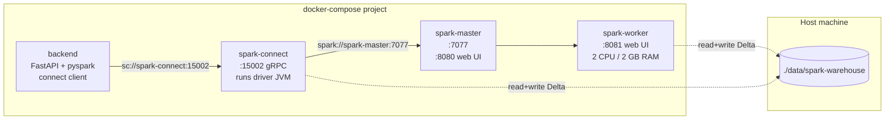

# Spark Stack — Deployment Reference

The Spark engine (used by Query Profiler when `query_intel_engine='spark'`) is
delivered as **three containers** in `docker-compose.yml`. This doc covers
the deployment shape, how the pieces talk to each other, the JAR/config
choices, and the bumps I hit during initial setup.

If you only want to *use* the Spark engine (not understand its deployment),
see [`QUERY_ENGINE.md`](QUERY_ENGINE.md). This doc is for the
engineer who needs to extend, debug, or upgrade the Spark stack.

---

## 1 · Topology



| Service | Purpose | Ports | Volume mounts |
|---|---|---|---|
| `spark-master` | Standalone-cluster master. Schedules executors on workers. | 7077 (worker comms), 8080 (web UI) | none |
| `spark-worker` | One executor container with 2 cores, 2 GB RAM. Runs Spark task threads + holds the **Delta filesystem reads** on `spark-warehouse`. | 8081 (web UI) | `./data/spark-warehouse:/opt/spark/spark-warehouse` |
| `spark-connect` | Spark Connect gRPC server + Spark driver JVM. Receives plans from the Python client, schedules onto the cluster, **also reads Delta logs**. | 15002 (gRPC) | `./data/spark-warehouse:/opt/spark/spark-warehouse` |

**Critical:** both `spark-connect` (driver) AND `spark-worker` (executor) must
have the **same** `spark-warehouse` bind mount. Without the worker mount,
executors write Delta files to their own ephemeral disk, the connect driver
later reads from the host bind mount, and you get
`[FAILED_READ_FILE.FILE_NOT_EXIST]`. This bit me during initial setup.

Image: `apache/spark:4.1.1` for all three. ~1 GB extracted, multi-arch (ARM
+ AMD64), runs as `spark` UID 185.

---

## 2 · Versions

| Component | Version | Notes |
|---|---|---|
| Apache Spark | 4.1.1 | Built-in Spark Connect server (no separate package). |
| Scala | 2.13 | Spark 4.x default. Drives the Delta artifact name. |
| Java | 17 (bundled) | Inside the image. |
| Delta Lake | 4.1.0 | `io.delta:delta-spark_2.13:4.1.0`. Pulled from Maven Central on first start. |
| PySpark (client) | 4.1.1 | `pyspark[connect]==4.1.1` in `backend/pyproject.toml`. **Must match server version exactly** — Spark Connect protocol is version-paired. |

To bump: update the image tag in compose AND the `pyspark[connect]==X.Y.Z`
line in `backend/pyproject.toml`. Then regenerate `backend/uv.lock` (see
the existing pattern in `docs/CLOUD_MIGRATION.md`).

---

## 3 · The Spark Connect command

The connect container runs `spark-submit` in foreground with the
SparkConnectServer main class. Why foreground rather than the
`start-connect-server.sh` daemon wrapper:

| `start-connect-server.sh` | Direct `spark-submit` (what we use) |
|---|---|
| Forks the JVM and exits. Container needs a `tail -f` to stay alive. | Runs the JVM as PID 1. Container lives or dies with it. |
| Errors land in a log file inside the container — invisible to `docker logs` if the script exited cleanly. | All output goes to stdout → `docker logs databricks_billing_spark_connect`. |

The actual command (from `docker-compose.yml`):

```yaml
command:
  - /opt/spark/bin/spark-submit
  - --class
  - org.apache.spark.sql.connect.service.SparkConnectServer
  - --name
  - SparkConnectServer
  - --master
  - spark://spark-master:7077
  - --conf
  - spark.jars.ivy=/tmp/.ivy2
  - --conf
  - spark.driver.extraJavaOptions=-Duser.home=/tmp
  - --packages
  - io.delta:delta-spark_2.13:4.1.0
  - --conf
  - spark.sql.extensions=io.delta.sql.DeltaSparkSessionExtension
  - --conf
  - spark.sql.catalog.spark_catalog=org.apache.spark.sql.delta.catalog.DeltaCatalog
  - --conf
  - spark.sql.warehouse.dir=/opt/spark/spark-warehouse
  - --conf
  - spark.connect.grpc.binding.port=15002
```

Annotated:

- **`spark.jars.ivy=/tmp/.ivy2`** + **`-Duser.home=/tmp`** — the
  `apache/spark` image has `HOME=/nonexistent` baked into `/etc/passwd` for
  UID 185. Ivy needs a writable home to download the Delta JARs.
  Pointing both at `/tmp` (world-writable) is the cleanest fix.
- **`--packages io.delta:delta-spark_2.13:4.1.0`** — pulls Delta + transitive
  deps from Maven Central on first start (~30 s). Subsequent starts read
  from the existing `/tmp/.ivy2` if the container hasn't been recreated.
- **`spark.sql.extensions=...DeltaSparkSessionExtension`** — registers
  Delta as a SQL extension so `CREATE TABLE ... USING DELTA` works.
- **`spark.sql.catalog.spark_catalog=...DeltaCatalog`** — makes the default
  catalog Delta-aware. `saveAsTable("spark_catalog.default.qi_statements")`
  writes a Delta table.
- **`spark.sql.warehouse.dir=/opt/spark/spark-warehouse`** — where
  unqualified `saveAsTable(...)` calls land. Bind-mounted to the host.
- **`spark.connect.grpc.binding.port=15002`** — the port the backend's
  pyspark client connects to.

---

## 4 · Worker resource sizing

```yaml
spark-worker:
  environment:
    SPARK_WORKER_CORES: "2"
    SPARK_WORKER_MEMORY: "4g"     # bumped from 2g for JDBC reads
```

2 cores / 4 GB covers ~5 M statements **and** the JDBC reads of the
larger Postgres-resident tables (`table_lineage` /
`column_lineage`). The previous 2 GB worker default OOMed on naïve
`SELECT * FROM table_lineage LIMIT 100` because Spark JDBC pulls the
whole table into one executor before applying the limit unless pushdown
is enabled (it now is — see §5).

To go bigger:

1. Raise these env vars.
2. Ensure the Docker engine has the memory available (`docker stats`).
3. Add more worker containers (just copy the `spark-worker` block, rename,
   change `--webui-port`).

The driver (inside spark-connect) is set to **2 GB** and the executor
gets **3 GB** via `spark-submit --conf spark.executor.memory=3g`.

```yaml
spark-connect:
  command:
    - ...
    - --driver-memory
    - 2g
    - --conf
    - spark.executor.memory=3g
```

For the qi_* extract specifically, the driver does the
pandas → SparkDataFrame conversion and is more memory-pressured than the
executors. Raise the driver memory before raising worker memory.

### Two ways Spark sees Postgres-resident tables

The "Query Engine" picker in Admin → Data Management has a Spark sub-mode
that flips how `billing_usage`, `query_history`, `databricks_meta`, the
lineage tables, and `qi_*` are exposed to the Spark session:

| `spark_mode` | What it does | Volume sweet spot |
|---|---|---|
| `jdbc_views` (default) | `backend/spark_session.py:_register_base_jdbc_views()` registers each table as a JDBC-backed Spark temp view. Queries push **predicates**, **`LIMIT`**, **`OFFSET`**, and **aggregates** down to Postgres (`pushDownPredicate` / `pushDownLimit` / `pushDownOffset` / `pushDownAggregate`). `fetchsize=10000` controls the PG JDBC cursor batch so the executor heap doesn't fill on large scans. | Anything that filters in Postgres (most queries). |
| `materialized` | `backend/spark_session.py:materialize_postgres_tables()` copies every base + qi_* table into `spark_catalog.default` as managed Delta tables under `data/spark-warehouse/`. The temp views are dropped on mode-switch so they don't shadow the catalog. | Multi-million-row scans where the JDBC round-trip dominates. |

Pushdown is the reason `LIMIT 100` against an 8M-row `table_lineage`
returns in milliseconds in `jdbc_views` mode — without it Spark would
pull every row before applying the limit. See
[`QUERY_ENGINE.md` §1.1](QUERY_ENGINE.md) for the full comparison and
the materialize flow.

---

## 5 · How the Python client talks to it

```python
# backend/spark_session.py
from pyspark.sql import SparkSession

spark = (
    SparkSession.builder
        .remote("sc://spark-connect:15002")   # gRPC, not master://
        .getOrCreate()
)

# Set per-session config — Spark 4.1 ANSI mode treats "ident" as a string
# literal by default; flip to identifier-quoting so our SQL works on both
# Postgres AND Spark.
spark.conf.set("spark.sql.ansi.doubleQuotedIdentifiers", "true")

# Subsequent calls are normal Spark API
df = spark.sql("SELECT count(*) FROM qi_statements")
rows = df.collect()
```

Singleton instance is cached in `spark_session.py::_SPARK`. On a backend
restart the cache is cleared (fresh gRPC connection). If `spark-connect`
itself restarts, the cached session goes stale and the next call raises
`NO_ACTIVE_SESSION` — backend restart fixes it.

---

## 6 · Web UIs

When the stack is up:

| URL | What |
|---|---|
| `http://localhost:8080` | Spark Master UI — worker list, applications, completed jobs |
| `http://localhost:8081` | Spark Worker UI — running tasks, logs |
| (no UI on 15002) | Spark Connect gRPC port — clients only |

The connect server doesn't expose its own UI, but its driver UI is at the
Spark cluster UI (port 8080 → click the application name).

---

## 7 · First-start checklist

Cold-start everything:

```bash
docker compose up -d db backend frontend
docker compose up -d spark-master spark-worker spark-connect
docker logs -f databricks_billing_spark_connect   # wait for "Spark Connect server started at [::]:15002"
```

Verify health:

```bash
# Engine setting
curl http://localhost:8000/api/admin/engine   # default {"engine":"duckdb"}

# Set engine to spark and extract
curl -X PATCH http://localhost:8000/api/admin/engine \
  -H 'Content-Type: application/json' -d '{"engine":"spark"}'
curl -X POST 'http://localhost:8000/api/admin/extract-query-intel?use_demo=true'

# Check the Delta tables landed
ls data/spark-warehouse/qi_statements/_delta_log/
# expect: 00000000000000000000.crc  00000000000000000000.json
```

---

## 8 · Troubleshooting

### "Spark Connect is unavailable: …"

Backend can't reach the Connect server. Common causes:

```bash
# Is the container even up?
docker ps --filter "name=spark-connect"

# What does the driver say?
docker logs databricks_billing_spark_connect --tail 50

# Did it ever bind?
docker logs databricks_billing_spark_connect | grep -i "Spark Connect server started"
```

If the driver died on Maven resolution, check `--packages` JAR coordinates.

### `[FAILED_READ_FILE.FILE_NOT_EXIST] _delta_log/0000…json does not exist`

Worker and connect containers don't see the same `spark-warehouse` mount.
Confirm both have the volume:

```bash
docker inspect databricks_billing_spark_worker  | grep -A2 -i mounts
docker inspect databricks_billing_spark_connect | grep -A2 -i mounts
```

Both should show `./data/spark-warehouse → /opt/spark/spark-warehouse`. If
not, the compose file is missing the worker mount — see §1 above.

### `[NO_ACTIVE_SESSION] No active Spark session found`

The backend's cached SparkSession points to a Spark Connect process that's
been restarted. Restart the backend:

```bash
docker compose restart backend
```

### `[PARSE_SYNTAX_ERROR] Syntax error at or near '"col"'`

Spark Connect dropped its session config. The doubleQuotedIdentifiers setting
is per-session — if `spark_session.py::_SPARK` gets recreated it should be
re-applied automatically. If it's not, check that the post-build smoke-test
call (`spark.conf.set("spark.sql.ansi.doubleQuotedIdentifiers","true")`)
hasn't been removed from `_build_session()`.

### `FileNotFoundException: /nonexistent/.ivy2/…`

The HOME workaround didn't apply. Check the compose `command:` block has
both `spark.jars.ivy=/tmp/.ivy2` and `spark.driver.extraJavaOptions=-Duser.home=/tmp`.
Also verify there's no `HOME:` env override missing them.

### First spark-connect start hangs at "loading settings :: url = …ivysettings.xml"

That's Ivy downloading the Delta artifacts on first start. Normal — wait
30–90 s on a fresh container. Subsequent starts use the on-disk Ivy cache
inside the container (`/tmp/.ivy2`).

### Worker shows `Cannot find any executors` in the master UI

The worker is up but the master can't reach it (or vice versa). Check both
containers are on the same docker network (default `compose_default`) and
that `--master spark://spark-master:7077` resolves inside the connect
container:

```bash
docker exec databricks_billing_spark_connect getent hosts spark-master
```

---

## 9 · Upgrading Spark / Delta

1. Confirm the Delta version that matches the Spark version: see
   [the compatibility matrix](https://docs.delta.io/latest/releases.html).
2. Update three places:
   - `apache/spark:X.Y.Z` (3 services in `docker-compose.yml`)
   - `--packages io.delta:delta-spark_2.13:X.Y.Z` (spark-connect command)
   - `"pyspark[connect]==X.Y.Z"` (`backend/pyproject.toml`)
3. Regenerate `backend/uv.lock`.
4. `docker compose pull` + `docker compose up -d --build backend
   spark-master spark-worker spark-connect`.

Don't forget the **Scala version** in the Delta artifact name — Spark 4.x is
on Scala 2.13. If you upgrade to a Spark version on a different Scala
(unlikely soon), bump `delta-spark_2.13` to match.

---

## 10 · What this stack is not

- **Not multi-tenant.** Single Spark Connect session shared across all
  backend requests. Fine for an admin tool; do not expose to untrusted
  users.
- **Not HA.** Single master, single worker. If either dies the engine is
  offline until restarted.
- **Not S3/ADLS backed (yet).** The warehouse is a local bind mount. To move
  it to cloud blob storage, see [`CLOUD_MIGRATION.md`](CLOUD_MIGRATION.md).
- **Not a Databricks workspace.** Databricks Runtime + Unity Catalog are
  out of scope here. This is plain OSS Spark + plain Delta.
